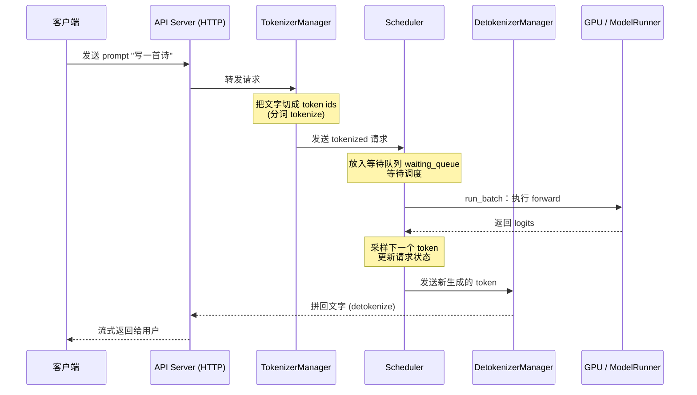

# 一、推理核心问题

# 二、sglang的整体架构

![[Pasted image 20260926163657.png]]

# 三、一次请求的路径

# 四、perfill

## perfill究竟在干什么

## 为什么perfill和decode要分离

瓶颈不同:

perfill的瓶颈在于gpu的计算量太大，需要根据输入，计算模型中每一次的参数；天然具有频繁gpu就计算的诉求

decode是自回归的过程，根据前面k v值，来计算下一个token，需要占据大量的显存资源

两者是矛盾的

## perfill面临三类压力

## flashAttention

## Chunked perfill
### 为什么要chunked perfill
1. prompt输入过长，perfill阶段需要为这些大量token提前分配好大量显存，造成显存峰值，可能引发oom，
2. 排队中短prompt的perfill请求被阻塞
3. 长时间perfill阻塞其他请求decoder过程，导致token生成速度卡顿 ，饿死其他请求
	1. 传统调度中，长 Prompt 的 Prefill 是一个不可中断的“大块”计算。在其执行期间，已经处于 Decode 阶段的请求必须等待，导致生成停顿（Generation Stalls），表现为极高的 TBT（Time-Between-Tokens）和 P99 延迟尖峰
	2. Chunked Prefill 的做法是将这个“大块”拆解成多个按顺序处理的“小块”（Chunk）。调度器在每个推理步骤（Iteration）中，不再一次性处理整个 Prefill，而是只处理其中一个 Chunk。处理完一个 Chunk 后，调度器就有机会将其他请求的 Decode 步骤插入进来，实现 Prefill 与 Decode 在**同一批次内的交替执行**
	3. 其核心优势在于利用了 Decode 阶段**计算资源未被充分利用**的特性。Decode 是内存带宽瓶颈型操作，GPU 的 Tensor Core 计算单元相对空闲。将计算密集型的 Prefill Chunk 与 Decode 混合在一个批次中，可以“填补”这些空闲的计算资源，从而在不显著增加单步耗时的前提下，推进 Prefill 的进度
 
### 实现机制
1. 将长的请求按照设定好的chunked-prefill-size进行划分，划分成不同的chunk，每执行完一个chunk，就把控制权交还给scheduler
2. scheduler可以决定：继续 prefill 当前 chunk 的下一块、prefill 等待队列里的新请求、跑 decode、prefill + decode 混跑（mixed chunk）

### 注意点

1. ==中间chunk不吐字==
	1. 一个请求只有**最后一个 chunk 完成后**才采样（sample）第一个输出 token，并进入 decode。中间那些 chunk 只是"读题"，不产生任何输出。
	2. 该请求的ttft不会降低
2. 中间chunk的产生token是会缓存的，再生成下一个chunk的token时，可以从缓存中读取出来用于perfill
3. chunk 切得越小，decode 越流畅，但 prefill 的总开销越大（因为切块本身有调度成本）。所以 chunk 大小（`chunked_prefill_size`）是一个需要权衡的旋钮

### 参数调优
#### 相关参数：

| **参数**                      | **默认**                | **含义**                                              |
| --------------------------- | --------------------- | --------------------------------------------------- |
| `--chunked-prefill-size`    | `None` 启动过程中会被覆写，默认开启 | 每个 chunk 的最大 token 数。`-1` 也等于禁用                     |
| `--max-prefill-tokens`      | `16384`               | 一个 prefill batch 的总 token 预算，一个遗留参数，和模型支持的上下文窗口取max |
| `--enable-dynamic-chunking` | `False`               | 流水线并行（PP）下动态调整 chunk 大小                             |
| `--schedule-policy`         | `fcfs`                | 调度策略，`shortest-prefill-first` 与 chunked 配合很好        |

**chunk 大小怎么选？** 这是一个权衡：

- **偏大**（如 8192）：切块次数少、调度开销小，但每次 prefill 更"重"，decode 会被饿得更久。
- **偏小**（如 256）：decode 更流畅、显存峰值更低，但切块频繁、总开销上升。

经验上，常见的起点是 `512` 或 `1024`，再根据实际负载的 TTFT / 吞吐曲线去调。**没有万能值**，要对着你自己的场景量。

**默认的`--chunked-prefill-size`，是sglang通过显存大小默认设置的：**

| GPU 显存      | 典型显卡           | 默认 chunked_prefill_size |
| ----------- | -------------- | ----------------------- |
| `< 20 GB`   | T4、4080        | 2048                    |
| `20~35 GB`  | A10、4090、5090  | 4096                    |
| `35~60 GB`  | A100 40GB、L40  | 4096                    |
| `60~90 GB`  | H100、A100 80GB | 8192                    |
| `90~160 GB` | H20、H200       | 8192                    |
| `>= 160 GB` | B200、MI300     | 16384                   |
| 拿不到显存信息     | 回退             | 4096                    |

#### 和其他特性参数的关系

- **Mixed Chunk（`--enable-mixed-chunk`）**：默认情况下，一个 batch 要么全是 prefill、要么全是 decode。Mixed chunk 允许**在同一个 batch 里既放 prefill 又放 decode**，进一步减少 GPU 空闲，这个开关是默认关闭的。
- **Prefill / Decode Disaggregation（PD 分离）**：一般来说，chunked perfill更使用于pd不分离的场景，用于做调度调节；但是也可以使用于pd分离场景。此时把 prefill 和 decode 放到不同的机器/GPU 上。chunked prefill仅对perfill的过程起效， 是它内部"怎么把 prefill 切成可控小块"的基础手段之一。
- **Dynamic Chunking**：针对流水线并行（PP），让每个 chunk 的计算时长尽量一致，避免流水线气泡。
- **Split Prefill**：`schedule_batch.py:3135` 的 `prepare_for_split_prefill` 说明存在另一种"拆分 prefill"的路径，它和 chunked 在 `extend_range` 的机制上共享同一套基础设施。

## Prefix cache--》radix cache

# 五、Decode

## 性能卡点
自回归生成过程，token一个一个的生成，但是算attention的时候，是需要前面所有的token的k,v值以及模型权重，取出来计算预测下一个token，因此对显存的需求很大，计算是有点冗余的。
==解决方式：==
1. 批处理
2. 投机解码
3. 更高效/准确的解码策略
## 批处理-Continuous batch
https://www.usenix.org/conference/osdi22/presentation/yu

### 为什么批处理
1. 每次取出一次kv cache中的kv，但是只计算一个token很亏，算力有冗余，可以算一批
2. 

### 批处理面临三个问题：

1. 早执行完毕的reqest怎么处理：通过scheduler的loop形式一直检查，有完成的请求就拿出来，并检查后来的request并放入

2. 后加入的request怎么处理

3. 不同长度的prompt如何在一个batch内推理： perfill阶段，将全部reqest进行flatten成一个大的一维向量，decode阶段由于都是单个token维度的计算，因此不涉及这个问题

### Iteration-Level Scheduling

![[Pasted image 20260927010539.png]]

### Selective Batching

## 解码策略

## 投机解码

## 如何保证不oom

# 六、Kv cache的实现和优化手段

![[Pasted image 20260926160258.png]]

## 注意力架构（根本上优化）
通过修改 Transformer 注意力结构，直接减少每一个 token 产出的 KV 张量大小，属于模型训练阶段内置优化，推理侧直接生效，无额外运行时开销。

1. **MQA 多查询注意力**  
    
    原理：全部 Query 头共享同一套 K/V 头，KV 头数量压缩至 1 组，KV 显存直接下降 N 倍。 
    
    优点：压缩比极高，推理解码速度快。 
    
    缺点：会带来一定生成质量损失，需要模型重训 / 微调补偿。 
    
    适用：追求吞吐、可接受轻微效果损失的场景。
    
2. **GQA 分组查询注意力（工业界事实标准）**  
    
    原理：把 Query 头划分为若干组，组内共享一套 KV 头。例如 Llama3‑70B：64 个 Q 头，8 个 KV 头，KV Cache 压缩 8 倍。 
    
    优点：MHA 与 MQA 之间最佳折中，质量损失很小，绝大多数开源商用模型（Llama2/3、Qwen、DeepSeek）标配 GQA。 
    
    缺点：仍需要训练阶段支持，不能直接对 MHA 模型直接改推理启用。
    
3. **MLA 多头隐式注意力**  
    
    原理：不维护完整 KV 张量，用低维隐向量替代原始 K/V，推理时再恢复，进一步压缩 KV 体积，专门面向百万级超长上下文。 
    
    优点：同等显存下支持更长上下文，KV 体积远优于 GQA。 
    
    缺点：需要模型原生训练支持，无法直接用于普通 LLM，推理内核需要专门适配。
    

小结：GQA 是线上部署首选；MLA 是新一代长上下文模型方向；MQA 现在已经很少单独使用。

## kv压缩减少存储
将 FP16/BF16 的 KV 张量，用更低比特存储，在显存中减少每个 token 的 KV 字节占用，Prefill 计算不变，仅改变存储格式，解码阶段实时反量化读取 K/V。

1. **FP8 KV Cache（当前生产主流）**  
    
    原理：把 KV 缓存存储为 FP8_e4m3，显存直接减半，vLLM、SGLang 原生支持。 
    
    优点：硬件原生支持，反量化开销小，精度损失很小，工程落地成熟。 缺点：需要支持 FP8 的 GPU（Ada、Hopper、Blackwell）；旧硬件无法加速。
    
2. **INT8 / INT4 KV Cache**  
    
    原理：将 KV 压缩为 8bit、4bit 整数，进一步压缩显存。代表方案 KIVI、TurboQuant。 KIVI 采用**非对称量化**：Key 按通道量化，Value 按 Token 量化，解决 KV 缓存数值分布不一致问题。 
    
    优点：压缩比高，旧 GPU 也可以运行。 
    
    缺点：4bit 会带来长上下文检索能力下降；反量化带来额外算力开销；vLLM/SGLang 官方原生支持有限，更多见于 LMDeploy、TurboMind。
    
3. **KV‑Compress、TurboQuant 编解码方案**  
    
    原理：针对每个注意力头使用可变压缩倍率，块级压缩 KV block，和 PagedAttention 分页架构兼容。 
    
    优点：兼顾压缩率与精度。 
    
    缺点：自定义内核，通用性差，大规模生产落地较少。
    

权衡边界：FP8 优先线上使用；INT4 仅用于对精度容忍度高的业务；高检索、Agent 工具调用场景，不建议直接 4bit KV。

## 动态稀疏与 Token 驱逐 Eviction（动态丢弃不重要 KV）

当显存不足，识别、丢弃注意力权重低的历史 token 对应的 KV Cache，保留关键 token，把 KV 占用从 O (N) 变成 O (窗口大小)，不修改模型权重，推理运行时动态执行，非常适合超长上下文场景。

1. **StreamingLLM（滑动窗口 + 注意力 Sink）**  
    
    原理：永久保留开头少数 Sink token，再保留最近 N 个 token，中间久远历史直接丢弃。 
    
    优点：实现简单，开销低。 
    
    缺点：会丢失中间历史信息，长文档问答任务会出现信息遗忘。
    
2. **H2O、SnapKV**  
    
    原理：基于历史注意力分数，动态统计 token 重要度，驱逐低分 token 的 KV，同时保留最近窗口 token。 
    
    优点：比单纯滑动窗口召回效果更好。 
    
    缺点：需要维护注意力统计，带来少量 GPU 开销；部分长检索任务精度会下降。
    
3. **MorphKV、R‑KV**  
    
    MorphKV：聚合历史注意力信号动态筛选重要旧 token。 
    
    R‑KV：专门针对 CoT 推理长输出，同时考虑 token 重要性与信息冗余，推理场景下可以把 KV 缓存压缩到 10%，精度几乎无损。 
    
    优点：推理 Agent 思维链场景收益明显。 
    
    缺点：算法复杂，对推理引擎内核侵入性强。
    
4. **PagedEviction**  
    
    原理：和 PagedAttention 分页架构深度适配，按 Block 整块驱逐，而不是驱逐零散 token，避免内存碎片，vLLM 生态方案。
    

适用场景：文档解析、超长对话 Agent；风险：驱逐错误关键 token 会造成幻觉、信息丢失；不能无脑开最大驱逐。

## 内存管理工程优化（更高效分配、复用 KV Cache）

不改变 KV 本身大小，优化显存分配、生命周期、共享复用，解决碎片、重复计算浪费，是现代推理引擎的基础底座。

1. **PagedAttention 分页注意力（vLLM 核心）**   
    
    https://arxiv.org/abs/2309.06180
    原理：借鉴操作系统分页机制，KV Cache 切分为固定大小 Block 页，逻辑连续，物理显存可以非连续存放，用 BlockTable 页表记录映射关系。 
    
    收益：消除显存碎片，GPU 显存利用率从 20‑40% 提升至 95% 以上；支持抢占、会话迁移。 
    
    局限：不减少 KV 总字节，只优化分配效率；SGLang、MindIE 都实现同类机制。
    
2. **Prefix Caching 前缀缓存 / RadixAttention（SGLang）**  
    
    原理：不同请求存在公共前缀（相同 System Prompt、知识库上下文、工具描述），把已经计算完成的 KV Block 保存，通过基数树 RadixTree 索引，新请求命中直接复用 KV，跳过重复 Prefill 计算。 
    
    收益：大幅降低 TTFT 首 token 延迟，减少重复 Prefill 算力消耗；System Prompt 越长收益越高。 
    
    变种：vLLM APC 自动前缀缓存，跨会话共享 KV 块。 局限：需要足够显存存放公共前缀；会话多、前缀差异大时命中率下降。
    
3. **KV Cache Offloading 分层卸载**  
    
    原理：GPU 显存放不下全部 KV，把冷 KV 块卸载到 CPU 内存、NVMe SSD，需要时再加载回 GPU 显存计算；代表 FlexGen、InfiniGen、MooncakeStore。 分层 L1 (GPU HBM)、L2 (CPU DRAM)、L3 (SSD / 分布式存储)。 
    
    优点：极大扩展单实例可承载上下文长度。 
    
    缺点：卸载加载会带来延迟抖动；SSD 介质访问延迟高，只适合冷 KV。

## 分布式与系统架构级 KV Cache 优化（集群维度）

单 GPU 显存终究有限，把 KV Cache 从单机 GPU 扩展到整个集群，是大规模 Agent、PD 分离架构下核心方案。

1. **PD 分离（Prefill‑Decode Disaggregation）配套 KV 传输**  
    
    原理：Prefill 集群计算生成 KV Cache，通过 RDMA 高速网络把 KV Cache 块传输给 Decode 集群，不在同一套 GPU 完成两个阶段。 
    
    关键点：传输 KV Cache 中间状态，不传输权重；对网络 RDMA 要求高。 
    
    代表：Mooncake 点对点传输组件，vLLM disaggregated‑prefill 能力。
    
2. **分布式 KV Cache 共享池（Mooncake Store）**  
    
    原理：集群全局统一 KV 存储池，多推理节点共享 KV 资源；KV 块可以存放在集群节点 CPU 内存、SSD；任意推理节点按需读取 KV 块，支持跨实例会话迁移、跨实例 Prefix Cache 命中。 
    
    价值：AI 智能体长任务场景，会话可以调度到任意 Decode 节点，不需要重新 Prefill；是 Agent 推理基础设施关键组件。 
    
    挑战：元数据管理、RDMA 网络、缓存淘汰策略、副本故障处理。
    
3. **多级全局缓存架构 HiCache（SGLang）**  
    
    L1 GPU 显存，L2 本机 CPU 内存，L3 分布式共享存储；统一管理本地 + 分布式 KV 缓存，兼顾访问延迟与总容量。

## sglang应用-radis cache原理 

## sglang生产应用之hicache
https://docs.sglang.io/docs/advanced_features/hicache

## 生产应用之mooncake

https://github.com/kvcache-ai/Mooncake

https://kvcache-ai.github.io/Mooncake/

# pd分离和pd不分离

# 七、serving：scheduler调度

## 调度策略

## 相关参数

### --enable-mixed-chunk
**允许在一个batch内，既可以perfill既可以decode**

**推荐启用的场景**

- **长文本处理**：当处理超过 **4k tokens** 的长文本时，启用此参数可实现预填充与解码的混合优化。
    
- **高并发、长输入**：在并发数 ≥ 200 且输入长度 ≥ 4096 的场景下，混合批次的收益更为明显。若结合 `--enable-flashinfer-pod-attention`（需同时指定 `--attention-backend flashinfer`），吞吐可提升 **4%–48%**，TTFT 和 TPOT 改善 **5%–30%**。在极端配置下（输入 16384、并发 1024），吞吐提升可达 **47.7%**。

**不建议或需谨慎使用的场景**

- **MLA（Multi-head Latent Attention）模型**：对于使用 MLA 的模型（如 DeepSeek 系列），Prefill 和 Decode 的**计算/内存访问特性差异较大**，官方讨论中建议**分开批次处理**，混合可能无法带来收益甚至适得其反。
    
- **特定硬件后端**：在 **Ascend NPU** 上，该功能在某些场景下（如 DeepSeek-V3.2 模型）**不受支持**。
    
- **正则表达式约束请求**：曾有 Bug 报告，启用 `--enable-mixed-chunk` 后，使用 JSON 正则的请求可能**返回错误结果**。虽然该 Issue 时间较早（2024 年），但在生产环境用于此类请求时仍需谨慎验证。
    
- **已知的稳定性问题**：社区中曾报告过启用后导致**崩溃**的 Bug（Issue #6921），以及与 CUDA Graph、词表张量掩码的兼容性问题。建议在升级到包含相关修复的版本后再启用。

# 八、分布式通信和并行策略

## 通信协议

### RDMA（远端内存访问）

绕过cpu，直接gpu和gpu之间直接通信

### NVlink

## 通信原语

1. 集合通信\(cc\)：一组节点之间通信

2. 点对点通信\(p2p\)：两个节点的通信

3. 核心区别：集合通信是N个gpu一起抢带宽，而点对点通信仅有2个

⚠️ 注意：通信发生在不同层级的硬件上，带宽差一个数量级——机内 NVLink 可达数百 GB/s，机间 InfiniBand 约 50 GB/s 量级，PCIe 更低。同样一个 AllReduce，放机内还是跨机，耗时可能差十倍。这是后续所有”哪个策略放哪里”决策的物理根源。

## 并行策略

tp
dp
ep

# 九、attention backend

**Attention Backend 是底层的“计算内核”**：它是真正在 GPU 上执行注意力计算的**算子实现**（如 FlashAttention、FlashInfer、Triton 等）。它负责“如何高效计算一次注意力”，解决的是 **“计算性能”** 问题

