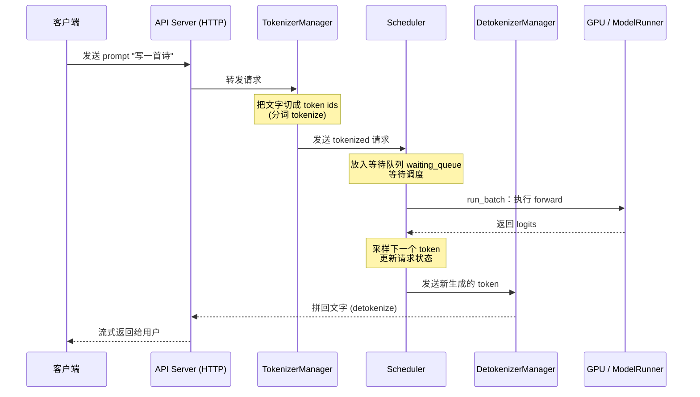

http://theneuralbase.com/sglang/learn/advanced
https://sglang.org/zh/advanced_features
# 一、推理核心问题


# 二、sglang的整体架构

![[Pasted image 20260926163657.png]]


# 三、一次请求的路径





# 四、prefill

## prefill究竟在干什么

prompt被tokenize之后进行perfill，首先进行RoPE和embedding，映射为向量，经过模型的层层计算==(同样为因果注意力机制==)，将每层的k,v缓存下来，并生成第一个token

==并行计算：==

**prefill 在 token/序列维度上是并行计算的**，但不是“整个网络所有计算都并行”。

更准确地说：

- **Prompt 里的所有 token 一次性送入模型**，而不是像 decode 那样一个一个来。
    
- 每一层里，所有 token 的 Q/K/V 可以通过大矩阵乘法同时算出来：
    
    - 输入 X∈Rn×dX∈Rn×d
        
    - 一次矩阵乘得到所有位置的 Q、K、V
        
    - 注意力分数矩阵一次算完，再加 **causal mask**
        
- 所以虽然每个 token 只能看自己和左边的 token，但**计算过程是并行的**，mask 只是把未来位置的注意力权重屏蔽掉。
    
- prefill 结束后，每一层 prompt token 的 K/V 都写进 **KV Cache**。
    
- 然后取最后一个位置的输出，采样得到第一个生成 token。

==计算过程：==
```

┌─────────────────────────────────────────────────────────────────────┐

│                        LLM 推理流程                                 │

├─────────────────────────────────────────────────────────────────────┤

│                                                                     │

│  阶段 1：PREFILL（处理 prompt）                                     │

│  ┌────────────────────────────────────────────────────────────┐    │

│  │  输入："What is the capital of France?"                    │    │

│  │       [tok0, tok1, tok2, tok3, tok4, tok5, tok6]          │    │

│  │                                                            │    │

│  │  并行处理所有 prompt token                                 │    │

│  │  → 为每个位置计算 Q、K、V                                  │    │

│  │  → 将 K、V 写入 cache（按层保存）                          │    │

│  │  → 返回最后一个位置的 logits → 生成第一个输出 token        │    │

│  │                                                            │    │

│  │  计算量：对 T 个 prompt token 是 O(T^2)（一次性成本）      │    │

│  │  这一阶段是计算瓶颈型（大矩阵乘法）                        │    │

│  └────────────────────────────────────────────────────────────┘    │

│                           │                                         │

│                           ▼                                         │

│  阶段 2：DECODE（逐 token 生成）                                   │

│  ┌────────────────────────────────────────────────────────────┐    │

│  │  Step 1: 输入 = [new_tok_7]                                │    │

│  │          只为这 1 个 token 计算 Q7、K7、V7                 │    │

│  │          将 K7,V7 追加到 cache → cache 变为 [K0..K7,V0..V7]│    │

│  │          用 Q7 对 cache 中全部 K,V 做注意力                │    │

│  │          → 得到下一个 token                                │    │

│  │                                                            │    │

│  │  Step 2: 输入 = [new_tok_8]                                │    │

│  │          只为这 1 个 token 计算 Q8、K8、V8                 │    │

│  │          将 K8,V8 追加到 cache → cache 变为 [K0..K8,V0..V8]│    │

│  │          用 Q8 对 cache 中全部 K,V 做注意力                │    │

│  │          → 得到下一个 token                                │    │

│  │                                                            │    │

│  │  每一步计算量：O(n)，其中 n 是当前总序列长度               │    │

│  │  这一阶段是内存带宽瓶颈型（从 HBM 中读取缓存的 K,V）       │    │

│  └────────────────────────────────────────────────────────────┘    │

│                                                                     │

└─────────────────────────────────────────────────────────────────────┘

```


## 为什么perfill和decode要分离

瓶颈不同:

perfill的瓶颈在于gpu的计算量太大，需要根据输入，计算模型中每一次的参数；天然具有频繁gpu就计算的诉求

decode是自回归的过程，根据前面k v值，来计算下一个token，需要占据大量的显存资源

两者是矛盾的

## prefill面临三类压力


# 五、Decode

## Decode在做什么
自回归过程，将之前缓存的k,v读出来，和当前新的kv cat在一起，计算logic，每次只输出一个token

![[Pasted image 20261005154057.png]]

## 性能卡点
自回归生成过程，token一个一个的生成，但是算attention的时候，是需要前面所有的token的k,v值以及模型权重，取出来计算预测下一个token，因此对显存的需求很大，计算是有点冗余的。
==解决方式：==
1. 批处理/chunked perfill
2. 投机解码
3. 更高效/准确的解码策略

## 解码策略

### temperature
主要作用：调节概率分布的“尖锐/平坦”程度
模型原始 logits 记为z_i。softmax 得到概率：
$$p_i = \frac{\exp(z_i)}{\sum_j \exp(z_j)}$$

加入温度 T后：
$$p_i = \frac{\exp(z_i / T)}{\sum_j \exp(z_j / T)}$$

- **T < 1**：logits 差距被放大，softmax 后分布更尖锐，高概率 token 更容易被选中，生成更确定、保守。
    
- **T = 1**：使用模型原始分布。
    
- **T > 1**：logits 差距被缩小，分布更平坦，低概率 token 也有更多机会，生成更随机、多样。
    
- **T → 0**：极限上接近 greedy，总是选概率最高的 token。实际实现里通常直接把 T=0 当作贪心解码

影响：
- 低温度：适合事实问答、代码、数学、结构化输出，但容易重复、死板。
- 高温度：适合创意写作、头脑风暴，但更容易跑偏、幻觉、语法错误。
### top k（只保留概率最高的k个候选）

1. 对所有 token 的 logits 排序；
    
2. 只保留分数最高的 kk 个 token；
    
3. 其余 token 概率置 0；
    
4. 在剩下的 k 个 token 中重新归一化并采样。

大模型词表通常有几万到几十万 token。很多低概率 token 虽然单个概率很低，但数量巨大，合起来可能被采样到，导致输出莫名其妙。Top-k 直接砍掉长尾，只从最可能的 k 个里选，降低“胡言乱语”的概率。

### top p

模型先输出每个 token 的 logits，经过温度缩放和 softmax 后得到概率分布 pipi​。

Top-p 的步骤：

1. 把所有 token 按概率从高到低排序。
    
2. 从最高概率开始累加，直到累积概率达到或超过阈值 p。
    
3. 保留这个最小集合，其余 token 概率置 0。
    
4. 在保留的 token 中重新归一化，然后按新概率采样。
    

数学上，设排序后概率为 p(1)≥p(2)≥…，找到最小的 k 使得：

$$\sum_{i=1}^{k} p_{(i)} \ge p$$
然后只保留前 kk个 token，重新归一化：
$$p'_i =
\begin{cases}
\frac{p_i}{\sum_{j \le k} p_j}, & i \le k \\
0, & i > k
\end{cases}$$

最后从 p′中采样下一个 token。

 **Top-p 的作用**

==① 动态控制候选集大小==

Top-p 不固定保留多少个 token，而是根据当前概率分布动态决定。

- 如果模型很确定，最高概率 token 占主导，Top-p 可能只保留 1~2 个 token。
    
- 如果模型不确定，概率分布平坦，Top-p 会保留更多 token。

这比 Top-k 更自适应。Top-k 固定保留 k 个，在分布尖锐时可能保留了太多没必要的低概率 token，在分布平坦时又可能截得太狠。

==② 砍掉长尾，降低胡言乱语==

大模型词表有几万到几十万 token。很多低概率 token 单个概率极低，但数量巨大，合起来仍可能被采样到，导致输出跑偏、幻觉或语法错误。Top-p 只保留累积概率达到 p 的核心 token，把长尾直接排除。

==③ 在质量和多样性之间平衡==

- **p 小**，比如 0.5~0.7：候选集小，生成更确定、保守，但多样性差，容易重复。
    
- **p 大**，比如 0.9~0.95：候选集大，生成更多样，但可能引入低质量 token。
    
- **p = 1**：不截断，保留全部 token，等于不启用 Top-p。
    
- **p 非常小**：可能只剩最高概率 token，近似 greedy 解码。
    

实践中常用 **p = 0.9 或 0.95**，在稳定性和多样性之间取得平衡


### 一般用法：
> logits → 除以温度 T → 选 top-k → 对 top-k 重新 softmax → 采样

- 稳定任务：T=0~0.3，top-k=1~20，top-p=0.1~0.5；
    
- 平衡任务：T=0.7~1.0，top-k=40~100，top-p=0.9~0.95；
    
- 创意任务：T=1.0~1.5，top-k 更大或 top-p=0.95~1.0。


## 投机解码

### MTP


### DSpark


## 如何保证不oom


# 六、Chunked perfill

SARATHI: Efficient LLM Inference by Piggybacking Decodes with Chunked-Prefills： [https://arxiv.org/abs/2308.16369](https://arxiv.org/abs/2308.16369)
Taming Throughput-Latency Tradeoff in LLM Inference with Sarathi-Serve：[https://arxiv.org/abs/2403.02310](https://arxiv.org/abs/2403.02310)
Github：[https://github.com/microsoft/sarathi-serve](https://github.com/microsoft/sarathi-serve)

### 为什么要chunked perfill
1. prompt输入过长，perfill阶段需要为这些大量token提前分配好大量显存，造成显存峰值，可能引发oom，
2. 排队中短prompt的perfill请求被阻塞
3. 长时间perfill阻塞其他请求decoder过程，导致token生成速度卡顿 ，饿死其他请求
	1. 传统调度中，长 Prompt 的 Prefill 是一个不可中断的“大块”计算。在其执行期间，已经处于 Decode 阶段的请求必须等待，导致生成停顿（Generation Stalls），表现为极高的 TBT（Time-Between-Tokens）和 P99 延迟尖峰
	2. Chunked Prefill 的做法是将这个“大块”拆解成多个按顺序处理的“小块”（Chunk）。调度器在每个推理步骤（Iteration）中，不再一次性处理整个 Prefill，而是只处理其中一个 Chunk。处理完一个 Chunk 后，调度器就有机会将其他请求的 Decode 步骤插入进来，实现 Prefill 与 Decode 在**同一批次内的交替执行**
	3. 其核心优势在于利用了 Decode 阶段**计算资源未被充分利用**的特性。Decode 是内存带宽瓶颈型操作，GPU 的 Tensor Core 计算单元相对空闲。将计算密集型的 Prefill Chunk 与 Decode 混合在一个批次中，可以“填补”这些空闲的计算资源，从而在不显著增加单步耗时的前提下，推进 Prefill 的进度
 
### 实现机制
1. 将长的请求按照设定好的chunked-prefill-size进行划分，划分成不同的chunk，每执行完一个chunk，就把控制权交还给scheduler
2. scheduler可以决定：继续 prefill 当前 chunk 的下一块、prefill 等待队列里的新请求、跑 decode、prefill + decode 混跑（mixed chunk）

### 注意点

1. ==中间chunk不吐字==
	1. 一个请求只有**最后一个 chunk 完成后**才采样（sample）第一个输出 token，并进入 decode。中间那些 chunk 只是"读题"，不产生任何输出。
	2. 该请求的ttft不会降低
2. 中间chunk的产生token是会缓存的，再生成下一个chunk的token时，可以从缓存中读取出来用于perfill
3. chunk 切得越小，decode 越流畅，但 prefill 的总开销越大（因为切块本身有调度成本）。所以 chunk 大小（`chunked_prefill_size`）是一个需要权衡的旋钮

### 参数调优
#### 相关参数：

| **参数**                      | **默认**                | **含义**                                              |
| --------------------------- | --------------------- | --------------------------------------------------- |
| `--chunked-prefill-size`    | `None` 启动过程中会被覆写，默认开启 | 每个 chunk 的最大 token 数。`-1` 也等于禁用                     |
| `--max-prefill-tokens`      | `16384`               | 一个 prefill batch 的总 token 预算，一个遗留参数，和模型支持的上下文窗口取max |
| `--enable-dynamic-chunking` | `False`               | 流水线并行（PP）下动态调整 chunk 大小                             |
| `--schedule-policy`         | `fcfs`                | 调度策略，`shortest-prefill-first` 与 chunked 配合很好        |

**chunk 大小怎么选？** 这是一个权衡：

- **偏大**（如 8192）：切块次数少、调度开销小，但每次 prefill 更"重"，decode 会被饿得更久。
- **偏小**（如 256）：decode 更流畅、显存峰值更低，但切块频繁、总开销上升。

经验上，常见的起点是 `512` 或 `1024`，再根据实际负载的 TTFT / 吞吐曲线去调。**没有万能值**，要对着你自己的场景量。

**默认的`--chunked-prefill-size`，是sglang通过显存大小默认设置的：**

| GPU 显存      | 典型显卡           | 默认 chunked_prefill_size |
| ----------- | -------------- | ----------------------- |
| `< 20 GB`   | T4、4080        | 2048                    |
| `20~35 GB`  | A10、4090、5090  | 4096                    |
| `35~60 GB`  | A100 40GB、L40  | 4096                    |
| `60~90 GB`  | H100、A100 80GB | 8192                    |
| `90~160 GB` | H20、H200       | 8192                    |
| `>= 160 GB` | B200、MI300     | 16384                   |
| 拿不到显存信息     | 回退             | 4096                    |


#### 和其他特性参数的关系

- **Mixed Chunk（`--enable-mixed-chunk`）**：默认情况下，一个 batch 要么全是 prefill、要么全是 decode。Mixed chunk 允许**在同一个 batch 里既放 prefill 又放 decode**，进一步减少 GPU 空闲，这个开关是默认关闭的。
- **Prefill / Decode Disaggregation（PD 分离）**：一般来说，chunked perfill更使用于pd不分离的场景，用于做调度调节；但是也可以使用于pd分离场景。此时把 prefill 和 decode 放到不同的机器/GPU 上。chunked prefill仅对perfill的过程起效， 是它内部"怎么把 prefill 切成可控小块"的基础手段之一。
- **Dynamic Chunking**：针对流水线并行（PP），让每个 chunk 的计算时长尽量一致，避免流水线气泡。
- **Split Prefill**：`schedule_batch.py:3135` 的 `prepare_for_split_prefill` 说明存在另一种"拆分 prefill"的路径，它和 chunked 在 `extend_range` 的机制上共享同一套基础设施。


# 七、批处理-Continuous batch
https://www.usenix.org/conference/osdi22/presentation/yu

### 为什么批处理
1. 每次取出一次kv cache中的kv，但是只计算一个token很亏，算力有冗余，可以算一批
2. 


### 批处理面临三个问题--核心是schduler调度

1. 早执行完毕的reqest怎么处理：通过scheduler的loop形式一直检查，有完成的请求就拿出来，并检查后来的request并放入

2. 后加入的request怎么处理

3. 不同长度的prompt如何在一个batch内推理： perfill阶段，将全部reqest进行flatten成一个大的一维向量，decode阶段由于都是单个token维度的计算，因此不涉及这个问题

### static batching
将一批请求封装处理，提高gpu核心利用率


### Iteration-Level Scheduling

![[Pasted image 20260927010539.png]]

iteration-level scheduling，不再等待 batch 中所有序列生成完成，而是每轮迭代动态决定 batch 大小。这样一来，batch 中的某个序列一旦完成生成，就可以立即被替换为新的请求，从而相比 Static Batching 显著提升了 GPU 的利用率。

在实践中应用 iteration-level scheduling 时，我们面临的一个主要挑战就是如何实现批处理。为了达到高效执行的目的，执行引擎应当能够对任意被选中的一组请求进行批处理执行。否则，就只能一个一个地处理请求，无法发挥 GPU 的大规模并行计算能力。然而，即使只是两条请求，也无法保证它们在下一轮迭代中能够合并执行。**这是因为要实现批处理，不仅需要多个请求处于相同的阶段，还必须具有形状完全一致的输入张量。**一对请求在以下 3 种情况下，下一次迭代不能一起批处理：
![[Pasted image 20260927230509.png]]

- **两个请求都处于 prefill 阶段，但输入 token 数量不同（例如 x₃ 和 x₄）**。prefill 阶段的 Attention 是一次性并行处理整个 prompt 序列。如果两个请求的输入 token 长度不同，它们的输入张量在长度维度（L）上不一致，无法拼接成统一形状的 batch 张量 `[B, L, H]`，导致无法合批执行。请求 x₃ 的 prompt 长度是 2，输入张量形状为 `[1, 2, H]`；请求 x₄ 的 prompt 长度是 3，输入张量形状为 `[1, 3, H]`，无法拼接成一个 `[2, L, H]` 的张量，因此不能合批执行。
- **两个请求都处于 decode 阶段，但正在生成不同位置的 token（例如 x₁ 和 x₂）。** 虽然 decode 阶段每次只处理一个 token，输入张量形状都是 `[1, H]`，但此阶段的 Attention 会依赖之前生成的所有 token（即使用 KV cache）。如果请求的生成位置不同，其 KV cache 长度也不同，导致 Attention 的 Key/Value 张量形状不同。
- **两个请求处于不同阶段：一个在 prefill，另一个在 decode（例如 x₁ 和 x₃）。** prefill 的一次迭代会并行处理所有输入 token，以提高效率，而 decode 阶段的一次迭代则只处理一个 token。

**为了解决上述挑战，一个可行的思路是：尽可能寻找这些请求在计算过程中的共性，以便将相同的部分合并执行，从而最大化批处理效率；对于差异部分，则单独处理。**


### Selective Batching
**elective Batching 的核心原理在于：仅对适合批处理的操作执行批处理，不适合批处理的操作则单独处理。**

具体来说：

- 对于 `preproj`、`postproj`、`FFN1` 和 `FFN2` 这类线性变换或归一化操作，它们的计算与序列长度无关，只是在 hidden_size 维度上做线性转换，并且都需要从显存读取权重。**因此，可以将 batch 内所有 token 拉平成一个二维张量**，例如 x₃ 和 x₄ 的输入张量可以合并为一个形状为 [∑L,H]=[5,H][∑L,H]=[5,H] 的二维张量，一次性完成所有相关计算。这样不仅简化了操作，还能显著提升权重加载的利用率，降低 IO 次数，提高整体执行效率。
- 对于 Attention 操作，由于每个请求的 mask、KV cache 和 token 位置可能不同，导致其张量形状不一致，无法直接合并处理。Selective Batching 会在进入 Attention 之前将 batch 拆分，逐个请求单独计算 Attention 分数，完成后再将结果合并回统一的张量，以便继续执行后续操作。**Attention 分数的计算并不依赖显存中的模型权重，只需使用之前生成的 Q、K、V 向量即可，因此拆分处理不会带来额外的 IO 开销。**


### 参数调优
| 参数                            | 默认值    | 说明                                                                                                                                                                                                                                                                                                       | 建议取值与调整时机                                                                                                                                                                                                                              |
| ----------------------------- | ------ | -------------------------------------------------------------------------------------------------------------------------------------------------------------------------------------------------------------------------------------------------------------------------------------------------------- | -------------------------------------------------------------------------------------------------------------------------------------------------------------------------------------------------------------------------------------- |
| `--max-batch-size`            | 64     | 单次前向传播（forward pass）中可处理的最大请求数[](http://theneuralbase.com/sglang/learn/advanced/cost-efficiency/)。                                                                                                                                                                                                       | **生产环境常用 64**。追求高吞吐可增至 **128**，但需监控显存。低延迟场景可降至 **32** 或更低。                                                                                                                                                                             |
| `--batch-wait-timeout-s`      | 0.1    | 调度器等待收集请求以组成一个批次的最长时间（秒）。                                                                                                                                                                                                                                                                                | **对延迟敏感**（如 p99 < 100ms）：设 **0.05**。**追求最大吞吐**：可设 **0.5**[](http://theneuralbase.com/sglang/learn/advanced/cost-efficiency/)。                                                                                                          |
| `--schedule-conservativeness` | 1.0    | 调度“保守度”。值**越小越激进**，会接纳更多请求；值**越大越保守**，避免 OOM[](https://gitee.com/jkmopl/vllm-read/raw/87c1248db1e8b538717170dac7b102d14606f018/books/SGLang%E6%8E%A8%E7%90%86%E5%A4%A7%E6%A8%A1%E5%9E%8B%E5%AE%9E%E6%88%98%E6%95%99%E7%A8%8B.pdf#20#6)[](https://sglang.org/zh/advanced_features/hyperparameter_tuning)。 | 若看到 `token usage < 0.9` 且 `#queue-req > 0`，可降至 **0.3**。若频繁出现 KV cache 满的警告，可增至 **1.3**[](https://sglang.org/zh/advanced_features/hyperparameter_tuning)。                                                                               |
| `--mem-fraction-static`       | 0.9    | 分配给**模型权重 + KV 缓存池**的 GPU 显存比例[](https://sglang.org/zh/advanced_features/hyperparameter_tuning)。                                                                                                                                                                                                         | 默认值较高。若遇到 OOM，可降至 **0.8** 或 **0.7**。若显存充裕，可增至 **0.95** 以扩大 KV 缓存。                                                                                                                                                                      |
| `--max-running-requests`      | 自动     | 允许同时运行的最大请求数。默认通常为 64。                                                                                                                                                                                                                                                                                   | **OOM 时降低**此值；**GPU 利用率低时增大**此值。增加前务必确认显存充足[](https://gitee.com/jkmopl/vllm-read/raw/87c1248db1e8b538717170dac7b102d14606f018/books/SGLang%E6%8E%A8%E7%90%86%E5%A4%A7%E6%A8%A1%E5%9E%8B%E5%AE%9E%E6%88%98%E6%95%99%E7%A8%8B.pdf#20#6)。 |
| `--chunked-prefill-size`      | 16384  | 分块预填充（Chunked Prefill）的块大小。影响长提示词的处理[](https://gitee.com/jkmopl/vllm-read/raw/87c1248db1e8b538717170dac7b102d14606f018/books/SGLang%E6%8E%A8%E7%90%86%E5%A4%A7%E6%A8%A1%E5%9E%8B%E5%AE%9E%E6%88%98%E6%95%99%E7%A8%8B.pdf#20#6)。                                                                          | 长上下文场景，减小到 **4096** 可降低首 Token 延迟（TTFT）。若预填充阶段 OOM，可降至 **2048**[](https://docs.sglang.com.cn/backend/hyperparameter_tuning.html#enabling-cache-for-torch-compile)。                                                                     |
| `--schedule-policy`           | `fcfs` | 调度策略，可选 `fcfs`（先到先服务）、`lpm`（最长前缀匹配）等[](https://gitee.com/jkmopl/vllm-read/raw/87c1248db1e8b538717170dac7b102d14606f018/books/SGLang%E6%8E%A8%E7%90%86%E5%A4%A7%E6%A8%A1%E5%9E%8B%E5%AE%9E%E6%88%98%E6%95%99%E7%A8%8B.pdf#20#6)。                                                                          | 高并发且请求有共享前缀（如相同 System Prompt）时，尝试 **`lpm`** 可提升缓存命中率。                                                                                                                                                                                 |
| `--cuda-graph-max-bs`         | 160    | CUDA Graph 捕获的最大批大小，可减少内核启动开销。                                                                                                                                                                                                                                                                           | 通常设置为与 `--max-running-requests` 相等。若显存紧张，可降低（如设为 80）以减少图内存开销。                                                                                                                                                                          |

### Attention backend对于批处理的影响（主要是perfill的处理）
不同 Attention Backend 对批处理的影响，核心差异在于**如何处理“变长序列”和“混合批处理（prefill + decode）”**。这决定了 GPU 利用率、显存效率和最终吞吐量的高低。

==Prefill 阶段的批处理，本质是处理一批长度不一的用户输入（Prompt）。==

- **FlashInfer（Flat Varlen）**：将批次中所有请求的 token **拼接成一个连续的一维长张量**，用 `indptr` 数组标记每个请求的起止位置。这种“拍平”方式让内核无需为每个请求单独启动，一次处理所有 token，并通过其独特的 `plan/run` 解耦机制，在 `plan` 阶段动态调度计算任务，以缓解长短序列带来的负载不均衡。
    
- **FlashAttention 3/4（`cu_seqlens` 寻址）**：同样支持变长序列，通过显式传入 `cu_seqlens_q` 和 `cu_seqlens_k` 来标记边界，内核直接基于偏移量寻址。它不进行物理拼接，而是依赖硬件特性（如 TMA）和 **Split-K** 并行化来提升效率。
    
- **Triton（程序ID + 块掩码）**：不要求输入是拼接的张量。内核通过**程序ID**索引批次，在内部动态计算每个请求的数据位置，并通过**块掩码**在计算时跳过被遮蔽的部分。这种方式灵活性高，但在极端不规则的工作负载下，效率可能低于前两者。

# 八、serving：scheduler调度


## 调度策略


## 相关参数


### --enable-mixed-chunk
**允许在一个batch内，既可以perfill既可以decode**

**推荐启用的场景**

- **长文本处理**：当处理超过 **4k tokens** 的长文本时，启用此参数可实现预填充与解码的混合优化。
    
- **高并发、长输入**：在并发数 ≥ 200 且输入长度 ≥ 4096 的场景下，混合批次的收益更为明显。若结合 `--enable-flashinfer-pod-attention`（需同时指定 `--attention-backend flashinfer`），吞吐可提升 **4%–48%**，TTFT 和 TPOT 改善 **5%–30%**。在极端配置下（输入 16384、并发 1024），吞吐提升可达 **47.7%**。

**不建议或需谨慎使用的场景**

- **MLA（Multi-head Latent Attention）模型**：对于使用 MLA 的模型（如 DeepSeek 系列），Prefill 和 Decode 的**计算/内存访问特性差异较大**，官方讨论中建议**分开批次处理**，混合可能无法带来收益甚至适得其反。
    
- **特定硬件后端**：在 **Ascend NPU** 上，该功能在某些场景下（如 DeepSeek-V3.2 模型）**不受支持**。
    
- **正则表达式约束请求**：曾有 Bug 报告，启用 `--enable-mixed-chunk` 后，使用 JSON 正则的请求可能**返回错误结果**。虽然该 Issue 时间较早（2024 年），但在生产环境用于此类请求时仍需谨慎验证。
    
- **已知的稳定性问题**：社区中曾报告过启用后导致**崩溃**的 Bug（Issue #6921），以及与 CUDA Graph、词表张量掩码的兼容性问题。建议在升级到包含相关修复的版本后再启用。


# 九、Kv cache的实现和优化手段

![[Pasted image 20260926160258.png]]

## 注意力架构（根本上优化）
通过修改 Transformer 注意力结构，直接减少每一个 token 产出的 KV 张量大小，属于模型训练阶段内置优化，推理侧直接生效，无额外运行时开销。

1. **MQA 多查询注意力**  
    
    原理：全部 Query 头共享同一套 K/V 头，KV 头数量压缩至 1 组，KV 显存直接下降 N 倍。 
    
    优点：压缩比极高，推理解码速度快。 
    
    缺点：会带来一定生成质量损失，需要模型重训 / 微调补偿。 
    
    适用：追求吞吐、可接受轻微效果损失的场景。
    
2. **GQA 分组查询注意力（工业界事实标准）**  
    
    原理：把 Query 头划分为若干组，组内共享一套 KV 头。例如 Llama3‑70B：64 个 Q 头，8 个 KV 头，KV Cache 压缩 8 倍。 
    
    优点：MHA 与 MQA 之间最佳折中，质量损失很小，绝大多数开源商用模型（Llama2/3、Qwen、DeepSeek）标配 GQA。 
    
    缺点：仍需要训练阶段支持，不能直接对 MHA 模型直接改推理启用。
    
3. **MLA 多头隐式注意力**  
    
    原理：不维护完整 KV 张量，用低维隐向量替代原始 K/V，推理时再恢复，进一步压缩 KV 体积，专门面向百万级超长上下文。 
    
    优点：同等显存下支持更长上下文，KV 体积远优于 GQA。 
    
    缺点：需要模型原生训练支持，无法直接用于普通 LLM，推理内核需要专门适配。
    

小结：GQA 是线上部署首选；MLA 是新一代长上下文模型方向；MQA 现在已经很少单独使用。

## KV Cache的存储形式

不改变 KV 本身大小，优化显存分配、生命周期、共享复用，解决碎片、重复计算浪费，是现代推理引擎的基础底座。

### 朴素 Dynamic kv cahche
最简单的 KV cache 形式，就是一个 Python 列表，里面每层存一个 `(K, V)` 元组：

```python

# KV cache: 每层保存一个 (key_cache, value_cache) 元组

# key_cache shape:   (batch, num_kv_heads, seq_len_so_far, head_dim)

# value_cache shape: (batch, num_kv_heads, seq_len_so_far, head_dim)

  

past_key_values: list[tuple[Tensor, Tensor]] = []

```

在 attention 中，使用 `torch.cat` 更新 cache：

```python

# In the attention forward:

if past_key_value is not None:

    # 把新 K,V 沿着 sequence 维度拼接到历史缓存后面

    k = torch.cat([past_key_value[0], k], dim=2)  # dim=2 是 seq_len

    v = torch.cat([past_key_value[1], v], dim=2)

  

# 新的 (k, v) 就包含了从位置 0 到当前位置的全部 key/value

present_key_value = (k, v)

```

这和 HuggingFace 内部 `DynamicCache` 的工作方式本质上是一样的。

==`torch.cat` 的问题==

虽然 `torch.cat` 能保证结果正确，但它有一个明显的性能问题：

```

Step 1: cache = [K0, V0]                    → cat 拷贝 1 份

Step 2: cache = [K0, K1, V0, V1]            → cat 拷贝 2 份

Step 3: cache = [K0, K1, K2, V0, V1, V2]    → cat 拷贝 3 份

...

Step n: cache = [K0..Kn, V0..Vn]            → cat 拷贝 n 份

  

总拷贝量 = 1 + 2 + 3 + ... + n = n(n+1)/2 = O(n^2)

```

每次 `torch.cat` 都会分配一个**新的 tensor**，把整个旧 cache 连同新的条目一起重新复制一遍。对于一个 36 层模型，生成 1000 个 token：

```

分配次数：36 层 × 2（K,V）× 1000 步 = 72,000 次分配

拷贝体量：36 × 2 × (1 + 2 + ... + 1000) ≈ 3600 万份 tensor 拷贝

```

![[Pasted image 20261005165110.png]]
图里每个小方块代表一个 token 的 KV 占用。Dynamic 的增长路径是：每步生成新 token 时，用 `torch.cat` 拼接历史与新 token。

当前实现位置：
- `python/aios/kvcache/dynamic.py`
- 类：`DynamicKVCache`

优点：
- 实现最简单，代码短，便于教学和调试。
- 和“连续内存 + 直接 attention”思路一致，容易验证 correctness。

缺点：
- 每次增长都要分配更大张量并复制旧内容，增长成本高。
- 序列越长，累计复制越重（典型 `1 + 2 + ... + n` 模式）。
- 并发请求多时，容易引入额外内存抖动。


### Preallocated Cache
![[Pasted image 20261005165544.png]]

图里每个小方块也是一个 token 槽位。Preallocated 是“先按 `max_seq_len` 整块预留，再按位置写入”。

优点：
- 生成过程无需反复扩容，单请求写入路径直。
- 对固定长度任务，延迟稳定。

缺点：
- 预留但未使用的槽位会长期占用显存。
- 多短请求并发时，显存利用率差（空洞占用明显）。

### PagedAttention 分页注意力（vLLM， sglang内存管理 核心）   

https://arxiv.org/abs/2309.06180
原理：借鉴操作系统分页机制，KV Cache 切分为固定大小 Block 页，逻辑连续，物理显存可以非连续存放，用 BlockTable 页表记录映射关系。 
收益：消除显存碎片，GPU 显存利用率从 20‑40% 提升至 95% 以上；支持抢占、会话迁移。 
局限：不减少 KV 总字节，只优化分配效率；SGLang、MindIE 都实现同类机制。


### Prefix Caching 前缀缓存 - RadixAttention（SGLang）
 
原理：不同请求存在公共前缀（相同 System Prompt、知识库上下文、工具描述），把已经计算完成的 KV Block 保存，通过基数树 RadixTree 索引，新请求命中直接复用 KV，跳过重复 Prefill 计算。 

收益：大幅降低 TTFT 首 token 延迟，减少重复 Prefill 算力消耗；System Prompt 越长收益越高。 
变种：vLLM APC 自动前缀缓存，跨会话共享 KV 块。 局限：需要足够显存存放公共前缀；会话多、前缀差异大时命中率下降。
### KV Cache Offloading 分层卸载* （sglang中的hicache）

原理：GPU 显存放不下全部 KV，把冷 KV 块卸载到 CPU 内存、NVMe SSD，需要时再加载回 GPU 显存计算；代表 FlexGen、InfiniGen、MooncakeStore。 分层 L1 (GPU HBM)、L2 (CPU DRAM)、L3 (SSD / 分布式存储)。 

优点：极大扩展单实例可承载上下文长度。 
缺点：卸载加载会带来延迟抖动；SSD 介质访问延迟高，只适合冷 KV。

### 相关sglang参数调优
| 组件              | 是否可独立启用/禁用           | 关键参数                          | 默认状态      |
| --------------- | -------------------- | ----------------------------- | --------- |
| **Radix Cache** | ✅ 可禁用                | `--disable-radix-cache`       | 启用        |
| **Page Cache**  | ✅ 可调整粒度，但分页机制本身是底层基础 | `--page-size`（默认64）           | 启用（页大小64） |
| **HiCache**     | ✅ 可选启用               | `--enable-hierarchical-cache` | 禁用        |


使用场景：

| 配置                     | Radix Cache | Page Cache    | HiCache | 适用场景                                     |
| ---------------------- | ----------- | ------------- | ------- | ---------------------------------------- |
| **默认**                 | ✅ 启用        | ✅ 启用（page=64） | ❌ 禁用    | 通用场景，有前缀复用需求                             |
| **禁用 Radix**           | ❌ 禁用        | ✅ 启用          | ❌ 禁用    | 无前缀复用、需要确定性输出                            |
| **启用 HiCache**         | ✅ 启用        | ✅ 启用          | ✅ 启用    | 长上下文、多轮对话、显存不足                           |
| **HiCache + 禁用 Radix** | ❌ 禁用        | ✅ 启用          | ✅ 启用    | 理论上可行，但 HiCache 的前缀查找依赖 Radix Tree，实际不推荐 |


## kv 驱逐 Eviction（动态丢弃不重要 KV）

当显存不足，识别、丢弃注意力权重低的历史 token 对应的 KV Cache，保留关键 token，把 KV 占用从 O (N) 变成 O (窗口大小)，不修改模型权重，推理运行时动态执行，非常适合超长上下文场景。

1. **StreamingLLM（滑动窗口 + 注意力 Sink）**  
    
    原理：永久保留开头少数 Sink token，再保留最近 N 个 token，中间久远历史直接丢弃。 
    
    优点：实现简单，开销低。 
    
    缺点：会丢失中间历史信息，长文档问答任务会出现信息遗忘。
    
2. **H2O、SnapKV**  
    
    原理：基于历史注意力分数，动态统计 token 重要度，驱逐低分 token 的 KV，同时保留最近窗口 token。 
    
    优点：比单纯滑动窗口召回效果更好。 
    
    缺点：需要维护注意力统计，带来少量 GPU 开销；部分长检索任务精度会下降。
    
3. **MorphKV、R‑KV**  
    
    MorphKV：聚合历史注意力信号动态筛选重要旧 token。 
    
    R‑KV：专门针对 CoT 推理长输出，同时考虑 token 重要性与信息冗余，推理场景下可以把 KV 缓存压缩到 10%，精度几乎无损。 
    
    优点：推理 Agent 思维链场景收益明显。 
    
    缺点：算法复杂，对推理引擎内核侵入性强。
    
4. **PagedEviction**  
    
    原理：和 PagedAttention 分页架构深度适配，按 Block 整块驱逐，而不是驱逐零散 token，避免内存碎片，vLLM 生态方案。
    

适用场景：文档解析、超长对话 Agent；风险：驱逐错误关键 token 会造成幻觉、信息丢失；不能无脑开最大驱逐。

## kv压缩减少存储
将 FP16/BF16 的 KV 张量，用更低比特存储，在显存中减少每个 token 的 KV 字节占用，Prefill 计算不变，仅改变存储格式，解码阶段实时反量化读取 K/V。

1. **FP8 KV Cache（当前生产主流）**  
    
    原理：把 KV 缓存存储为 FP8_e4m3，显存直接减半，vLLM、SGLang 原生支持。 
    
    优点：硬件原生支持，反量化开销小，精度损失很小，工程落地成熟。 缺点：需要支持 FP8 的 GPU（Ada、Hopper、Blackwell）；旧硬件无法加速。
    
2. **INT8 / INT4 KV Cache**  
    
    原理：将 KV 压缩为 8bit、4bit 整数，进一步压缩显存。代表方案 KIVI、TurboQuant。 KIVI 采用**非对称量化**：Key 按通道量化，Value 按 Token 量化，解决 KV 缓存数值分布不一致问题。 
    
    优点：压缩比高，旧 GPU 也可以运行。 
    
    缺点：4bit 会带来长上下文检索能力下降；反量化带来额外算力开销；vLLM/SGLang 官方原生支持有限，更多见于 LMDeploy、TurboMind。
    
3. **KV‑Compress、TurboQuant 编解码方案**  
    
    原理：针对每个注意力头使用可变压缩倍率，块级压缩 KV block，和 PagedAttention 分页架构兼容。 
    
    优点：兼顾压缩率与精度。 
    
    缺点：自定义内核，通用性差，大规模生产落地较少。
    

权衡边界：FP8 优先线上使用；INT4 仅用于对精度容忍度高的业务；高检索、Agent 工具调用场景，不建议直接 4bit KV。


## 分布式与系统架构级 KV Cache 优化（集群维度）

单 GPU 显存终究有限，把 KV Cache 从单机 GPU 扩展到整个集群，是大规模 Agent、PD 分离架构下核心方案。

1. **PD 分离（Prefill‑Decode Disaggregation）配套 KV 传输**  
    
    原理：Prefill 集群计算生成 KV Cache，通过 RDMA 高速网络把 KV Cache 块传输给 Decode 集群，不在同一套 GPU 完成两个阶段。 
    
    关键点：传输 KV Cache 中间状态，不传输权重；对网络 RDMA 要求高。 
    
    代表：Mooncake 点对点传输组件，vLLM disaggregated‑prefill 能力。
    
2. **分布式 KV Cache 共享池（Mooncake Store）**  
    
    原理：集群全局统一 KV 存储池，多推理节点共享 KV 资源；KV 块可以存放在集群节点 CPU 内存、SSD；任意推理节点按需读取 KV 块，支持跨实例会话迁移、跨实例 Prefix Cache 命中。 
    
    价值：AI 智能体长任务场景，会话可以调度到任意 Decode 节点，不需要重新 Prefill；是 Agent 推理基础设施关键组件。 
    
    挑战：元数据管理、RDMA 网络、缓存淘汰策略、副本故障处理。
    
3. **多级全局缓存架构 HiCache（SGLang）**  
    
    L1 GPU 显存，L2 本机 CPU 内存，L3 分布式共享存储；统一管理本地 + 分布式 KV 缓存，兼顾访问延迟与总容量。


## sglang生产应用之hicache
https://docs.sglang.io/docs/advanced_features/hicache


## 生产应用之mooncake

https://github.com/kvcache-ai/Mooncake

https://kvcache-ai.github.io/Mooncake/


# 十、分布式通信和并行策略

## pd分离


## 通信协议

### RDMA（远端内存访问）

绕过cpu，直接gpu和gpu之间直接通信


### NVlink


## 通信原语

1. 集合通信\(cc\)：一组节点之间通信

2. 点对点通信\(p2p\)：两个节点的通信

3. 核心区别：集合通信是N个gpu一起抢带宽，而点对点通信仅有2个


⚠️ 注意：通信发生在不同层级的硬件上，带宽差一个数量级——机内 NVLink 可达数百 GB/s，机间 InfiniBand 约 50 GB/s 量级，PCIe 更低。同样一个 AllReduce，放机内还是跨机，耗时可能差十倍。这是后续所有”哪个策略放哪里”决策的物理根源。


## 并行策略

### tp


### dp


### ep


# attention backend
https://docs.sglang.io/docs/advanced_features/attention_backend

**Attention Backend 是底层的“计算内核”**：它是真正在 GPU 上执行注意力计算的**算子实现**（如 FlashAttention、FlashInfer、Triton 等）。它负责“如何高效计算一次注意力”，解决的是 **“计算性能”** 问题

## FlashInfer


SGLang 官方文档对 FlashInfer 后端的定位是：**在非 Hopper 架构的 GPU（如 A100、A40）上，用于通用 MHA 模型的高性能注意力实现**，具有广泛的功能支持（包括 FP8 KV Cache）。

因此，如果你使用的是 **A100 等非 Hopper GPU**，并希望获得对 FP8 KV Cache、滑动窗口等特性的良好支持，FlashInfer 通常是 SGLang 下的一个优选后端。如果你在 **Hopper（H100/H800）** 上，SGLang 的自动选择机制可能会倾向于使用 **FA3（FlashAttention 3）** 后端，因为它在 Hopper 上可能有更优的表现。
## FA3


## sglang参数


# 算子优化

## 算子融合
### 算子融合是什么

![[Pasted image 20261005191458.png]]

先看这张图。左边的未融合版本把一段连续计算拆成 `kernel A -> kernel B -> kernel C` 三个独立 GPU kernel。每个 kernel 都有自己的 tile 循环：先把输入 tile 从 DDR/HBM 读到 SRAM，计算完以后把结果写回 DDR/HBM。下一个 kernel 不能直接使用上一阶段留在片上的数据，只能再从 DDR/HBM 把中间结果读回来。

所以未融合的真正代价不只是“多了几个函数调用”，而是：

1. **3 次 kernel launch**：A、B、C 分别调度，decode 小 batch 下 launch 开销会变得明显。
2. **3 个独立 for-loop**：每个 kernel 都重新遍历 tile，无法把局部数据流连续接起来。
3. **中间张量反复落盘**：`intermediate_1`、`intermediate_2` 会经历 `SRAM -> DDR/HBM -> SRAM` 的往返，浪费 HBM 带宽。

右边的融合版本把 A、B、C 放进同一个 fused kernel。对于同一块 tile，数据只从 DDR/HBM 读入一次，然后在 SRAM / registers 里连续完成 `A -> B -> C`，中间结果不写回全局显存，直到最终输出才 store 回 DDR/HBM。

这就是算子融合的核心：**把多个相邻算子的 tile loop 合并成一个 loop，让中间 tile 尽量留在片上存储中**。它不改变数学结果，也不一定减少主计算量；它减少的是 GPU 调度次数和 HBM 读写次数。

 decode 阶段每步 token 很少，小 kernel 和中间张量读写会被反复放大。融合后，模型层内部的局部数据流更像右图：一次读取、片上连续计算、一次写回。这个变化会在每一层、每一个 decode step 重复累积，所以即使单个算子很小，总体收益仍然明显。
### Merged Linear 原理

Merged Linear 的核心是一个简单的线性代数等价关系：如果多个线性层共享同一个输入 `x`，就不必分别执行多次 GEMM，而是把它们的权重沿**输出维**拼在一起，执行一次更宽的 GEMM(General Matrix Multiply，通用矩阵乘法)

```text
y1 = x @ W1.T
y2 = x @ W2.T
y3 = x @ W3.T

# 等价于：
y_merged = x @ concat(W1, W2, W3).T
y1, y2, y3 = split(y_merged)
```

PyTorch 的 `F.linear(x, weight)` 计算 `x @ weight.T`，权重布局是 `(output_size, input_size)`。因此 merged linear 只需要把权重沿 `dim=0` 拼接；GEMM 的输出是一段连续内存，再按原始输出大小切成多个 view。这里的 `split()` 不复制数据，只是在同一块输出 buffer 上建立逻辑切片。

![[Pasted image 20261005192655.png]]

例如上图的两个 merged linear：

- `LinearQKVMerged`：把 attention 中共享输入的 `q_proj/k_proj/v_proj` 合成一次投影，输出布局为 `[Q | K | V]`。
- `LinearColParallelMerged`：把 MLP 中共享输入的 `gate_proj/up_proj` 合成一次投影，输出布局为 `[gate | up]`。

它们对应的输出切片如下：

```text
qkv = qkv_proj(x)
q, k, v = qkv.split([q_size, kv_size, kv_size], dim=-1)

gate_up = gate_up_proj(x)
hidden = silu_and_mul(gate_up)
```

对 Qwen3-0.6B 来说：

- `q_size = 16 × 128 = 2048`，`kv_size = 8 × 128 = 1024`，故 `Wqkv` 的形状为 `(4096, 1024)`，输出为 `(T, 4096)`。
- `Wgate_up` 的形状为 `(2 × 3072, 1024) = (6144, 1024)`；`silu_and_mul` 读取其前半部分作为 gate、后半部分作为 up，输出恢复到 `(T, 3072)`。

残差路径也可以合并。`fused_add_rmsnorm(x, residual)` 的语义是：

```text
residual = residual + x
x = RMSNorm(residual)
```

因此 decoder 不再每层构造 `residual + hidden_states` 临时张量，而是持续传递 `(x, residual)`：
![[Pasted image 20261005193013.png]]

融合前，`Add` 的输出 `sum = residual + x` 同时有两条依赖边：一条把 `sum` 保存为下一子层的 `residual`，另一条把它作为 `RMSNorm` 的输入。两条算子节点之间需要将 `sum` 写回 HBM，再由下一次 kernel 读入。

融合后，`fused_add_rmsnorm(x, residual)` 保留完全相同的两条输出边：`residual` 在原缓冲区原地更新，归一化结果写入 `x` 并送给 attention / MLP。拓扑从两个 GPU 节点收敛为一个节点，`sum` 仅在 SRAM / 寄存器中短暂存在。

KV 写入保持在 `MHAKVCache.store_kv()`，但其实现委托给 `kernel.store_cache()`。输入是新 token 的 `(k, v, out_loc)`，内核按 `out_loc` 将整行 head vector 写入连续 cache。模型层不知道 page table 或物理 slot。


## cuda graph


## tensor并行