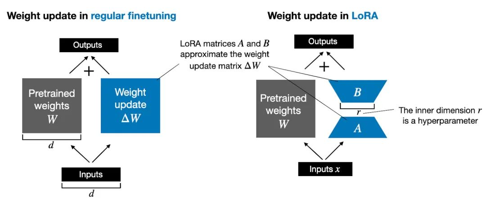

# 后训练\-微调技术与实战

大模型工程化相关技术：https://github\.com/liguodongiot/llm\-action

微调（Fine\-tuning）是在特定任务的小数据集上微调预训练模型以优化性能

*监督式微调\(SFT, Supervised Fine\-Tuning\)*

## PEFT 部分参数高效微调

https://blog\.csdn\.net/2401\_85325557/article/details/145323009?fromshare=blogdetail\&sharetype=blogdetail\&sharerId=145323009\&sharerefer=PC\&sharesource=qq\_51777949\&sharefrom=from\_link

### BitFit

BitFit（论文：BitFit: Simple Parameter\-efficient Fine\-tuning or Transformer\-based Masked Language\-models）是一种稀疏的微调方法，它训练时只更新bias的参数或者部分bias参数。

**核心原理：** **PLM（预训练模型）不变，W（模型的权重）不变，X（模型输入）不变，bias（偏差参数）改变**

### Prompt Tuning

The Power of Scale for Parameter\-Efficient Prompt Tuning

什么是Prompt\-tuning？Prompt\-tuning通过修改输入文本的提示（Prompt）来引导模型生成符合特定任务或情境的输出，而无需对模型的全量参数进行微调。

这种方法利用了预训练语言模型（PLM）在零样本或少样本学习中的强大能力，通过修改输入提示来激活模型内部的相关知识和能力。（冻结模型原始权重）

**核心原理：** **PLM（预训练模型）不变，W（模型的权重）不变，bias（偏差参数）不变，X（模型输入）改变。**

Prompt Tuning 还提出了 Prompt Ensembling，也就是在一个批次（Batch）里同时训练同一个任务的不同 prompt（即采用多种不同方式询问同一个问题），这样相当于训练了不同模型，比模型集成的成本小多了。

### P\-Tuning、P\-TuningV2

1. GPT Understands, Too

P\-Tuning：

将Prompt转换为可以学习的Embedding层，并用MLP\+LSTM的方式来对Prompt Embedding进行一层处理。

P\-TuningV2：

1. P\-Tuning v2: Prompt Tuning Can Be Comparable to Fine\-tuning Universally Across Scales and Tasks

### Prefix Tuning

Prefix\-tuning是Prompt\-tuning的一种变体， 它通过在输入文本前添加一段可学习的“前缀”来指导模型完成任务。

这个前缀与输入序列一起作为注意力机制的输入，从而影响模型对输入序列的理解和表示。 由于前缀是可学习的，它可以在微调过程中根据特定任务进行调整，使得模型能够更好地适应新的领域或任务。

**核心原理：** **PLM（预训练模型）不变，W（模型的权重）不变，bias（偏差参数）不变，X（模型输入）不变，增加W’（前缀嵌入的权重）**

### Adapter Tuning及其变体

Adapter Tuning（论文：Parameter\-Efficient Transfer Learning for NLP），该方法设计了Adapter结构，并将其嵌入Transformer的结构里面，针对每一个Transformer层，增加了两个Adapter结构\(分别是多头注意力的投影之后和第二个feed\-forward层之后\)，在训练时，固定住原来预训练模型的参数不变，只对新增的 Adapter 结构和 Layer Norm 层进行微调，从而保证了训练的高效性。

### LoRA、AdaloRA、QLoRA

LoRA（Low\-Rank Adaptation）通过分解预训练模型中的部分权重矩阵为低秩矩阵，并仅微调这些低秩矩阵的少量参数来适应新任务。

对于预训练权重矩阵W0∈Rd×d𝑊0∈𝑅𝑑×𝑑，LoRa限制了其更新方式，即将全参微调的增量参数矩阵ΔWΔ𝑊表示为两个参数量更小的矩阵A、B，即ΔW = AB。

**核心原理：PLM（预训练模型）不变、W（模型的权重）不变，X（模型输入）不变，分解ΔW（分解为两个低秩矩阵A、B）。**

### IA3

## ReFT强化微调

ReFT（Reinforced Fine\-Tuning，强化微调）：这是SFT和PPO（近端策略优化）的结合。在第一阶段，模型通过 SFT 在有标注的数据上进行训练，建立基本的语言理解和生成能力。第二阶段，引入 PPO 算法，对模型进行强化学习优化。此时，模型的输出由自动化程序进行评估，程序根据预设的规则或标准对模型的输出进行评价，并生成奖励信号。模型根据这些奖励信号，使用 PPO 算法调整自身参数，以产生更优的输出。ReFT 的特点是评估过程自动化，无需人类参与，适用于有明确客观标准的任务，例如数学问题求解。

## PEFT工具

PEFT 是 Huggingface 开源的一个参数高效微调库，它提供了最新的参数高效微调技术，并且可以与 [Transformers](https://zhida.zhihu.com/search?content_id=232961367&content_type=Article&match_order=1&q=Transformers&zhida_source=entity) 和 [Accelerate](https://zhida.zhihu.com/search?content_id=232961367&content_type=Article&match_order=1&q=Accelerate&zhida_source=entity) 进行无缝集成。

## 微调框架unsloth

## Llama Factory

官网： https://llamafactory\.cn/

## 微调实战

https://mp\.weixin\.qq\.com/s/XXSVWRWEtV8ZoAfj6Wo3rQ

## Deepseek微调

【【DeepSeek\+LoRA\+FastAPI】开发人员如何微调大模型并暴露接口给后端调用】 https://www\.bilibili\.com/video/BV1R6P7eVEtd/?share\_source=copy\_web\&vd\_source=c7ce5bedd038c2c410f5e4545cfb2e15

## 手搓all\-\-**模型白盒子构建指南**

https://github\.com/datawhalechina/tiny\-universe

## LLM微调高效数据筛选技术

LLM微调高效数据筛选技术原理\-DEITA

LLM微调高效数据筛选技术原理\-MoDS

LLM微调高效数据筛选技术原理\-IFD

LLM微调高效数据筛选技术原理\-CaR

LESS：仅选择5%有影响力的数据优于全量数据集进行目标指令微调

LESS 实践：用少量的数据进行目标指令微调

