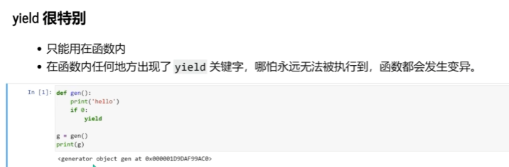
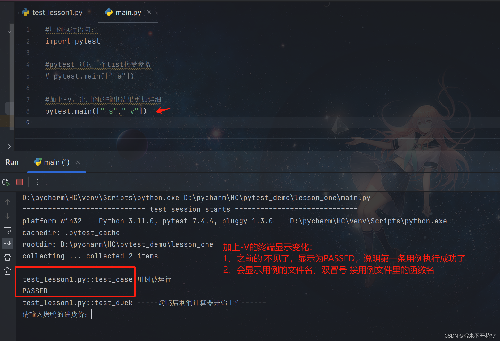
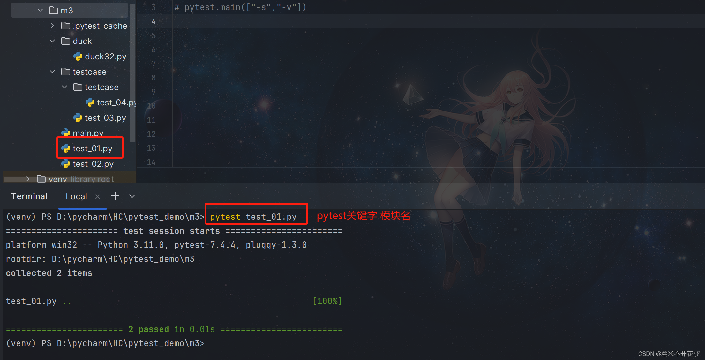
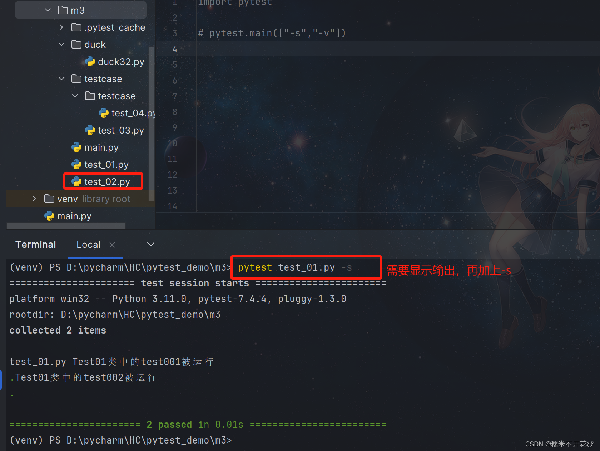
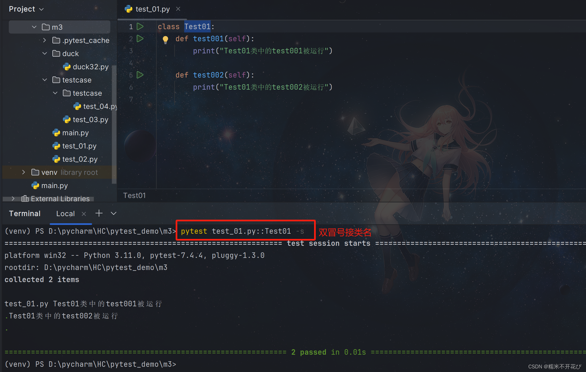
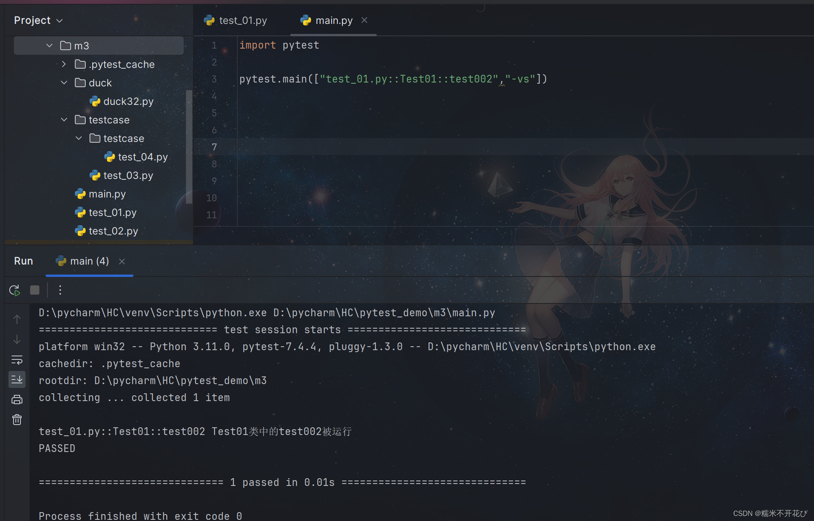
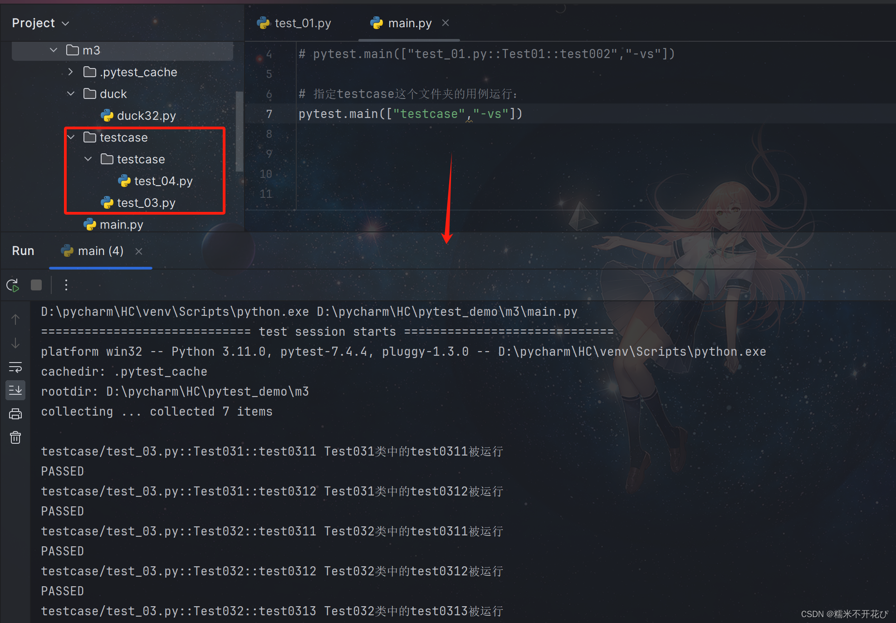
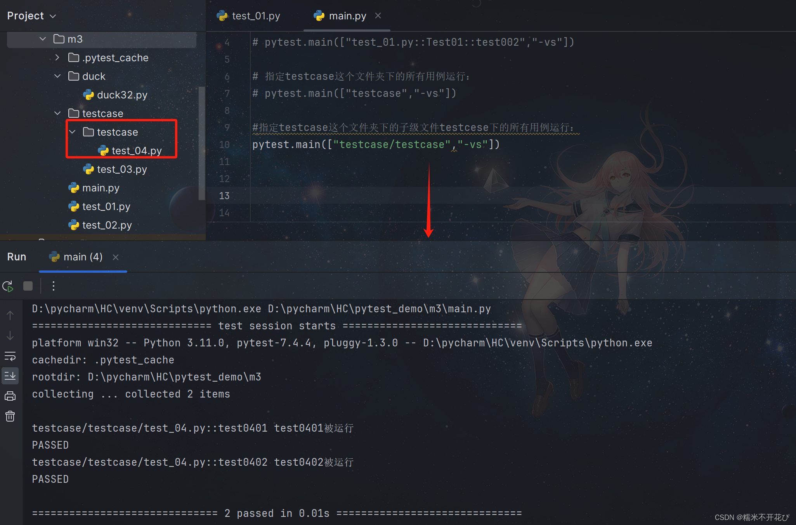
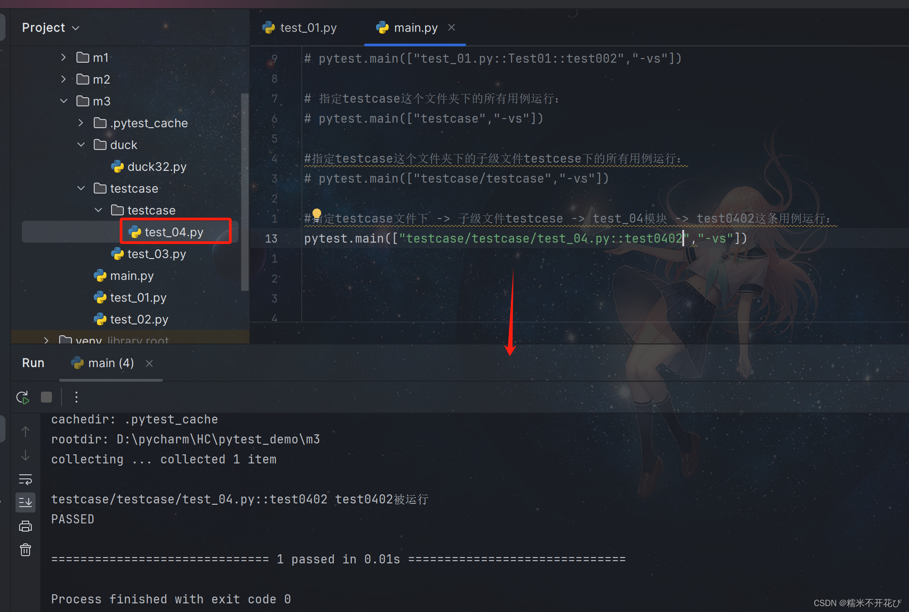

# Python

https://guangzhengli\.com/blog/zh/indie\-hacker\-tech\-stack\-2024/

https://www\.runoob\.com/python/python\-tutorial\.html


# python底层机制

## 字典驱动

在 Python 中，**几乎所有的对象（类、实例、模块、函数）在底层都是一个包裹着 ****`dict`****（哈希表）的容器。**

### 对象、实例的本质：`dict` 属性

在 Java 中，如果你定义一个类 `User` 有 `name` 字段，这个字段在内存中的偏移量是固定的。但在 Python 中，一个实例的属性是存储在一个名为 `dict` 的字典里的。

```Plain Text
class User:def __init__(self, name):
        self.name = name

u = User("Alice")
print(u.__dict__)  # 输出: {'name': 'Alice'}# 你甚至可以动态地往字典里塞东西
u.age = 25
print(u.__dict__)  # 输出: {'name': 'Alice', 'age': 25}
```

**底层逻辑**：当你调用 `u.name` 时，Python 实际上是在执行 `u.dict['name']`。

- **Java 视角**：这相当于每一个 Java 对象内部都自动维护了一个 `HashMap<String, Object>` 来存成员变量。

---

### 命名空间的本质：层级化的字典

Python 寻找变量的过程，本质上是在**一组字典**中进行哈希查找。这被称为 **LEGB 规则**。

1. **L \(Local\)**: 函数内部的局部变量字典。

2. **E \(Enclosing\)**: 闭包环境的字典。

3. **G \(Global\)**: 当前模块（文件）的字典。

4. **B \(Built\-in\)**: Python 内置符号的字典。

这就是为什么你开头给出的代码中 `print = log_print` 能生效：

- 你在 **Global 字典**中插入了一个 Key 为 `"print"`，Value 为 `log_print` 函数对象的条目。

- 当代码后续调用 `print()` 时，Python 先查 Global 字典，找到了你的版本，于是**屏蔽**了 Built\-in 字典里的原始版本。

---

### 类与继承的本质：字典的链式查找

在 Python 中，**类本身也是一个对象**，它也有自己的 `dict`，用来存储类变量和方法。

### 方法调用是怎么发生的？

当你调用 `u.say_hello()` 时：

1. 先在实例 `u.dict` 里找（通常找不着方法，只找得着属性）。

2. 去 `User.dict`（类字典）里找。

3. 如果没找到，去父类的 `dict` 里找（按照 MRO 顺序）。

## 内存模型：一切皆对象（PyObject）

在 Python 的 C 实现（CPython）中，所有的东西——无论是整数、字符串还是函数——本质上都是一个 `PyObject` 结构体。

### 函数在内存中是什么？

当你定义 `def log_print(): ...` 时，Python 解释器会在堆内存中创建一个类型为 `PyFunctionObject` 的对象。

- **Java 视角**：方法是字节码中的一段指令映射。

- **Python 视角**：函数是一个**实例化的对象**，就像你在 Java 里 `new` 出来的 `HashMap` 一样。它有自己的内存地址，有属性（比如 `name`），甚至可以动态添加属性。


## **可变对象（Mutable）** 和 **不可变对象（Immutable）**

### dict 或者 `list` 或自定义`对象`（可变对象）放进list或者dict在

因为 `list` 和自定义对象都是**可变对象**，如果你把它们赋值给多个变量或放入列表，大家都指向同一个地址。一旦你通过某个变量修改了它内部的值，所有人都会看到变化。

```Python
# 1. 放入一个新的 list
original_list = [1, 2, 3]
container = []
container.append(original_list)  # 复制了 original_list 的地址

# 2. 修改 original_list
original_list.append(4)

print(container)  # 输出: [[1, 2, 3, 4]] -> 容器里的 list 跟着变了！
```

### 如果放进去的是一个普通“变量”（如数字、字符串、元组）

这里是最容易让人产生误解的地方。像数字（`int`）、字符串（`str`）、元组（`tuple`）属于**不可变对象**。它们在赋值时**同样是复制地址**，但因为它们“不可变”，一旦你想修改它，Python 会直接在内存中**创建一个新对象**，并将变量指向这个新对象的地址。

这就导致表面上看它们好像是“值传递”，但底层依然是“地址引用”。

```Python
name = "Claude"
user_list = [name]  # user_list[0] 现在指向 "Claude" 的内存地址

name = "Opus"       
# 注意：这并不是把 "Claude" 改成了 "Opus"！
# 而是创建了一个新的字符串 "Opus"，并让 name 变量指向它
```

### 深拷贝`copy.deepcopy()`

在 Python 中，如果你希望彻底断开新旧对象之间的内存联系，让后续的任何修改都**完全不影响**原对象，你就需要使用**深拷贝（Deep Copy）**。

Python 提供了一个内置的工具库 `copy`，专门用来处理拷贝问题。


对于复杂的嵌套列表、字典或者自定义对象，最标准、最安全的方法就是使用 `copy.deepcopy()`。它会递归地复制对象内部的所有层级，在内存中完全克隆出一份全新的实体。

```Python
import copy

# 1. 原始的嵌套列表（类似于你之前处理的 messages）
original_messages = [
    {"role": "user", "content": ["这是原始数据"]}
]

# 2. 执行深拷贝
new_messages = copy.deepcopy(original_messages)

# 3. 修改新列表内部深层嵌套的字典
new_messages[0]["content"][0] = "我已经把数据改掉了！"# 4. 验证结果
print("新列表:", new_messages)
print("原列表:", original_messages)
```

**输出结果：**

> **新列表:** `[{'role': 'user', 'content': ['我已经把数据改掉了！']}]`
> 
> **原列表:** `[{'role': 'user', 'content': ['这是原始数据']}]`  ← *完好无损！*
> 
> 


# Main函数

## 入口

```Python
*if* __name__ == "__main__":
    parser = argparse.ArgumentParser(*description*='IMO Problem Solver Agent (SDK Version)')
    parser.add_argument('problem_file', *nargs*='?', *default*='problem_statement.txt', 
                       *help*='Path to the problem statement file (default: problem_statement.txt)')
    parser.add_argument('--log', '-l', *type*=str, *help*='Path to log file (optional)')
    parser.add_argument('--other_prompts', '-o', *type*=str, *help*='Comma-separated other prompts (optional)')
    parser.add_argument("--max_runs", '-m', *type*=int, *default*=10, *help*='Maximum number of runs (default: 10)')
    
    args = parser.parse_args()

    max_runs = args.max_runs
    
    other_prompts = []
    *if* args.other_prompts:
        other_prompts = args.other_prompts.split(',')

    print(">>>>>>> Other prompts:")
    print(other_prompts)
```

## Arguments模块

`argparse` 是 Python 标准库中处理命令行参数的利器，相当于 Java 中的 `JCommander` 或 `Commons CLI`。

**实例化解析器**

```Plain Text
parser = argparse.ArgumentParser(description='...')
```

- 定义一个解析器对象，`description` 用于在用户输入 `-h` 或 `--help` 时显示的帮助文本。

这段代码展示了四种不同的参数定义方式：

1. **位置参数 \(Positional Argument\)**:

    ```Plain Text
    parser.add_argument('problem_file', nargs='?', default='...')
    ```

    - 没有 `--` 前缀。

    - **`nargs='?'`**：表示该参数是可选的（0 个或 1 个）。

    - **`default`**：如果用户没传，就用这个默认值。

2. **可选参数 \+ 指定类型 \(Typed Argument\)**:

    ```Plain Text
    parser.add_argument("--max_runs", '-m', type=int, default=10)
    ```

    - `--` 前缀。意味参数可选

    - **`type=int`**：`argparse` 会自动尝试将输入字符串转换为 `int`。如果用户输入了非数字，会直接报错并显示帮助信息。

# 一些关键字

### Glogal

3. https://blog\.csdn\.net/2401\_86544677/article/details/145049019


### 无穷大和无穷小

无穷大： res = float\("inf"\)

无穷小： float\("\-inf"\)

或者引入math包

```Python
import math  
res = math.inf   # 正无穷 
res = -math.inf  # 负无穷
```

# 数据结构与使用

变量的类型无需显示声明


## 无基础数据类型

在 Java 中，`int a = 5;` 占用 4 字节栈空间。 在 Python 中，`a = 5` 实际上是：

- 创建一个 `PyLongObject` 对象，存放在堆上。

- `a` 是一个引用，指向这个对象。 由于 Python 对小整数（\-5 到 256）进行了\*\***对象池**（Integer Interning）\*\*缓存，所以性能损失被降到了最低。

## str字符串

### 普通用法

https://zhuanlan\.zhihu\.com/p/662644470

```python
创建字符串有4种方式 ，示例如下：

str1 = 'This is a string. We built it with single quotes.'
str2 = "This is also a string, but built with double quotes."
str3 = '''This is built using triple quotes,
so it can span multiple lines.'''
str4 = """This too is 
a multiline onebuilt 
with triple double-quotes."""
print(f'1、{str1}')
print(f'2、{str2}')
print(f'3、{str3}')
```


### 字符串和字符转化\-根据下标

```Python
text = "Python"  
print(text[0])  # 输出: P (第 1 个字符)
```


### 字符串拼接

#### 使用加号 `+` （最简单直观）

这是最基础的拼接方式，直接用数学里的加号把两个字符串连起来。

Python

```Plain Text
str1 = "Hello"
str2 = "World"# 直接拼接
result = str1 + str2
print(result)  # 输出: HelloWorld# 如果中间需要加空格，可以这样写：
result_with_space = str1 + " " + str2
print(result_with_space)  # 输出: Hello World
```

*适用场景：少量简单的字符串拼接。*

#### 使用 f\-string （最推荐，最优雅）

从 Python 3\.6 开始引入的 f\-string 是目前**最受推崇**的字符串格式化和拼接方式。只需要在字符串前面加一个 `f`，然后把变量用大括号 `{}` 括起来放进去即可。

Python

```Plain Text
str1 = "Hello"
str2 = "World"# 把变量直接嵌在字符串里
result = f"{str1}{str2}"
print(result)  # 输出: HelloWorld# 加上空格和标点符号非常自然
result2 = f"{str1}, {str2}!"
print(result2)  # 输出: Hello, World!
```

*适用场景：绝大多数情况，特别是需要把变量和固定文本混排时。可读性极强！*

#### 使用 `join()` 方法 （适合拼接多个/列表中的字符串）

如果你有一个列表，里面装了多个字符串，想要把它们拼接成一个完整的字符串，使用 `.join()` 是性能最好、最专业的做法。

Python

```Plain Text
words = ["Python", "is", "awesome"]

# 语法："连接符".join(列表)# 用空格把它们拼起来
result = " ".join(words)
print(result)  # 输出: Python is awesome# 无缝拼接（连接符为空字符串）
result2 = "".join(words)
print(result2)  # 输出: Pythonisawesome# 用逗号拼接
result3 = ",".join([str1, str2]) # 输出: Hello,World
```

*适用场景：需要把列表或元组里的多个字符串合并为一个字符串时。*

#### 使用 `.format()` 方法 （老版本 Python 的常用写法）

在 f\-string 出现之前，这是最常用的格式化拼接方法。它的原理是使用 `{}` 作为占位符。

Python

```Plain Text
str1 = "Hello"
str2 = "World"

result = "{} {}".format(str1, str2)
print(result)  # 输出: Hello World
```

*适用场景：维护较老的 Python 代码时可能会经常看到。*


### 字符串取子串\-\-它会生成一个**全新的字符串对象**（除非你切的是完整的它自己）

`string[start:stop:step]`

- **`start`**** \(起始位置\)**：切片开始的索引（**包含**该位置的字符）。如果不写，默认从 0 开始。

- **`stop`**** \(结束位置\)**：切片结束的索引（**不包含**该位置的字符，即取到 `stop-1` 为止）。如果不写，默认取到字符串末尾。

- **`step`**** \(步长\)**：每次取字符的跨度。

### join函数

```Plain Text
memory_lines = ["用户问了天气", "机器人回答了晴天", "用户说了谢谢"]
```

```Plain Text
memory_context = "\n".join(memory_lines)
```

**变量 ****`memory_context`**** 的结果会变成一个单一的字符串：**

```Plain Text
用户问了天气
机器人回答了晴天
用户说了谢谢
```

---

**为什么这么做**

在开发 AI 或聊天机器人（Context Window 管理）时，这个操作非常常见：

1. **从列表到文本**：程序通常用列表（List）来动态存储每一句对话，因为列表方便添加（`append`）数据。

2. **送入模型解析**：大模型（如 Gemini）通常接收的是一段连续的**长文本**（String），而不是列表。

3. **格式化**：通过 `"\n".join()`，你把零散的对话记录转换成了模型能够理解的、带格式的“上下文段落”。

**常见变体**

你可以根据需要更换分隔符：

- **空格连接**：`" ".join(words)` —— 将单词连成句子。

- **逗号连接**：`",".join(tags)` —— 生成 CSV 格式或标签列表。

- **双换行连接**：`"\n\n".join(paragraphs)` —— 在段落之间留出空行

### f\-string 格式化

```Python
user_prompt = f"Input:\n{parsed_messages}"
```

`f"..."`：表示这是一个格式化字符串。

`{parsed_messages}`：这是一个占位符。Python 会把变量 `parsed_messages` 的实际内容填入到这个位置。

`\n`：代表换行。

### json操作

1. **序列化，将list/dict转为json==》json\.dumps**

    1. 在 Python 中，我们经常处理字典（dict），但如果你想把这些数据发送给网页前端、写入文本文件或者通过 API 传输，你就需要把它变成标准化的 JSON 字符串。

    ```Python
    
    import json
    
    # 这是一个 Python 字典
    data = {
        "name": "张三",
        "age": 25,
        "is_student": False
    }
    
    # 使用 dumps 将其转换为 JSON 字符串
    json_string = json.dumps(data, ensure_ascii=False)
    
    print(json_string)
    # 输出: {"name": "张三", "age": 25, "is_student": false}
    ```


### match 匹配符

skill文本

```YAML
---
name: "translation"
tags: "tool"
---
这里是正文第一行
这里是正文第二行
```

```Python
import re

def _parse_frontmatter(self, text: str) -> tuple:
    """
    Parse YAML frontmatter between --- delimiters.
    经过这个函数解析后，会切分成两部分：
    meta: {"name": "translation", "description": "...", "tags": "..."}
    body: "这里是技能的具体 prompt 或执行步骤..."
    """
    match = re.match(r"^---\n(.*?)\n---\n(.*)", text, re.DOTALL)
    if not match:
        return {}, text
    try:
        meta = yaml.safe_load(match.group(1)) or {}
    except yaml.YAMLError:
        meta = {}
    return meta, match.group(2).strip()
```

`^`：**匹配字符串的开头**。这确保了 `---` 必须是整个文件的绝对开头，前面不能有任何空格或空行。

`---\n`：**字面匹配**。匹配三个减号 `---` 以及紧跟其后的一个换行符 `\n`。这通常是 Markdown 中 Frontmatter 的起始分界线。

`(.*?)`：**第 1 个捕获组（括号的作用）**。

- `.` 代表匹配除换行符外的任意字符。

- `*` 代表匹配 0 次或多次。

- `?` 代表**非贪婪模式（Lazy Match）**。这意味着它在遇到下一个 `---` 时会**立即停止**，而不是一路匹配到文件末尾。这里抓取的就是 `YAML` 配置内容。

`\n---\n`：**字面匹配**。匹配结束的分界线，即一个换行、三个减号、再一个换行。

`(.*)`：**第 2 个捕获组**。抓取剩下的所有内容，也就是 Markdown 的正式文本。

`re.DOTALL` 标志

在默认情况下，正则表达式中的点号 `.` 是**不能**匹配换行符 `\n` 的。

但是，元数据和正文通常都包含很多行。因此，这里传入了第三个参数 `re.DOTALL`（也可以写作 `re.S`）。

> **`re.DOTALL`**** 的作用是：** 让点号 `.` 可以匹配包括换行符 `\n` 在内的**任意字符**。 没有这个参数，这个正则表达式在处理多行文本时就会直接失效（返回 `None`）。
> 
> 

**结果**

**`match.group(0)`**：代表整个匹配到的完整字符串（包含那两组 `---`）。

**`match.group(1)`**：对应第一个括号 `(.*?)`，切出的内容是：name: "translation"tags: "tool"

**`match.group(2)`**：对应第二个括号 `(.*)`，切出的内容是：

这里是正文第一行
这里是正文第二行

### \.strip\(\)

`strip()` 是一个内置的字符串（`str`）方法，它的核心作用是：**移除字符串开头（左边）和结尾（右边）的空白字符。**

如果不给 `.strip()` 传入任何参数，它会默认移除字符串两端的所有“空白字符”，这包括：

- 空格 ` `

- 换行符 `\n`

- 制表符 `\t`

- 回车符 `\r`

```Python
text = " \n\t  Hello World!   \n "
result = text.strip()

print(f"原字符串: {repr(text)}")
print(f"处理之后: {repr(result)}")
```

```Plain Text
原字符串: ' \n\t  Hello World!   \n '
处理之后: 'Hello World!'
```

如果你只想清理某一边，Python 还提供了两个亲兄弟方法：

- **`.lstrip()`**（Left strip）：只移除**左边**（开头）的空白/指定字符。

- **`.rstrip()`**（Right strip）：只移除**右边**（结尾）的空白/指定字符。

## list \[\]

它可以同时存储不同类型：`my_list = [1, "Hello", [1, 2]]`。

它支持极其强大的\*\*切片（Slicing）\*\*操作：`my_list[1:3]`。

**底层实现**：连续的指针数组，扩容策略比 Java 更激进，以减少 `realloc` 的次数。

### list定义

```python
#定义
list1 = []
list1 = ['physics', 'chemistry', 1997, 2000]
list2 = [1, 2, 3, 4, 5 ]
list3 = ["a", "b", "c", "d"]
**# 初始化一段固定长度的list**
maxLeftList = [0]*len(height)
```

### 增

```Python
#增
list1.append("sad")
```

### 删

```Python
#删除最后一个元素
list2.pop()
#删
del list1[2]
**清空列表**：nums[:] = []。
```

### 改

#### 修改单个值

通过索引直接访问并赋值。Python 的索引从 `0` 开始。

Python

```Plain Text
nums = [10, 20, 30, 40]

# 将索引为 1 的元素（20）改为 99
nums[1] = 99

print(nums)  # 输出: [10, 99, 30, 40]
```

> **注意**：如果你访问了不存在的索引（如 `nums[10] = 1`），会抛出 `IndexError`。
> 
> 

---

#### 修改一组值（切片赋值）

这是 Python 比 Java 灵活的地方。你可以直接替换列表中的一个片段。

```Plain Text
nums = [1, 2, 3, 4, 5]

# 将索引 1 到 3（不含 3）的元素替换
nums[1:3] = [22, 33]

print(nums)  # 输出: [1, 22, 33, 4, 5]
```

**切片赋值的高级用法：**

- **长度可以不等**：替换进去的列表长度不一定要和原切片长度一致，列表会自动伸缩。

```Plain Text
nums = [1, 2, 3, 4]
nums[1:3] = [9, 8, 7, 6] # 把 [2, 3] 替换成了 [9, 8, 7, 6]
print(nums) # [1, 9, 8, 7, 6, 4]
```

### 查

```python
# 直接通过序号读取
list1[2]

# 切片方式读取 [start_index : endIndex : step]
list2[1:5]
list3[:-1]
list4[1:]
list5[:]

# list的长度
len(list1)
```

### 切片（浅拷贝）==》利用浅拷贝可以实现先筛选对象，再处理

**obj\[start:stop:step\]**


### 遍历

在 Python 中遍历列表（List）非常灵活。作为 Java 选手，你可以对比着 Java 的 `for-i`、`foreach` 和 `Iterator` 来快速掌握 Python 的写法。

---

#### 直接遍历元素 \(最常用\)

等同于 Java 的 `for (int num : nums)`。当你**不需要索引**时，这是首选。

```Plain Text
nums = [10, 20, 30]
for x in nums:
    print(x)
```

#### 带有索引的遍历 \(枚举\)

这是 Python 最优雅的写法。Java 选手经常习惯用索引去取值，但在 Python 中，如果你**既要索引又要值**，请使用 `enumerate()`。

```Plain Text
nums = [10, 20, 30]
for i, val in enumerate(nums):
    print(f"索引: {i}, 数值: {val}")
```

- `i` 接收索引，`val` 接收对应的值。

- 你可以通过 `enumerate(nums, 1)` 让索引从 1 开始计数。

#### 通过索引遍历 \(下标访问\)

等同于 Java 的 `for (int i = 0; i < nums.length; i++)`。

```Plain Text
nums = [10, 20, 30]
for i in range(len(nums)):
    print(nums[i])
```

- `range(len(nums))` 生成一个从 `0` 到 `n-1` 的序列。

#### 反向遍历 \(Reverse\)

在 LeetCode 题目中（如“回文链表”或“倒序处理数组”），经常需要从后往前遍历。

```Plain Text
nums = [10, 20, 30]

# 方式 A：使用 reversed() —— 不改变原列表，最推荐for x in reversed(nums):
    print(x)

# 方式 B：使用切片 —— 会产生一个新列表副本for x in nums[::-1]:
    print(x)

# 方式 C：通过索引倒序for i in range(len(nums) - 1, -1, -1):
    print(nums[i])
```

#### 同时遍历两个列表 \(Zip\)

如果你有两个长度相同的列表（例如 `names` 和 `scores`），想同时取出对应位置的元素：

```Plain Text
names = ["Alice", "Bob"]
scores = [95, 88]

for name, score in zip(names, scores):
    print(f"{name}: {score}")
```

### 排序

对列表（List）进行排序有**两种**最主流、最核心的方法：列表自带的 **`list.sort()`** 方法，以及 Python 的内置函数 **`sorted()`**。

它们的作用都是排序，但有一个非常关键的区别：**是否改变原数据。**

---

#### 方法一：`list.sort()` —— “就地重排”（改变原列表）

这是列表专属的方法。它会直接在你原来的那个列表内部进行重新排列。

- **特点**：效率高（节省内存），因为不需要创建新列表。

- **⚠️ 致命易错点**：它是在原地操作的，**没有返回值（严格来说返回的是 ****`None`****）**。所以千万不要把它赋值给新变量！

Python

```Plain Text
numbers = [5, 2, 9, 1, 5]

# 正确用法：直接调用，原列表被改变
numbers.sort()
print(numbers)  
# 输出: [1, 2, 5, 5, 9]# ❌ 错误用法：不要这么做！# wrong_list = numbers.sort()  -> wrong_list 会变成 None
```

---

#### 方法二：`sorted()` —— “复印后重排”（生成新列表）

这是 Python 的内置高阶函数。它会先把你给它的数据“复印”一份，然后对复印件进行排序，最后把排好序的**新列表**交给你。

- **特点**：安全，不会破坏你原来的数据。而且它不仅能排列表，还能排元组、字符串、字典等所有可迭代对象。

- **用法**：需要拿一个变量去接收它的返回值。

```Python
numbers = [5, 2, 9, 1, 5]

# 生成一个全新的排好序的列表，存入 sorted_numbers
sorted_numbers = sorted(numbers)

print(sorted_numbers) # 输出: [1, 2, 5, 5, 9] (新列表)
print(numbers)        # 输出: [5, 2, 9, 1, 5] (原列表毫发无损)
```

---

#### 自定义排序规则（`key` 和 `reverse`）

无论是 `list.sort()` 还是 `sorted()`，都支持两个非常强大的可选参数：`reverse` 和 `key`。

##### 倒序排列 \(`reverse=True`\)

默认情况下，排序都是升序（从小到大 / 从 A 到 Z）。如果你想降序（从大到小），只需要加上 `reverse=True`。

```Python
letters = ['c', 'a', 'd', 'b']

# 降序排列
letters.sort(reverse=True)
print(letters)  
# 输出: ['d', 'c', 'b', 'a']
```

##### 自定义排序标准 \(`key` 参数 \+ 你的老朋友 `lambda`\)，注意这里的key是函数名

这是排序里最核心的高级技巧。默认情况下，Python 只看元素本身的大小。但如果你想按照**特定规则**排序呢？ `key` 参数接收一个**函数**，Python 会在排序前，把列表里的每个元素都扔进这个函数里“评估”一下，然后**根据评估出来的结果进行排序**。

**场景 A：按照字符串的长度排序（使用内置函数 ****`len`****）**

```Python
words = ["apple", "pie", "banana", "kiwi"]

# 告诉 Python：不要按字母表排，请按单词的长度 (len) 排
sorted_words = sorted(words, key=len)

print(sorted_words)  
# 输出: ['pie', 'kiwi', 'apple', 'banana']
```

## Tuple\(\) \-list的进阶

- **不可变性**：一旦创建，不能增删改（底层内存分配后固定）。

- **可哈希**：正因为不可变，它可以作为 `dict` 的 Key。

- **性能**：比 `list` 更轻量

### 定义和查

```Python
# 1. 定义 (使用圆括号)
point = (10, 20)
user_info = ("Alice", 25, "Engineer")

# 2. 访问 (通过下标)
print(point[0]) # 10


# 4. 只有 1 个元素的元组 (必须加逗号，否则会被当作括号运算符)
single = (1,) 
```

### 拆包Unpacking

1. **对象属性**

    ```Python
    name, age, job = user_info
    print(f"Name: {name}, Age: {age}")
    ```

2. **遍历的过程中拆包**

    ```Python
    to_clear = [(id1, part1),(id2, part2)]
    for _, _, result in to_clear:
       tool_id = result.get("tool_use_id", "")
       
    #下划线 _ 是一个约定的变量名，用来表示“虽然这里有一个值，但我根本不需要用到它，把它忽略掉
    ```

### 理解元组的不可变性

元组的“不可变”，指的是元组内部符号（指针）的“指向”不能变，而不是它指向的“内容”不能变。

当我们执行 `tool_results.append((msg_idx, part_idx, part))` 时，Python 在内存中创建了一个元组。

这个元组有三个位置（格口）：

- 第 0 个格口：装的是整数 `msg_idx`（比如 `2`）

- 第 1 个格口：装的是整数 `part_idx`（比如 `0`）

- 第 2 个格口：装的是变量 `part` —— 也就是**那个工具结果字典的内存地址（指针）**。


元组的不可变性，意思是**这个元组一旦创建，这三个格口里装的“地址”就死死锁定了，不能换成别的地址**。

- ❌ **不允许的操作**：你想把第 2 个格口里的地址，换成另一个新字典的地址。或者想把第 0 个格口里的 `2` 改成 `3`。如果你尝试 `tup[2] = {}`，Python 会直接暴怒并报错：`TypeError: 'tuple' object does not support item assignment`。

- 🟢 **允许的操作（就地修改）**：虽然你不能把第 2 个格口的“地址”抠出来换掉，但你**可以顺着这个地址，摸到堆内存里的那台“字典实体机”，然后修改这台机器内部的零件（Key\-Value）**。

因为元组只管住自己的格口里装的是哪个地址，至于那个地址上的字典自己怎么折腾，元组根本管不着，也阻挡不了。


## 字典dict\{\}

### 原理

#### 特点

- **键值对**：Key 必须是不可变类型（str, int, tuple）。

- **有序性**：Python 3\.7\+ 默认保留插入顺序。

---

#### 底层结构

在传统的哈希表（如 Java 8 之前的 `HashMap` 或旧版 Python）中，哈希表是一个巨大的数组，每个槽位（Bucket）直接存储 Key\-Value 对。如果哈希表很空，会浪费大量内存。

现代 Python（3\.6\+）引入了 **“紧凑字典”（Compact Dict）** 概念，将内存拆分为两个数组：

1. **Indices Array（索引数组）**：一个存储整数的小数组，充当哈希表。

2. **Entries Array（实体数组）**：一个紧凑的数组，按插入顺序存储具体的 `hash`, `key`, `value`。

#### 工作流程：

当你要查找 `d["name"]` 时：

1. 计算 `"name"` 的哈希值。

2. 通过 `hash & (mask)` 找到 **Indices Array** 中的下标。

3. 取出该下标对应的值（比如 `2`）。

4. 去 **Entries Array** 的索引 `2` 位置直接获取数据。

**Java 对比**：Java `HashMap` 使用 Node 数组 \+ 链表/红黑树。Python 通过维护 `Entries` 数组的顺序，不仅节省了内存（不存储空槽的 KV 指针），还顺带实现了 **Preserve Insertion Order（保留插入顺序）**。

```python
>>> tinydict = {'a': 1, 'b': 2, 'b': '3'}
>>> tinydict['b']
'3'
>>> tinydict
{'a': 1, 'b': '3'}
```

### 用法

#### 定义

```Python
# 1. 定义 (使用花括号和冒号)
scores = {"Math": 95, "English": 88}
```

#### 查

```Python
# 3. 安全访问 (类似 Java 的 Optional 或 getOrDefault)
# 直接用 scores["History"] 如果不存在会报 KeyError
history = scores.get("History", 0) # 找不到返回默认值 0

# 判断dict中是否有对应的key， 用in来判断，时间复杂度为0
my_dict = {"name": "Alice", "age": 25}

if "name" in my_dict:
    print("key 'name' 存在！")
else:
    print("key 'name' 不存在！")

# 也可以用来判断不存在
if "gender" not in my_dict:
    print("key 'gender' 不存在！")
```

#### 增、改

```Python
# 2. 访问与修改
scores["Math"] = 98        # 修改
scores["Science"] = 90     # 新增
```

#### 删

pop\(key, default\) —— 最安全、最常用的方法，删除一个key并返回这个key对应的val，如果这个key不存在，则返回默认的default值

```Python
my_dict = {'a': 1, 'b': 2, 'c': 3}  
# 删除键 'b' 并获取它的值 
val = my_dict.pop('b')  
print(val)      
# 输出: 2 
print(my_dict)  
# 输出: {'a': 1, 'c': 3}
# 安全删除不存在的键 'x'，不会报错 
my_dict.pop('x', None) 

# 直接使用del有风险，如果删除一个不存在的key会报错    
del tinydict['Name']  # 删除键是'Name'的条目
tinydict.clear()      # 清空字典所有条目
del tinydict          # 删除字典
```


#### 遍历

**遍历key**

```Python
for key in user_info:     
    print(key)
```

**遍历value**

```Python
for value in user_info.values():     
    print(value)
```

**同时遍历**

```Python
for key, value in scores.items():
    print(f"Subject: {key}, Score: {value}")
```

#### 排序

使用 Python 内置的 `sorted()` 函数对字典的键值对（`.items()`）进行排序，然后再将其转换回字典。

这里有几种最常见的字典排序场景：

我们先定义一个示例字典，记录学生的成绩：

Python

```Plain Text
scores = {'Bob': 75, 'Alice': 92, 'Charlie': 88, 'David': 60}
```

##### 按“键 \(Key\)”排序

如果你想按字母顺序对字典的键进行排序，可以直接对 `.items()` 使用 `sorted()`，因为默认情况下它会根据元组的第一个元素（即键）进行排序

```Python
# 默认按键（名字）升序排序
sorted_by_key = dict(sorted(scores.items()))

print(sorted_by_key)
# 输出: {'Alice': 92, 'Bob': 75, 'Charlie': 88, 'David': 60}
```

##### 按“值 \(Value\)”排序（最常用）

如果想根据字典里的值（比如分数高低）进行排序，需要用到 `sorted()` 函数的 `key` 参数，配合匿名函数 `lambda`。

Python

```Python
# 按值（分数）升序排序 (从小到大)# item[1] 代表取键值对元组中的第二个元素，即 value
sorted_by_value = dict(sorted(scores.items(), key=lambda item: item[1]))

print(sorted_by_value)
# 输出: {'David': 60, 'Bob': 75, 'Charlie': 88, 'Alice': 92}
```

##### 降序排序 \(从大到小\)

无论是按键还是按值排序，只要加上 `reverse=True` 参数，就可以实现降序排序。

```Python
# 按值（分数）降序排序 (从高到低)
sorted_desc = dict(sorted(scores.items(), key=lambda item: item[1], reverse=True))

print(sorted_desc)
# 输出: {'Alice': 92, 'Charlie': 88, 'Bob': 75, 'David': 60}
```


#### 获取keys或者values转为list

```Python
# 准备一个字典（Map）
my_map = {"name": "Alice", "age": 25, "city": "Beijing"}

# 提取所有的 key或者values
key_list = list(my_map.keys())
value_list = list(my_maps.values())

print(key_list)
# 输出: ['name', 'age', 'city']
```


### 高阶包装类collections

set不用判断 Map 里面是否有这个 key，直接 set 就行，不会报错

Get 的时候也不用判断 map 里面是否有这个 key，直接 get 他就行，也不会报错

```Python
mp = collections.defaultdict(list)
```

当你把 Python 的内置类（如 `list`, `int`, `set`）作为参数传进去时，`defaultdict` 在遇到新键时，会直接调用这个类来生成默认值。


## Set\{\}

- **唯一性**：自动去重。

- **无序性**：元素没有下标。

- **集合运算**：原生支持交、并、差集。

```Python
# 1. 定义 (使用花括号)
fruits = {"apple", "banana", "orange"}
# 注意：空集合必须用 set()，因为 {} 是空字典
empty_set = set()

# 2. 快速去重
ids = [1, 2, 2, 3, 4, 4, 4]
unique_ids = set(ids) # {1, 2, 3, 4}

# 3. 集合运算 (Java 需要调用多个方法，Python 只需符号)
a = {1, 2, 3}
b = {3, 4, 5}

print(a | b)  # 并集 (Union): {1, 2, 3, 4, 5}
print(a & b)  # 交集 (Intersection): {3}
print(a - b)  # 差集 (Difference): {1, 2}
```


## None

Java 的 `null` 是一个特殊的关键字。Python 的 `None` 是一个**真实的单例对象**（属于 `NoneType` 类）。

- **检查是否为空的惯用法是 ****`if x is None:`**** 而不是 ****`if x == None:`****。**


# 函数方法

## 定义

1. **指定参数：**

    ```Python
    def function_name(parameter1, parameter2):
        # 这里是缩进代码块（没有花括号！）
        return value  
       
    ```

    

2. **类型提醒**

    1. **严格模式：指定输入和输出的数据类型**

    ```Python
    def square(number: int) -> int:
        return number*number
        
     注意：这里用到了python的类型提醒，表示该函数的输入为int型，输出也为int型
    ```

    ```Python
    def call_gemini_api(
        system_instruction: str | None,
        contents: list,
        verbose: bool = True
    ) -> str | None:
        #XX 函数内容
    ```

**`def`**: 关键字，相当于 Java 的 `public static`（在模块级别定义时）。

**`system_instruction: str | None`**: 参数类型注解。`str | None` 是 Python 3\.10\+ 的语法，相当于 Java 的 `String`（但显式标注了可以是 `null`）。

**`verbose: bool = True`**: **默认参数**。调用时如果不传这个参数，它默认为 `True`。这在 Java 中通常需要通过方法重载（Overloading）来实现。

**`-> str | None`**: 返回值注解。说明该函数要么返回字符串，要么返回 `None` \(Java 的 `null`\)。

## **可变参数函数定义**

**位置可变参数**（`*args`）和**关键字可变参数**（`**kwargs`）。

### \*args

```Python
***args**：对应 Java 的可变参数 String... args，
        *args 会将所有“按顺序传入”的多余参数打包成一个 **Tuple（元组）**

def sum_all(*numbers):
    # numbers 在这里是一个元组，比如 (1, 2, 3)
    total = 0
    for n in numbers:
        total += n
    return total

print(sum_all(1, 2, 3, 4)) # 输出 10

```

### \*\*kwargs

```Python
****kwargs**：Java 没有直接对应物，它接收**键值对（Named Arguments）**，它
            会将所有“带名字传入”的参数打包成一个 **Dict（字典）**

def print_info(**info):
    # info 在这里是一个字典，比如 {"name": "Alice", "age": 25}
    for key, value in info.items():
        print(f"{key} == {value}")

print_info(name="Alice", age=25, job="Manager")
```

### 同时使用

它使用了 **“完全透传（Full Forwarding）”** 模式。

由于它不知道原生的 `print` 函数到底会被怎么调用（可能有人传 `print("a", "b")`，也可能有人传 `print("a", end="")`），通过同时接收 `*args`（捕获内容）和 `**kwargs`（捕获配置如 `end`, `file`, `sep`），它实现了对原生 `print` 接口的 **100% 完美模拟**。

```Python
def log_print(*args, **kwargs):
    original_print(*args, **kwargs)
    # ... 后续逻辑
```


### 参数解包（Unpacking）：逆向操作

这是 Python 最骚的操作。如果你手里已经有一个 List 或 Dict，你可以用 `*` 或 `**` 将它们“打散”传给函数。

```Plain Text
def my_func(a, b, c):
    print(a, b, c)

# 1. 列表解包
params_list = [1, 2, 3]
my_func(*params_list)  # 等价于 my_func(1, 2, 3)# 2. 字典解包
params_dict = {"a": 1, "b": 2, "c": 3}
my_func(**params_dict) # 等价于 my_func(a=1, b=2, c=3)
```

### 底层原理

从底层来看，这涉及到 Python 虚拟机的 **栈操作**：

1. **打包（Packing）**：当调用函数时，Python 解释器会先识别出固定参数。剩下的位置参数会被压入一个 `PyTupleObject`，剩下的关键字参数会被压入一个 `PyDictObject`。

2. **赋值**：将这两个对象分别赋值给函数局部命名空间里的 `args` 和 `kwargs` 变量。


## 函数即对象

在 Java 中，方法（Method）依附于类（Class），你不能直接把 `public void myMethod()` 赋值给一个变量。但在 Python 中，**函数即对象**。

在 Python 中，**变量只是一个指向对象的标签。**

在 Python 中，通过**修改符号表**，你只用一行代码就完成了整个模块的 AOP（面向切面编程）。

```Python
_log_file = None             # 1. 在全局字典中定义一个 Key，初始为 None
original_print = print       # 2. 备份：将内置 print 的对象引用存起来

def log_print(*args, **kwargs): # 3. 定义一个新函数对象
    """
    自定义打印函数，同时输出到 stdout 和日志文件。
    """
    original_print(*args, **kwargs) # 4. 透传：调用备份的原生函数
    if _log_file is not None:
        # 5. 序列化：将所有位置参数转为字符串并拼接
        message = ' '.join(str(arg) for arg in args)
        _log_file.write(message + '\n')
        _log_file.flush()

print = log_print            # 6. 劫持：改变全局字典中 'print' 的指向
```


# 内置函数

## getattr

通过方法名字符串直接获取类的属性或者直接调用方法，灵活性极高

1、属性值，直接读取result = getattr\(p, "age", 34\)，并且为了安全设置默认值，如果没有对应的属性值，则返回默认值

2、方法，则methed = getattr\(p, "getAge"\)获取的是方法名，直接methed（）加括号会直接调用方法

```Python
class Person:
    def __init__(self):
        self.name = "Alice"
        self.age = 25
        self.city = "Beijing"
    def getAge():
        return self.age+10

p = Person()

# 传统硬编码（写死了）：
print(p.name) 

# 动态获取（灵活）：
# 假设你想看什么属性，是由用户输入决定的
user_request = "age" 
result = getattr(p, user_request, 34)
print(f"用户的 {user_request} 是: {result}") # 输出: 用户的 age 是: 25
```


## hasattr

`hasattr()` 是 Python 中的一个内置函数，它的主要用途是**检查一个对象是否包含某个特定的属性或方法**。

在动态语言如 Python 中，对象的结构是灵活的。`hasattr()` 可以帮你提前确认对象“有没有这个能力或数据”，从而避免因为访问不存在的属性而导致程序崩溃（抛出 `AttributeError` 错误）。

```Plain Text
hasattr(object, name)
```

- **object**: 你想要检查的目标对象。

- **name**: 你想要检查的属性名或方法名，**必须是一个字符串**。

**返回值**：如果对象有该属性，返回 `True`；如果没有，返回 `False`。

## list\( \)函数

`list()` 是 Python 中的一个内置函数（严格来说是一个数据类型/类），它的核心作用有两个：**创建一个空的列表**，或者**把其他“可遍历的（可迭代的）”数据强制转换成一个真正的列表**。

你可以把它想象成一个“装箱机”：只要送进来的东西是可以一个一个拿出来的，`list()` 就会把它们全拿出来，按顺序装进一个带有中括号 `[]` 的箱子里。

以下是 `list()` 最常见、最实用的几种用法场景：

### 将“隐藏的”迭代器实体化（最常见用法）

这就是你在上一题 `map()` 中遇到的情况。像 `map()`、`filter()`、`range()` 这样的函数，为了节省内存，它们返回的都是一个“迭代器”（只存规则，不存具体数据）。`list()` 可以强迫它们立刻计算，并把结果装进列表。

Python

```Plain Text
# 场景 1: range()
numbers = list(range(5))
print(numbers)  # 输出: [0, 1, 2, 3, 4]# 场景 2: map()
squares = list(map(lambda x: x**2, [1, 2, 3]))
print(squares)  # 输出: [1, 4, 9]
```

### 将字符串（String）拆解成单字符列表

如果你把一个字符串传给 `list()`，它会把字符串里的每一个字符（包括空格）拆开，变成列表里的独立元素。

Python

```Plain Text
word = "Hello"
char_list = list(word)

print(char_list)  
# 输出: ['H', 'e', 'l', 'l', 'o']
```

### 将元组（Tuple）或集合（Set）转换为列表

元组 `()` 是不可变的，集合 `{}` 是无序且去重的。如果你想修改它们里面的数据，或者利用列表的排序等特殊功能，可以先用 `list()` 把它们转换成列表。

Python

```Plain Text
# 元组转列表
my_tuple = (10, 20, 30)
tuple_to_list = list(my_tuple)
print(tuple_to_list)  # 输出: [10, 20, 30]# 集合转列表
my_set = {"apple", "banana", "cherry"}
set_to_list = list(my_set)
print(set_to_list)    # 输出: ['cherry', 'apple', 'banana'] (注意：集合无序，每次输出的顺序可能不同)
```

### 提取字典（Dictionary）的键或值

当你直接把一个字典传给 `list()` 时，它默认只会提取字典的**键（Keys）**。

Python

```Plain Text
student = {'name': 'Alice', 'age': 20, 'grade': 'A'}

# 默认提取字典的键 (Keys)
keys_list = list(student)
print(keys_list)      # 输出: ['name', 'age', 'grade']# 如果想提取值 (Values)，需要显式调用 .values()
values_list = list(student.values())
print(values_list)    # 输出: ['Alice', 20, 'A']# 如果想同时提取键和值组成元组的列表，调用 .items()
items_list = list(student.items())
print(items_list)     # 输出: [('name', 'Alice'), ('age', 20), ('grade', 'A')]
```

### 创建空列表

虽然可以通过 `list()` 创建一个空列表，但在实际开发中，我们**极少**这么写。

Python

```Plain Text
# 语法上可行
empty1 = list()  

# 但 Python 开发者通常推荐直接用中括号，因为执行速度更快，且更直观
empty2 = []      
```


## map\(\)

核心作用是：**接收一个函数和一个（或多个）可迭代对象（如列表），把这个函数自动应用到可迭代对象的每一个元素上，然后返回加工后的结果。**

```Plain Text
map(函数, 可迭代对象)
```

- **函数**：你想要对数据执行的操作。可以是普通 `def` 定义的函数，也可以是 `lambda` 匿名函数。

- **可迭代对象**：你要处理的数据源，比如列表、元组或字符串。


## filter\(\)

**接收一个规则（函数）和一批数据，挨个检查数据。规则测试通过（返回 ****`True`****）的数据予以保留，测试不通过（返回 ****`False`****）的统统丢弃。**

```Plain Text
filter(函数, 可迭代对象)
```

- **函数**：这是你的“质检标准”。这个函数接收一个参数，并且**必须返回布尔值（****`True`**** 或 ****`False`****）**。

- **可迭代对象**：你要筛选的数据源（如列表）。


## sorted\(\)


### 对list排序


### 对字符串排序


`sorted()` 函数可以接收任何**可迭代对象（Iterable）**，而字符串本质上就是由一个个字符组成的序列，所以它完全可以被排序。

不过，字符串排序有几个非常关键的**潜规则**，我们需要注意：

#### 最核心的特点：返回值是“列表”而不是“字符串”

当你把一个字符串传给 `sorted()` 时，它会把字符串拆成单个字符，排序后返回一个**列表（List）**。

Python

```Plain Text
text = "python"
result = sorted(text)

print(result)
# 输出: ['h', 'n', 'o', 'p', 't', 'y']
```

> 💡 **怎么拼回字符串？** 如果你希望排序后得到的还是一个字符串，需要用 `.join()` 方法把它们拼接起来：
> 
> Python
> 
> ```Plain Text
> sorted_text = "".join(sorted(text))
> print(sorted_text)  # 输出: hnopty
> ```
> 
> 

#### 排序的幕后大佬：ASCII / Unicode 码

`sorted()` 对字符排序时，并不是按照拼音或者英文字母表的直觉来排的，而是按照字符的 **ASCII / Unicode 编码大小**来排的。

这就导致了以下几个有趣的规则：

##### ① 大写字母排在小写字母前面

在 ASCII 码表中，大写字母（A\-Z）的编码是 65\~90，而小写字母（a\-z）是 97\~122。所以**大写永远排在小写前面**。

Python

```Plain Text
print("".join(sorted("HelloPython")))
# 输出: HPehllnooty  （大写的 H 和 P 排在了最前面）
```

##### ② 数字排在字母前面

数字（0\-9）的编码比字母更小。

Python

```Plain Text
print("".join(sorted("py314")))
# 输出: 134py
```

##### ③ 常用字符的排序先后顺序：

> **空格 \< 数字 \< 大写字母 \< 小写字母 \< 中文**
> 
> 

#### 高级进阶玩法

##### 玩法 A：倒序（从大到小）排序

和数字排序一样，加上 `reverse=True` 参数即可。

Python

```Plain Text
text = "python"
print("".join(sorted(text, reverse=True)))
# 输出: ytpnoh
```

##### 玩法 B：忽略大小写排序（最常用）

如果你想让 `A` 和 `a` 排在一起，不希望大写字母猛冲到前面，可以使用 `key` 参数，把所有字符在对比时都临时变成小写（`str.lower`）：

Python

```Plain Text
text = "HelloPython"# 正常排序: HPehllnooty# 忽略大小写排序：
print("".join(sorted(text, key=str.lower)))
# 输出: eHllnooPhty (相同字母会挨在一起，整体按 a-z 顺序)
```


### 时间复杂度和空间复杂度

在 Python 中，`sorted()` 函数（以及列表的 `.sort()` 方法）底层使用的是一种名为 **Timsort** 的混合稳定排序算法（结合了归并排序和插入排序）。

它的时间复杂度和空间复杂度表现非常优秀，具体指标如下：

#### 时间复杂度（Time Complexity）

Timsort 的天才之处在于它会**智能识别数据中原本就存在的“有序片段”（称为 Runs）**。如果你的数据已经排好序了，它只需要扫描一遍整个列表确认有序即可，不会傻傻地去执行复杂的拆分和合并。

#### 空间复杂度（Space Complexity）

- **空间复杂度为：**$O(n)$

`sorted()` 函数在运行过程中，需要开辟一段额外的内存空间来临时存储合并过程中的数据，并且由于它会**返回一个全新的列表**，因此它至少需要消耗与原数据等量（$n$）的内存空间。


## next\(\)

`next()` 是一个非常强大且优雅的内置函数。它的核心作用是：**从一个“迭代器”（Iterator）中，只取出“下一个”（也就是第一个）符合条件的元素**

```Python
# 传统的写法的等价逻辑：
summary = ""
for block in response.content:
    if hasattr(block, "text"):
        summary = block.text
        break  # 找到了第一个 text 块，立刻停止循环！
if not summary:
    summary = ""
```

把它浓缩成一行：

```Python
summary = next((block.text for block in response.content if hasattr(block, "text")), "")
```

# lambda函数

## 基本语法

`lambda` 表达式的语法非常简单，只有一行：

Python

```Plain Text
lambda 参数列表: 表达式
```

- **`lambda`**：Python 的关键字，表示这是一个匿名函数。

- **参数列表**：和普通函数一样，可以有零个、一个或多个参数，用逗号分隔（例如 `x` 或 `x, y`）。

- **冒号 ****`:`**：分隔参数和表达式。

- **表达式**：只能是一个**单行表达式**，不能包含多行代码或复杂的控制流（如 `if-else` 代码块，但可以使用三元运算符）。这个表达式的计算结果会自动作为返回值（不需要写 `return`）。

---

## 直观对比：`def` vs `lambda`

让我们看一个最简单的加法函数对比：

```Python
def add(x, y):return x + y

print(add(2, 3))  # 输出: 5
```

**使用 ****`lambda`**** 表达式：**

```Python
# 一个参数或者多个参数都可以
add_lambda = lambda x, y: x + y
print(add_lambda(2, 3))  # 输出: 5

# 也可以无参数
get5 = lambda : 5
```

## 最常见的实战用法

`lambda` 表达式最常与高阶函数（接受函数作为参数的函数）搭配使用，例如 `map()`、`filter()` 和 `sorted()`。

#### 场景一：配合 `sorted()` 或 `list.sort()` 进行自定义排序

如果你有一个包含字典的列表，并且想按照字典中的某个特定键进行排序：

```Python
users = [
    {'name': 'Alice', 'age': 25},
    {'name': 'Bob', 'age': 20},
    {'name': 'Charlie', 'age': 30}
]

# 按 age (年龄) 从小到大排序
# lambda x: x['age'] 告诉 sorted 函数：排序的依据是每个字典的 'age' 值
sorted_users = sorted(users, key=lambda x: x['age'])

print(sorted_users)
# 输出: [{'name': 'Bob', 'age': 20}, {'name': 'Alice', 'age': 25}, {'name': 'Charlie', 'age': 30}]
```

#### 场景二：配合 `map()` 转换数据

`map()` 会将一个函数应用到列表（或可迭代对象）的每一个元素上。

```Python
numbers = [1, 2, 3, 4, 5]

# 将列表中的每个数字平方
squared = list(map(lambda x: x**2, numbers))

print(squared)  
# 输出: [1, 4, 9, 16, 25]
```

#### 场景三：配合 `filter()` 过滤数据

`filter()` 用于保留那些让函数返回 `True` 的元素。

```Plain Text
numbers = [1, 2, 3, 4, 5, 6]

# 过滤出所有的偶数 (x % 2 == 0)
evens = list(filter(lambda x: x % 2 == 0, numbers))

print(evens)  
# 输出: [2, 4, 6]
```

#### 场景四：包含简单的条件判断（三元运算符）

虽然 lambda 里不能写完整的 `if...else...` 代码块，但可以使用简化的三元表达式 `条件成立时的值 if 条件 else 条件不成立时的值`。

Python

```Plain Text
# 判断一个数是奇数还是偶数
check_even = lambda x: "偶数" if x % 2 == 0 else "奇数"

print(check_even(4))  # 输出: 偶数
print(check_even(7))  # 输出: 奇数
```

# 类结构

### 类结构

在 Java 中，`this` 是隐式关键字。在 Python 中，`self` 必须**显式**作为第一个参数传入方法。

```Python
class Dog:
    # 相当于 Java 的构造函数
    def __init__(self, name):
        self.name = name  # 实例变量：存储在实例的 __dict__ 中
    
    # 实例方法
    def bark(self):
        print(f"{self.name} says woof!")
```


1. **不需要属性声明**

不需要在类顶端声明 `private String name;`。只要在 `init` 中赋值给 `self.xxx`，属性就“诞生”了。

2. **init\(\)**

    1. 非必须

    2. 它不是真正的构造函数（`new` 才是），它负责初始化已创建的实例。类的初始化（例如属性赋值）

    3. 在类一实例化的时候便会执行

3. **Self**

    1. 不是关键字，只是个约定俗成的变量名。调用 `my_dog.bark()` 时，Python 自动将 `my_dog` 传给第一个参数。

4. **Python setattr\(\) 函数**

    1. https://www\.runoob\.com/python/python\-func\-setattr\.html

### 类的继承

1. **可以继承多个父类**

2. **可以重写父类方法**

3. **通过****super****\(\) *****调用父类方法***

4. **调用本地的属性，使用 self\.name**

5. **父类中有init方法时，子类必须为父类的init方法中的 全部属性 赋值**

```python
class Parent1:
    def greet(self):
        print("Hello from Parent1")
 
class Parent2:
    def greet(self):
        print("Hello from Parent2")
 
class Child(Parent1, Parent2):

    def greet(self):
        super().greet()  *# 调用父类方法*
        print("Hello from child")
 
child = Child()
child.greet()  # 输出: Hello from Parent1 (根据继承顺序)
```

```python
class Parent:
    def __init__(self, name):
        self.name = name
 
class Child(Parent):
    def __init__(self, name, age):
        super().__init__(name)  # 调用父类的初始化方法
        self.age = age
 
child = Child("Alice", 10)
print(child.name)  # 输出: Alice
print(child.age)   # 输出: 10
```


### 抽象类


```python
from abc import ABC, abstractmethod
 
# 定义抽象基类
class Shape(ABC):
    @abstractmethod
    def area(self):
        """计算面积"""
        pass
 
    @abstractmethod
    def perimeter(self):
        """计算周长"""
        pass
 
# 子类必须实现所有抽象方法
class Rectangle(Shape):
    def __init__(self, width, height):
        self.width = width
        self.height = height
 
    def area(self):
        return self.width * self.height
 
    def perimeter(self):
        return 2 * (self.width + self.height)
 
# 实例化子类
rect = Rectangle(5, 10)
print(rect.area())       # 输出: 50
print(rect.perimeter())  # 输出: 30
 
# 尝试实例化抽象类会报错
# shape = Shape()  # TypeError: Can't instantiate abstract class Shape with abstract methods area, perimeter
```

# 代码分支结构

## if \-else


## 三元运算符

```Plain Text
条件成立时的值 if 你的判断条件 else 条件不成立时的值
```

## 海象运算符

```Python
if tool := self.tools.get(name): 
       XXXX
```

1. **执行获取操作**

首先，程序会执行等号右边的代码 `self.tools.get(name)`。这通常是从一个字典或集合中尝试获取名字为 `name` 的工具。如果找到了，返回该工具对象；如果没找到，通常返回 `None`。

2. **进行赋值**

接着，海象运算符 `:=` 会将刚刚获取到的结果，赋值给左边的变量 `tool`。 此时，变量 `tool` 就保存了获取到的对象（或者 `None`）。

3. **进行条件判断**

最后，整个表达式会返回被赋值的内容，交由外层的 `if` 语句进行判断。

- 如果获取到了真实的工具对象（通常在 Python 中被认为是“真”/Truthy），`if` 条件成立，进入代码块，并且**在代码块内部你可以直接使用 ****`tool`**** 这个变量**。

- 如果没有获取到（返回了 `None`，被认为是“假”/Falsy），`if` 条件不成立，跳过该代码块。

---

对比一下在 Python 3\.8 之前（没有海象运算符时），你必须写成两行代码：

**老写法：**

```Plain Text
tool = self.tools.get(name)  # 先赋值
if tool:                     
# 再判断
# 执行后续操作，例如: tool.set_context(...)
```


## for

`range()` 函数的语法是 `range(start, stop, step)`

- `start`：起始值（包含）

- `stop`：结束值（**不包含**）。如果要遍历到 `0`，结束值必须设为 `-1`。

- `step`：步长，`-1` 表示每次递减 1， 1表示每次递增1。

```Python
#从 0 到 len-1 正常正序遍历，左闭右开区间
for i in range(1,len(slist)):
      XXX

# 从 len-1 序号倒序遍历到 0，左闭右开区间
for i in range(len(slist)-1,-1,-1)
      xxx

```


## try, except, else, 和 finally，raise

### 用法示例

捕获所有异常

```python
try:
    result = 10 / 0
except Exception as e:
    print(f"发生了一个错误：{e}")
```

```python
try:
    # 可能会发生异常的代码
    result = 10 / 0  # 尝试对数字进行除零操作，会触发 ZeroDivisionError 异常
except ZeroDivisionError:
    # 处理特定类型异常的代码块
    print("除零错误发生了！")
else:
    # 没有发生异常时执行的代码块
    print("没有发生异常！")
finally:
    # 无论是否有异常都会执行的清理代码块
    print("无论是否有异常，这里都会执行！")
```

### try\-except的优雅使用

```python
file = None  # 先将 file 变量初始化为 None

try:
    file = open('file.txt', 'r')
    content = file.read()
    number = 1 / 0  # 这里可能会触发 ZeroDivisionError
except FileNotFoundError:
    print("文件未找到！")
except ZeroDivisionError as e:
    print(f"发生除零错误：{e}")
except Exception as e:
    print(f"发生其他类型的异常：{e}")
finally:
    if file is not None:  # 在关闭文件之前验证文件句柄的存在
        file.close()
```

### raise

主动抛出一个异常

#### 抛出一个标准的内置异常

这是最基础的用法。当你编写的函数发现传入的参数不符合要求时，可以主动抛出一个带有提示信息的异常。


```Python
def set_age(age):if age < 0:
        # 主动抛出一个“值错误”(ValueError)raise ValueError("年龄不能是负数！")
    print(f"年龄已设置为: {age}")

set_age(20)  # 正常运行
set_age(-5)  # 程序崩溃，并报错：ValueError: 年龄不能是负数！
```

**常用的内置异常：** `ValueError`（值错误）、`TypeError`（类型错误）、`KeyError`（字典键不存在）、`RuntimeError`（运行时错误）等。

---

#### 原封不动地重新抛出异常（Re\-raise）

这是非常高频的用法！有时候你在 `except` 块里捕获到了异常，但你**不想在这里吞掉它**（处理不了），你只是想先做点别的事（比如记个日志、清理一下资源），然后再把它原样扔给上一级。 这时候，直接写一个 `raise`（后面什么都不加）即可。会把完整的异常栈重新抛出去

```Python
def divide(a, b):try:
        return a / b
    except ZeroDivisionError:
        print("【日志记录】发生除零错误，已记录到系统监控中。")
        # 记录完日志后，把原来的 ZeroDivisionError 原封不动地往上层抛raise 
```

---

#### 异常链转换 \(`raise ... from ...`\)

在 Python 3 中引入的高级用法。当你捕获了一个异常，但你想把它“包装”成另一种对当前业务更有意义的异常抛出时使用，同时保留原始异常的追踪信息。

```Python
try:
    # 模拟一个数据库查询失败1 / 0
except ZeroDivisionError as e:
    # 将底层的技术错误，转化为业务层面的错误
    raise RuntimeError("数据库查询失败") from e
```


## with \-上下文管理器（Context Manager）

#### 原理

https://zhuanlan\.zhihu\.com/p/666349407

`with` 是 Python 中用于资源管理的关键字，它提供了一种简洁的方式，确保在使用完资源后自动进行清理（如关闭文件、释放锁、断开连接等）。这种机制基于上下文管理器（context manager）协议。

with操作可以自动执行代码前后设置的特定的设置和清理

---

一个类如果定义了 `enter` 和 `exit` 方法，其实例就可以作为上下文管理器。

```Python
class MyContext:
    def __enter__(self):
        print("进入上下文")
        return self  # 可以返回任何对象，供 as 子句使用

    def __exit__(self, exc_type, exc_val, exc_tb):
        print("退出上下文")
        # 返回 True 表示异常已被处理，不再向外抛出；返回 False 则继续抛出
        return False

with MyContext() as obj:
    print("执行中")
    # 如果这里发生异常，__exit__ 仍然会被调用
```


#### 文件操作：

1. 在处理文件读写时，使用 `with` 语句可以确保在退出代码块时文件会被正确关闭，即使发生异常也不会影响文件的关闭操作。例如：

```python
try:
    with open('file.txt', 'r') as file:
        content = file.read()
        # 其他文件操作
except FileNotFoundError:
    print("文件未找到！")
except IOError as e:
    print(f"文件操作发生异常：{e}")
else:
    print("文件操作成功完成！")
```

具体来说，当进入 `with` 语句块时，`open` 函数会被调用以打开文件，返回的文件对象会被传递给上下文管理器，而上下文管理器会负责捕获并处理可能发生的异常，比如文件未找到或者其他 I/O 错误，然后在退出代码块时正确关闭文件。因此，如果在打开文件的过程中出现异常，文件句柄根本就没有被创建，也就不需要额外的操作去关闭文件。

这种结构的好处是，无论文件操作是否成功，上下文管理器都会在退出代码块时正确关闭文件，避免了忘记手动关闭文件句柄造成资源泄漏的问题。

#### 数据库操作：

用Python的数据库模块来处理数据库连接时，可以使用`with`语句来自动管理资源，包括数据库连接。下面是一个经典示例代码，用于演示如何利用`with`语句处理数据库连接并处理错误：

```python
import sqlite3

try:
    # 尝试连接数据库
    conn = sqlite3.connect('example.db')
    cursor = conn.cursor()

    # 在这个代码块中，已成功建立数据库连接并创建游标
    cursor.execute('SELECT * FROM table_name')
    rows = cursor.fetchall()
    for row in rows:
        print(row)

except sqlite3.Error as e:
    # 处理数据库操作可能出现的异常
    print(f"数据库操作发生异常：{e}")

finally:
    # 无论是否发生异常，都需要确保关闭数据库连接
    if 'cursor' in locals():
        cursor.close()
    if 'conn' in locals():
        conn.close()
```

在这个例子中，我们首先使用`with`语句创建了一个数据库连接`connection`。然后在`with`代码块内部，我们使用了`try...except`结构来捕获可能出现的数据库错误。在`try`块中，我们执行了一个简单的查询，并在`except`块中处理任何可能出现的`sqlite3.Error`。在`with`代码块结束时，Python会自动关闭数据库连接，无论是否发生了异常。

使用`with`语句可以确保资源在使用完成后被正确释放，同时通过`try...except`可以捕获并处理可能的错误，使得代码更加健壮和可靠。

#### 网络连接：

处理网络连接时，使用上下文管理器可以确保连接在使用后被正确关闭，并且能够处理可能发生的网络错误。以下是一个经典案例，演示如何使用上下文管理器来管理网络连接：

```python
import socket

# 定义服务器地址和端口
server_address = ('127.0.0.1', 8888)

# 创建一个套接字对象
with socket.socket(socket.AF_INET, socket.SOCK_STREAM) as s:
    try:
        # 连接到服务器
        s.connect(server_address)

        # 发送数据
        message = 'Hello, server!'
        s.sendall(message.encode('utf-8'))

        # 接收数据
        data = s.recv(1024)
        print('Received:', data.decode('utf-8'))

    except socket.error as e:
        # 处理网络错误
        print("网络错误:", e)
```

在这个例子中，我们首先创建了一个套接字对象，然后使用`with`语句来管理这个套接字对象`s`。在`with`代码块内部，我们尝试连接到服务器并发送数据，同时使用`try...except`结构来捕获可能发生的网络错误。无论是否发生异常，`with`代码块结束时都会自动关闭套接字连接，确保资源得到正确释放。

这个例子展示了如何使用上下文管理器来管理网络连接，确保连接在使用完成后被正确关闭，并处理可能出现的网络错误。这种方式使得网络编程更加健壮和可靠。

#### 多线程同步：

当在多线程环境中使用锁时，有时候需要在获取锁的过程中处理可能出现的异常。这时可以结合 `try` 和 `except` 语法来进行线程锁的管理。下面是一个经典的例子：

假设我们有一个共享资源 `shared_resource`，多个线程需要对其进行操作，为了确保线程安全，我们使用 `threading.Lock` 来创建一个锁并在需要的地方加锁和解锁。

```python
import threading

shared_resource = 0
lock = threading.Lock()

def thread_function():
    global shared_resource
    try:
        with lock:
            # 在这个代码块中，锁已经被获取
            shared_resource += 1
    except Exception as e:
        print(f"发生异常：{e}")
    finally:
        # 无论是否发生异常，都需要确保释放锁
        lock.release()

# 创建多个线程并启动
threads = []
for _ in range(5):
    t = threading.Thread(target=thread_function)
    threads.append(t)
    t.start()

# 等待所有线程结束
for t in threads:
    t.join()

print("最终的 shared_resource 值为:", shared_resource)
```

在这个例子中，我们定义了一个 `thread_function`，在其中我们使用 `with lock` 结构来获取锁，然后对共享资源 `shared_resource` 进行操作。如果在获取锁或对共享资源进行操作的过程中发生异常，我们可以在 `except` 块中捕获异常并进行相应的处理。最后，在 `finally` 块中确保释放锁，以确保其他线程能够继续访问共享资源。

通过结合 `try` 和 `except` 语法，我们可以在多线程程序中更安全地管理锁的获取和释放，并对可能出现的异常进行处理，确保程序的稳定性和可靠性。

#### 内存分配：

存分配时，一种常见的情况是使用动态内存分配来创建和管理资源。在 Python 中，可以使用内置的 `ctypes` 模块来进行内存分配和释放。以下是一个简单的示例：

```python
import ctypes

try:
    # 尝试分配内存
    buffer_size = 10
    buffer = ctypes.create_string_buffer(buffer_size)

    # 在这个代码块中，已成功分配了内存
    ctypes.memset(buffer, 0, buffer_size)  # 对内存进行初始化（可选操作）

except MemoryError as e:
    # 处理内存分配可能出现的异常
    print(f"内存分配发生异常：{e}")

finally:
    # 无论是否发生异常，都需要确保释放已分配的内存
    if 'buffer' in locals():
        del buffer
```

在这个案例中，我们尝试使用 `ctypes` 模块分配一块内存，并对其进行操作。在try块中，我们尝试分配内存并进行相关操作。如果在这个过程中发生了内存分配异常（MemoryError），我们将在except块中捕获异常并进行相应处理。最后，在finally块中，我们确保释放了已经分配的内存，以避免内存泄漏问题。

通过使用try\-except结构，我们能够在内存分配过程中处理可能出现的异常，并且在finally块中确保了已分配的内存得到了正确释放，从而避免资源泄露问题。

#### 自定义上下文管理器

```python
import sqlite3

class DatabaseConnection:
    def __init__(self, db_name):
        self.db_name = db_name
        self.connection = None

    def __enter__(self):
        self.connection = sqlite3.connect(self.db_name)
        return self.connection

    def __exit__(self, exc_type, exc_value, traceback):
        self.connection.close()

# 使用自定义的数据库连接上下文管理器
with DatabaseConnection('example.db') as conn:
    cursor = conn.cursor()
    cursor.execute("CREATE TABLE IF NOT EXISTS users (id INTEGER PRIMARY KEY, name TEXT)")
```

在这个示例中，我们定义了一个名为 `DatabaseConnection` 的类，它实现了 `enter` 和 `exit` 方法。在 `enter` 方法中，我们建立了与数据库的连接并返回连接对象，以便在 `with` 语句块中使用。在 `exit` 方法中，我们关闭了数据库连接。

这个例子展示了如何使用自定义上下文管理器来管理数据库连接，确保在代码块结束时正确关闭连接，无论是否发生异常。

除了文件操作和数据库连接之外，自定义上下文管理器还可以用于各种资源的管理，例如网络连接、线程锁等。通过使用自定义上下文管理器，你可以确保资源的获取和释放都能得到正确管理，使得代码更加健壮和可维护。

## match\-else

https://zhuanlan\.zhihu\.com/p/677755331

https://blog\.csdn\.net/xyh2004/article/details/140405858

match\-case只有OR模式，没有AND模式

```xml
match subject:
    case <pattern_1>:
        <action_1>
    case <pattern_2>:
        <action_2>
    case <pattern_3>:
        <action_3>
    case _:
        <action_wildcard>
```

```python
class Point:  
    def __init__(self, x, y):  
        self.x = x  
        self.y = y  
 
def where_is(point):  
    match point:  
        case Point(0, 0):  
            print("Origin")  
        case Point(0, y):  
            print(f"Y={y}")  
        case Point(x, 0):  
            print(f"X={x}")  
        case Point(x, y):  
            print(f"X={x}, Y={y}")  
        case _:  
            print("Not a point")
```

# **推导式 \(Comprehension\)\-\-for的语法糖**

普通 `for` 循环的“语法糖”（简化版写法），类似java中stream的用法

`[` **对它做什么\(表达式\)**  `for`  **把它拿出来\(迭代\)**  `if`  **符合什么条件\(过滤\)** `]`

## ① 列表推导式 \[ \]

- **标志**：方括号 `[]`， 

- **用途**：生成列表。

- **\[expression for item in iterable if condition\]**

```Plain Text
squares = [x ** 2 for x in range(1, 11) if x % 2 == 0] 
```

## ② 字典推导式 \(Dictionary Comprehension\)

- **标志**：大括号 `{}`，并且里面必须包含冒号 `:`（表示键值对 `key: value`）

- **用途**：快速翻转字典、或者基于列表生成字典。

- **\{key\_expr: value\_expr for item in iterable if condition\}**

```Python
# 场景：有员工和对应的基础分，现在想给每个人的分数加 10 分
scores = {'Alice': 90, 'Bob': 75}
new_scores = {name: score + 10 for name, score in scores.items()}
# 结果: {'Alice': 100, 'Bob': 85}

# 场景：把列表变成字典（索引作为键，名字作为值）
names = ["Alice", "Bob"]
name_dict = {index: name for index, name in enumerate(names)}
# 结果: {0: 'Alice', 1: 'Bob'}
```

## ③ 集合推导式 \(Set Comprehension\)

- **标志**：大括号 `{}`，但里面**没有冒号**（只有单值）。

- **用途**：生成集合，它自带**自动去重**的超能力！


```Python
# 场景：处理一堆带有大小写混杂的单词，提取出所有不重复的单词
words = ["apple", "Banana", "APPLE", "banana", "cat"]
unique_words = {word.lower() for word in words}
# 结果: {'cat', 'apple', 'banana'} (顺序可能是随机的，但绝不重复)
```

## ④ 生成器推导式 \(Generator Expression\)

- **标志**：**圆括号 ****`()`**

- **它不会像列表推导式那样一次性把所有数据生成并加载到内存中，而是返回一个生成器对象（Generator），只有在你循环遍历它或者调用 ****`next()`**** 时，它才会按需计算下一个值。这在处理海量数据时非常节省内存。**

- \(expression for item in iterable if condition\)

```Python
# 适合处理海量数据
huge_gen = (x ** 2 for x in range(1000000000)) 
# 瞬间执行完毕，不占内存
print(next(huge_gen)) # 输出: 0
print(next(huge_gen)) # 输出: 1
```

---

## 进阶玩法：如果有复杂的 else 逻辑处理，位置需要前置

刚才我们用的 `if` 是放在最后的，那是用来“过滤数据”**的（符合条件的留下，不符合的丢弃）。 如果你想保留所有数据，但是要**“根据条件对数据做不同的处理”（比如：大于 60 分的标记为及格，小于 60 分的标记为不及格），你需要把 `if-else` 写在 `for` 的前面！

*语法：* `[` **\[A if 条件 else B\]** `for` 变量 `in` 可迭代对象 `]`

Python

```Plain Text
scores = [45, 80, 95, 50]

# 及格的输出"Pass"，不及格的保持原分数
results = ["Pass" if score >= 60 else score for score in scores]

print(results) 
```


# python装饰器

装饰器，顾名思义，就是增强函数或类的功能的一个函数。

## @property

`@property` 装饰器用于将类的方法转换为属性，使得可以像访问属性一样访问方法。这使得代码更加简洁和直观。

```python
class Person:
    def __init__(self, name, age):
        self._name = name
        self._age = age

    @property
    def name(self):
        return self._name

    @property
    def age(self):
        return self._age

    @age.setter  # 设置属性的setter方法
    def age(self, value):
        if value < 0:
            raise ValueError("Age cannot be negative")
        self._age = value

# 使用示例
p = Person("Alice", 30)
print(p.name)  # 输出: Alice
print(p.age)   # 输出: 30

p.age = 35  # 通过setter方法设置年龄
print(p.age)  # 输出: 35

# p.age = -5  # 会抛出 ValueError

```


## @classmethod

`@classmethod` 装饰器用于定义类方法。类方法的第一个参数必须是表示类本身的 `cls`，而不是实例。类方法通常用于创建类的工厂方法。

```python
class Person:
    def __init__(self, name, age):
        self.name = name
        self.age = age

    @classmethod
    def from_birth_year(**cls**, name, birth_year):
        return cls(name, 2023 - birth_year)

# 使用示例
p1 = Person("Alice", 30)
p2 = Person.from_birth_year("Bob", 1990)

print(p1.name, p1.age)  # 输出: Alice 30
print(p2.name, p2.age)  # 输出: Bob 33
```


## @staticmethod

`@staticmethod` 装饰器用于定义静态方法。静态方法不依赖于类或实例，它们类似于普通函数，但在类的命名空间中。静态方法通常用于实现逻辑上与类相关但不需要访问类或实例的功能。

```python
class Math:
    @staticmethod
    def add(x, y):
        return x + y

    @staticmethod
    def subtract(x, y):
        return x - y

# 使用示例
print(Math.add(5, 3))  # 输出: 8
print(Math.subtract(5, 3))  # 输出: 2
```


## @abstratmethod

`@abstractmethod` 装饰器用于定义抽象方法，这些方法必须在子类中实现。这个装饰器通常与 `abc` 模块中的 `ABC` 类一起使用。

```python
from abc import ABC, abstractmethod

class Animal(ABC):
    @abstractmethod
    def make_sound(self):
        pass

class Dog(Animal):
    def make_sound(self):
        return "Woof"

class Cat(Animal):
    def make_sound(self):
        return "Meow"

# 使用示例
dog = Dog()
cat = Cat()
print(dog.make_sound())  # 输出: Woof
print(cat.make_sound())  # 输出: Meow

# animal = Animal()  # 不能实例化抽象类，会抛出 TypeError
```


## @dataclass

### 主要作用

```Python
@dataclass(slots=True)
class AgentHookContext:
    """钩子函数的上下文，包含当前迭代的信息和状态"""

    iteration: int
    messages: list[dict[str, Any]]
    response: LLMResponse | None = None
    usage: dict[str, int] = field(default_factory=dict)
    tool_calls: list[ToolCallRequest] = field(default_factory=list)
    tool_results: list[Any] = field(default_factory=list)
    tool_events: list[dict[str, str]] = field(default_factory=list)
    streamed_content: bool = False
    final_content: str | None = None
    stop_reason: str | None = None
    error: str | None = None
```

**`@dataclass`****:** 这是一个类装饰器。它的主要作用是**自动帮你写代码**。只要你声明了变量名和类型，它就会在底层自动为你生成 `init` \(初始化方法\)、`repr` \(打印对象时的格式化输出\)、`eq` \(比较两个对象是否相等\) 等魔术方法，省去了大量枯燥的样板代码。

### field\(\) 

为什么不直接写 `usage: dict[str, int] = {}` 呢？这就引出了 `field()` 最核心的几个使用场景：

#### 解决“可变默认值”的共享陷阱（最常用的场景）

在 Python 中，如果你把一个**可变对象**（比如列表 `[]`、字典 `{}`、集合 `set()`）作为类属性的默认值，所有的实例会**共享这同一个对象**。这会导致可怕的 Bug：

**❌ 错误写法（Python 甚至会直接报错阻止你）：**

```Python
@dataclassclass Player:
    inventory: list = [] # 危险！所有玩家会共享同一个背包
```

**✅ 正确写法（使用 field）：**

```Python
from dataclasses mport dataclass, field

@dataclassclass 
Player:# 每次创建新 Player 时，都会调用 list() 生成一个全新的空列表
    inventory: list = field(default_factory=list) 
```

- **`default_factory`**：接收一个**无参函数**（如 `list`, `dict`, 或者自定义函数）。当创建实例且没有传入该参数时，它会调用这个函数来生成默认值，确保每个实例都有独立的数据。

---

#### 控制属性是否出现在初始化 `init` 中

有时候，某个属性是你自己要在内部计算生成的，不希望用户在创建对象时传进来。你可以用 `init=False`。

```Python
@dataclassclass Rectangle
    width: float
    height: float# area 不应该由用户传入，而是在初始化后计算得出
   ** area: float = field(init=False) **

    def __post_init__(self):# __post_init__ 是 dataclass 提供的钩子，在 __init__ 执行完后自动调用
        self.area = self.width * self.height

# 用法
rect = Rectangle(width=10, height=5)
print(rect.area)  # 输出: 50
```

---

#### 控制属性是否出现在打印 `repr` 中

如果你的类里有一个存放巨量数据的属性（比如一万字的日志文本），或者包含敏感信息（比如密码），你不希望在 `print(obj)` 的时候把它打印出来刷屏，可以用 `repr=False`。

```Python
@dataclassclass UserContext:
    username: str
    password_hash: str = field(repr=False) # 打印对象时隐藏它

user = UserContext(username="Alice", password_hash="123456789xyz")
print(user) 
# 输出: UserContext(username='Alice')  -> 密码被隐藏了
```

---

#### 控制属性是否参与比较 `eq`

`@dataclass` 会自动帮你生成 `eq` 方法，用于比较两个对象是否相等（比如 `obj1 == obj2`）。默认是比较所有属性。但如果某个属性是随机生成的 ID 或者时间戳，你不希望它影响比较结果，可以用 `compare=False`。


```Python
import time

@dataclassclass Item:
    name: str
    price: int# 记录创建时间，但不参与两个 Item 是否相等的判断
    created_at: float = field(default_factory=time.time, compare=False)

item1 = Item("Sword", 100)
time.sleep(0.1)
item2 = Item("Sword", 100)

print(item1 == item2) # 输出: True (因为 created_at 被排除在比较之外了)
```

### slots

**`slots=True`**** \(Python 3\.10\+ 特性\):** 这是非常关键的一个参数。默认情况下，Python 会用一个字典 \(`dict`\) 来保存对象的属性，这会消耗较多的内存。开启 `slots=True` 后，Python 会使用底层的 `slots` 机制来存储属性。

- **优点 1（省内存）**：拒绝为每个实例创建 `dict`，大幅降低内存占用。这对于在 Agent 执行过程中可能被成百上千次创建的“上下文对象”来说非常重要。

- **优点 2（提性能）**：属性的读取和写入速度会略微提升。

- **优点 3（防手抖）**：它会锁定类的属性，如果你不小心拼错了属性名（比如 `context.eror = "bug"`），程序会直接报错，而不是悄悄为你创建一个新属性。


## @lru\_cache

这是一个 Python 标准库自带的装饰器，全称是“最近最少使用缓存 \(Least Recently Used Cache\)”。

- **如果不加它**：每次你想渲染一个模板，程序都会重新去硬盘读取文件夹、重新实例化一个 `Environment` 对象，极其消耗性能。

- **加了它**：函数在第一次执行后，会把返回的 `Environment` 对象**缓存在内存里**。下次再调用 `_environment()` 时，直接从内存秒出，省去了所有初始化开销！


## 自定义装饰器

### 方法装饰器

**无参装饰器**

```Python
def my_simple_decorator(func):
    # wrapper 是包装函数，它会在内部调用原函数
    def wrapper():
        print(">>> 准备执行函数...")
        func()  # 执行原函数
        print(">>> 函数执行完毕！")
    
    return wrapper # 返回包装函数

# 使用 @ 语法糖来应用装饰器
@my_simple_decorator
def say_hello():
    print("Hello, World!")

# 调用函数
say_hello()
```

**有参装饰器**

```Python
def log_decorator(func):
    def wrapper(*args, **kwargs):
        print(f"[日志] 正在调用函数: {func.__name__}()")
        print(f"[日志] 传入的位置参数: {args}, 关键字参数: {kwargs}")
        
        # 执行原函数，并保存返回值，
        # 这里的参数不一定是给func传递，也有可能是wrapper内部使用参数进行逻辑处理
        result = func(*args, **kwargs)
        
        print(f"[日志] 函数执行结束，返回值是: {result}")
        return result # 返回原函数的返回值
    
    return wrapper

@log_decorator
def add(a, b):
    return a + b

print(add(3, 5))
```


### 类装饰器

用在一个类上面的装饰器

**无参：**

```Python
def add_timestamp(cls):     
    cls.created_at = "2026-05-10"
    return cls  

@add_timestamp
class MyReport:
    pass  

report = MyReport() 
print(report.created_at)  # 输出: 2026-05-10
```


### 举例

#### 自定义日志装饰器

```python
import functools

def log_calls(func):
    @functools.wraps(func)
    def wrapper(*args, **kwargs):
        print(f"Calling {func.__name__} with args={args} and kwargs={kwargs}")
        result = func(*args, **kwargs)
        print(f"{func.__name__} returned {result}")
        return result
    return wrapper

# 使用示例
@log_calls
def add(x, y):
    return x + y

@log_calls
def greet(name, greeting="Hello"):
    return f"{greeting}, {name}!"

print(add(3, 5))  # 调用 add(3, 5)
print(greet("Alice"))  # 调用 greet("Alice")
print(greet("Bob", greeting="Hi"))  # 调用 greet("Bob", greeting="Hi")
```

#### 自定义计时装饰器

```python
import functools
import time

def timer(func):
    @functools.wraps(func)
    def wrapper(*args, **kwargs):
        start_time = time.time()
        result = func(*args, **kwargs)
        end_time = time.time()
        elapsed_time = end_time - start_time
        print(f"{func.__name__} executed in {elapsed_time:.4f} seconds")
        return result
    return wrapper

# 使用示例
@timer
def slow_function(duration):
    time.sleep(duration)
    return "Done"

print(slow_function(2))  # 调用 slow_function(2)
```


# 迭代器和生成器

https://www\.bilibili\.com/video/BV1sS4y1b7qb/?spm\_id\_from=333\.1387\.favlist\.content\.click


## 迭代器

可迭代对象都实现了 \_iter\_接口

迭代器中含有两个函数 iter\(\) next\(\)


迭代器应用：数据管道


迭代器应用：数据生成器


## 生成器




## yield

Python 3\.5 之后引入了 `async`/`await`，协程的实现不再直接依赖 `yield`，但底层原理仍源于生成器。`await` 在底层相当于 `yield from`，而 `async def` 函数会被编译为带有特定标志的生成器。


# 协程asyncio

- **协程，又称微线程，英文名****`Coroutine`**，是运行在单线程中的“并发”，协程相比多线程的一大优势就是省去了多线程之间的切换开销，获得了更高的运行效率。Python中的异步IO模块asyncio就是基本的协程模块。

- 协程（Coroutine）是 Python 中实现并发的一种重要方式。它允许我们在单线程内通过主动让出控制权来切换任务，从而实现类似多线程的并发效果，但开销远小于线程，非常适合 I/O 密集型场景。

- **协程与线程的区别：**

    - 线程是操作系统级别的抢占式调度，上下文切换开销大。

    - 协程是用户态的非抢占式调度，通过 `await` 主动让出，切换极快。

## `定义协程函数：`

### `async`

`async` 关键字创建一个协程。

- 协程函数：用 `async def` 定义的函数，调用它不会立即执行，而是返回一个协程对象*class coroutine*。

- `asyncio.run()` 被设计为 `asyncio` 程序的主要入口点。仅执行一个协程，该协程可能会调用程序中的其他协程和函数。


```Python

import asyncio

# 定义一个协程函数
async def say_hello():
    print("Hello")
    await asyncio.sleep(1)   # 模拟 I/O 等待，主动让出控制权
    print("World")

# 运行协程
asyncio.run(say_hello())

#say_hello 是一个协程函数，调用它不会执行，而是返回一个协程对象。
#asyncio.sleep(1) 也是一个协程，await 会挂起当前协程，直到 sleep 完成（即 1 秒后）。
#asyncio.run() 会创建一个事件循环，并运行传入的协程直到完成。
```

在Jupyter笔记本中，你可以直接使用`await`来运行异步代码，而不需要使用`asyncio.run()`。如果你是在一个脚本中，确保整个脚本的执行入口是异步的，并且使用`if name == "__main__": asyncio.run(main())`来启动事件循环。


### `await`

`await` 关键字指的是暂停当前协程的执行，等待调用的协程返回结果再继续执行。 **`await`**** 关键字后面是对协程的调用，**如下所示：

```Python
result = await my_coroutine()
```

**`await`**** 关键字导致 ****`my_coroutine()`**** 执行，等待代码完成并返回结果****。**

**需要注意的是 ****`await`**** 关键字仅在协程内部有效**。换句话说，您必须在async def函数中（协程内）使用 `await` 关键字。

网络请求

在处理网络请求时，协程允许你并发地发送多个请求并等待它们的响应，而不会阻塞主线程。这对于开发高效的网络爬虫或处理大量并行API调用的服务尤为重要。

示例代码概念

```Python
import asyncio
import aiohttp

async def fetch_url(url):
    async with aiohttp.ClientSession() as session:
        async with session.get(url) as response:
            return await response.text()

async def main():
    urls = ["http://example.com", "http://example.org", "http://example.net"]
    tasks = [fetch_url(url) for url in urls]
    pages = await asyncio.gather(*tasks)处理获取的页面数据
asyncio.run(main())
```

## 真正的多并发task \& Gather

协程的真正威力在于可以同时等待多个操作，通过 `asyncio.gather` 或 `asyncio.create_task` 实现并发。

### Task

为了同时运行多个异步操作，你需要使用 `asyncio` 库中的 `Task`。

`Task` 是 `asyncio` 中的一个对象，它封装了一个协程，并在事件循环中并发地运行。

```Python
import asyncio
import time

async def task(name, delay):
    print(f"Task {name} 开始，等待 {delay} 秒")
    await asyncio.sleep(delay)
    print(f"Task {name} 完成")
    return f"结果 {name}"

async def main():
    # 并发运行三个协程
    results = await asyncio.gather(
        task("A", 2),
        task("B", 1),
        task("C", 3)
    )
    print("所有任务结果:", results)

start = time.time()
asyncio.run(main())
print(f"总耗时: {time.time() - start:.2f}秒")
```

在这个例子中，`main` 协程创建了三个任务，并且使用 `asyncio.gather` 来等待它们全部完成。这样，这三个协程 `my_coroutine` 可以**并发执行**，协程的优势在于它们可以在等待I/O操作（如网络请求或读写文件）完成时挂起，这时其他协程可以运行，从而提高效率和响应性，减少阻塞时间，但它们不是在不同的处理器或核心上同时运行。这种方式提高了程序的效率，特别是在处理多个IO密集型或网络请求时。（这里的`asyncio.gather`后面补充说明）

### Gather

**asyncio\.gather\(\*tasks\)**

在上面的例子中,我们使用了asyncio\.gather\(\*tasks\)来等待所有任务完成。这里补充说明gather的作用以及与直接await每个任务的区别:asyncio\.gather\(\*aws, return\_exceptions=False\) 是一个非常有用的函数,用于并发运行aws序列中的可等待对象。它有以下特点:

1. 如果aws中的某个可等待对象是协程,它会自动被封装为一个Task。

2. 如果所有可等待对象都成功完成,结果将是一个由所有返回值聚合而成的列表。结果值的顺序与aws中可等待对象的顺序相对应。

3. 如果return\_exceptions为False\(默认\),aws中第一个引发异常的可等待对象会立即将异常传播给等待gather\(\)的任务。aws中的其他可等待对象不会被取消并将继续运行。

4. 如果gather\(\)本身被取消,那么aws中所有被提交的尚未完成的可等待对象也会被取消。

5. 与之前例子中的for循环\+await模式相比,使用gather的优势在于:

    - 它会自动将任何协程作为任务来调度执行。如果你没有手动创建任务,那么for循环\+await的方法在开始await之前根本不会运行任何任务\(失去了异步处理的优势\),而gather会在一开始就为所有任务创建Task。

    - 当return\_exceptions为False\(默认\)时,你能立即知道是否有错误发生;而使用循环,你可能会在某个任务失败前就已经处理了很多结果。当然,这取决于实际需求,未必总是优势。

    - 你可以把gather赋值给一个变量,当发生异常时,可以通过调用gathername\.cancel\(\)来批量取消所有未完成的任务,而不需要知道具体哪些任务需要取消。

因此,简而言之,使用asyncio\.gather让多个协程作为任务并发执行变得非常简单和高效,它规避了手动创建任务、管理异常、取消任务等繁琐的工作。这就是为什么在上面的例子中,当我们把任务传给gather后,异步操作才真正有效执行,而且代码也变得更加简洁。


asyncio\.create\_task的创建和取消。

如果感兴趣可以进一步查看：

[Python asyncio\.create\_task\(\): Run Multiple Tasks Concurrently](https://www.pythontutorial.net/python-concurrency/python-asyncio-create_task/)


gather在上面提到asyncio\.create\_task的时候提到协程创建了三个任务，并且使用 `asyncio.gather` 来等待它们全部完成。

现在来展开了解

```Python
gather(*aws, return_exceptions=False) -> Future[tuple[()]]
```

`asyncio.gather()` 函数有两个参数：

- `aws` 是一系列可等待的对象。如果 `aws` 中的任何对象是协程，则 `asyncio.gather()` 函数会自动将其调度为任务。

- 默认情况下， `return_exceptions` 为 `False` 。如果可等待对象中发生异常，则会立即传播到等待 `asyncio.gather()` 的任务。其他等待项目将继续运行并且不会被取消。

`asyncio.gather()` 将可等待结果作为元组返回，其顺序与将可等待结果传递给函数的顺序相同

如果 `return_exceptions` 是 `True` 。 `asyncio.gather()` 会将异常添加到结果中（如果有），并且不会将异常传播给调用者。

以下示例使用 `asyncio.gather()` 运行两个异步操作并显示结果：

### task\.add\_done\_callback

给一个异步任务（Task）绑定一个“回调函数”（Callback）。当这个任务执行完毕（无论成功、报错还是被取消）时，系统会自动调用这个绑定的函数。

**基本语法和规则**

```Plain Text
task.add_done_callback(callback_function)
```

**⚠️ 两个极其重要的硬性规则：**

1. **必须接收一个参数**：你绑定的这个 `callback_function`（回调函数），**必须**且只能接收一个参数。当任务完成时，系统会把“刚刚完成的这个任务对象（Task 本身）”作为参数传给它。

2. **不能是异步函数**：回调函数必须是一个普通的同步函数（`def` 定义的），**不能**是异步函数（`async def`），里面也不能写 `await`。它应该只执行一些快速的、非阻塞的操作（比如记录日志、清理内存、修改状态）。

## 超时时间设置

### 主要用法

```Python
msg = await asyncio.wait_for(self.bus.consume_inbound(), timeout=1.0)
```

asyncio\.wait\_for的核心作用只有一个：**为某个异步操作（协程或任务）设置一个“超时时间”**。

在实际开发中，当你请求网络接口、查询数据库或执行任何可能卡住的操作时，为了防止程序一直干等，通常都会套上一个 `wait_for`。

```Plain Text
await asyncio.wait_for(aw, timeout)
```

- **`aw`**** \(Awaitable\)**: 你要执行的异步对象，通常是一个协程函数（调用 `async def` 定义的函数）或一个 `Task`。

- **`timeout`**** \(超时时间\)**: 允许等待的最大秒数（可以是整数或浮点数）。如果设置为 `None`，则表示一直等待，直到任务完成（相当于没设置超时）。

**返回值**：如果任务在超时前顺利完成，它会返回该任务的结果。 

**异常**：如果时间到了任务还没完成，它会抛出 `asyncio.TimeoutError` 异常，可以通过捕获异常来做一些处理

### 核心机制：超时后会“取消”任务（划重点！）

`wait_for` 有一个非常关键的底层行为：**一旦超时触发，它不仅会抛出异常，还会直接发送“取消信号”给里面正在执行的任务（Cancel the task）**。

这意味着，一旦超时，你的那个异步操作就会被迫中途停止，不会在后台偷偷摸摸继续执行，这有助于节省系统资源。

#### 💡 进阶技巧：如果超时了，但我不想取消任务怎么办？`asyncio.shield`

有时候，你希望即使你不再等待结果了，这个任务依然能在后台继续默默跑完。这时，你需要配合 `asyncio.shield` 使用，给任务套一层“防取消护盾”：

```Python
async def main():
    task = asyncio.create_task(slow_task())
    try:
        # 用 shield 保护任务，即使 wait_for 超时了，task 也不会被取消await asyncio.wait_for(asyncio.shield(task), timeout=2.0)
    except TimeoutError:
        print("我已经不想等了，但任务还在后台继续跑...")
        
    # 主程序继续做其他事，此时 task 并没有死掉
```


## nest\_asyncio

```Python
import nest_asyncio
nest_asyncio.apply()
```

### 主要作用

`nest_asyncio.apply()` 的作用是**允许在同一个线程中“嵌套”运行多个事件循环（Event Loop）**。

在标准的 Python `asyncio` 设计中，一个线程在同一时间只能运行**一个**事件循环。如果你尝试在一个已经在运行的循环中再次调用 `asyncio.run()` 或启动新的循环，Python 会抛出这个经典的错误：

> `RuntimeError: This event loop is already running`
> 
> 

**在你的代码场景中：**

1. **主循环**：`cmd_interactive` 启动了一个异步主循环 `_async_main_loop` 来监听你的键盘输入和处理消息。

2. **嵌套调用**：在某些复杂的环境下（比如在 Jupyter Notebook 中运行，或者某些库内部强行使用了 `asyncio.run`），程序会尝试开启第二个循环。

3. **冲突**：如果没有 `nest_asyncio`，程序会直接崩溃。

### `nest_asyncio` 是如何工作的？

它通过“打补丁”（Monkey Patching）的方式修改了 Python 标准库中的 `asyncio`。

- 它让事件循环变得可重入（Re\-entrant）。

- 当检测到已经有一个循环在运行时，它不会报错，而是巧妙地将新的任务“嵌入”到当前正在运行的循环任务队列中。


## asyncio\.Queue 队列\-削峰填谷

它就是一个**专为协程（Coroutine）设计的、先进先出（FIFO）的数据管道**。

操作 `asyncio.Queue` 主要有以下几个最常用的方法，它们通常成对出现：

#### 放入数据

- **`await queue.put(item)`**：把数据放进队列。如果队列满了（设置了 `maxsize`），它会在这里**挂起等待**，直到有空位。

- **`queue.put_nowait(item)`**：不等待。能放就放，满了就直接报错 `asyncio.QueueFull`。

#### 取出数据

- **`await queue.get()`**：从队列取出一个数据。如果队列是空的，它会在这里**一直挂起等待**，直到有服务员挂上新单子。

- **`queue.get_nowait()`**：不等待。有单子就拿，没单子就直接报错 `asyncio.QueueEmpty`。

#### 任务协同（汇报进度，非常重要！）

- **`queue.task_done()`**：厨师做完一道菜后，必须调用这个方法，告诉队列：“我刚刚拿走的那个任务，已经彻底做完了。”

- **`await queue.join()`**：餐厅经理（主程序）在下班前使用的。它会在这里**一直等**，直到队列里的每一个任务都被 `task_done()` 标记为完成，然后经理才会关门打烊。

---

### 经典实战：生产者\-消费者模型

下面这段代码是 `asyncio.Queue` 最标准、最常用的骨架。掌握了这个，你就掌握了 Python 异步并发的精髓：

Python

```Plain Text
import asyncio
import random
import time

# --- 生产者（服务员） ---async def producer(name, queue):for i in range(5):
        # 模拟服务员接待客人的耗时await asyncio.sleep(random.uniform(0.1, 0.5))
        order = f"订单-{name}-{i}"# 把订单挂到队列上await queue.put(order)
        print(f"💁‍♂️ 服务员 {name} 挂上了 {order}")

# --- 消费者（厨师） ---async def consumer(name, queue):while True:
        # 1. 取单：如果没单子，厨师就在这里打瞌睡等待
        order = await queue.get()
        print(f"  🍳 厨师 {name} 开始处理 {order}...")
        
        # 2. 做菜：模拟炒菜耗时await asyncio.sleep(random.uniform(0.5, 1.5))
        print(f"  ✅ 厨师 {name} 完成了 {order}！")
        
        # 3. 汇报：告诉队列，这个单子我做完了！(至关重要)
        queue.task_done()

# --- 餐厅经理（主控程序） ---async def main():# 创建一个容量无上限的队列
    queue = asyncio.Queue()

    # 雇佣 1 个服务员（生产者）
    prod_task = asyncio.create_task(producer("小明", queue))

    # 雇佣 2 个厨师（消费者）# 注意：消费者通常是一个死循环，所以我们在后台挂起它们
    cons_task1 = asyncio.create_task(consumer("大拿", queue))
    cons_task2 = asyncio.create_task(consumer("老李", queue))

    # 1. 等待服务员把所有单子都挂完await prod_task
    print("📢 服务员：所有客人都点完单了！")

    # 2. 经理等待后厨把队列里所有的菜都做完# (如果厨师忘了调用 task_done()，程序就会在这里永远卡死)await queue.join()
    print("📢 经理：所有菜都上齐了，准备打烊！")

    # 3. 取消厨师的死循环任务，让他们下班
    cons_task1.cancel()
    cons_task2.cancel()

# 启动运行
asyncio.run(main())
```

### 为什么不直接用 Python 自带的 `list` 或者 `queue.Queue`？

- **为什么不用 ****`list`****？** 当多个协程同时去 `append` 和 `pop` 一个列表时，由于没有底层的等待和唤醒机制，你必须自己写复杂的锁（Lock）和轮询（while 循环判断长度），不仅效率极低，而且极易出错。

- **为什么不用标准库的 ****`queue.Queue`****？** 标准库的那个是为**多线程（Threading）设计的。如果放在异步代码里调用 ****`queue.get()`****，它会产生阻塞（Blocking）**，直接把整个 Event Loop（事件循环）卡死，导致你的机器人瞬间失去响应。


## asyncio\.Semaphore信号量\-处理并发问题

#### 核心工作机制

1. **初始化**：创建 Semaphore 时传入一个整数（例如 `limit = 3`），这个数字也就是初始的计数器值。

2. **获取（Acquire）**：当协程执行 `await semaphore.acquire()` 时：

    - 如果计数器大于 0，计数器减 1，协程继续向下执行。

    - 如果计数器等于 0，协程在此处挂起（阻塞），直到其他协程释放资源。

3. **释放（Release）**：当协程执行 `semaphore.release()` 时：

    - 计数器加 1。

    - `asyncio` 事件循环会唤醒一个正在等待此 Semaphore 的挂起协程，使其继续执行。

```Python
import asyncio

# 初始化，最大并发数为 3
sem = asyncio.Semaphore(3)

async def limited_task():
    # 尝试获取 Semaphore，计数器减 1
    async with sem: 
        # --- 受并发限制的代码块开始 ---
        # 这里的代码同一时刻最多只有 3 个协程在运行
        await execute_heavy_io_operation()
        # --- 受并发限制的代码块结束 ---
    
    # 离开上下文管理器，自动执行 release()，计数器加 1
```


## asyncio\.Lock 互斥锁

### 基本使用

`asyncio.Lock` 内部维护一个布尔状态（Locked/Unlocked）和一个等待队列：

1. **获取（Acquire）**：协程执行 `await lock.acquire()` 时：

    - 如果锁处于**未锁定**状态，该协程立即获得锁，锁状态变为**已锁定**，协程继续执行。

    - 如果锁处于**已锁定**状态，当前协程挂起并进入等待队列，直到锁的所有权被交出。

2. **释放（Release）**：协程执行 `lock.release()` 时：

    - 锁状态恢复为**未锁定**。

    - 事件循环会唤醒等待队列中最前面的**一个**协程，将锁交由它持有并恢复执行。

与 `Semaphore` 一样，必须使用 `async with` 上下文管理器来确保锁在任何情况下（包括代码抛出异常）都能被正确释放，避免死锁。

```Python
import asyncio

# 初始化互斥锁
lock = asyncio.Lock()

async def safe_operation():
    async with lock:
        # --- 临界区开始 ---
        # 这里的代码在同一时刻绝对不可能被多个协程并发执行
        await modify_shared_data()
        # --- 临界区结束 ---
```


### 结合弱引用==》内存防爆

```Python
Class A: 
    # init
    self._locks: weakref.WeakValueDictionary[str, asyncio.Lock] = (     weakref.WeakValueDictionary() )  
    
    def get_lock(self, session_key: str) -> asyncio.Lock:
        return self._locks.setdefault(session_key, asyncio.Lock())
        
    # 主体逻辑
    lock = self.get_lock(session.key)
    async with lock:
        XXX
```

**痛点：** 如果你用普通的 Python 字典（`dict`）来存每个 session 的锁（例如 `{"user1": Lock, "user2": Lock...}`），随着用户越来越多，这个字典会无限膨胀。即使用户几个月不登录了，那把锁依然死死占着内存，导致**内存泄漏**。

**解法：** `weakref.WeakValueDictionary` 是 Python 的“弱引用字典”。它的特性是：**当字典里的值（Lock 对象）在程序的其他地方不再被使用时，Python 的垃圾回收器会自动把这条记录从字典里悄悄抹掉**。

**运行效果：** 当用户 A 在疯狂发消息触发并发时，字典里会生成一把锁，几个异步任务靠这把锁排队；一旦这些任务都执行完了，没有任何代码再抓着这把锁不放，这把锁就会像泡沫一样自动从内存和字典中消失，真正做到了“随用随建，用完即毁”。


## 应用

### Web应用和API服务

在开发Web应用和API服务时，协程允许服务器并发处理多个客户端请求。这对于构建高性能的Web服务和API非常有用，可以显著提高响应速度和吞吐量。

示例代码概念

假设使用基于协程的Web框架（如FastAPI）：

```Python
pythonCopy code
from fastapi import FastAPI
import httpx
app = FastAPI()

@app.get("/data")
async def fetch_data():
    async with httpx.AsyncClient() as client:
        response = await client.get("https://api.example.com/data")
        return response.json()
```

### 对于多智能体协同这种场景

1. 使用异步或者说协程的资源开销是最低的，因为异步是单线程，无论消耗的资源或者协程切换的成本都是低于进程/线程的。

2. python 提供了足够方便的工具/语法糖来对异步进行支持，写起来就像同步代码一样简单，简化了处理并行任务和复杂工作流的编程模型

这个项目作为一个LLM \(Large Language Model\) API封装器的代理框架，涉及到大量的API访问请求，这正是使用异步编程的主要原因之一。在这个上下文中，异步编程的使用主要带来以下几个关键优势：

1. 提高并发性：异步编程允许程序在等待API响应时不会阻塞，能够同时处理多个API请求。这对于需要与服务器频繁交互的应用来说非常重要，因为它可以显著提高应用程序的并发处理能力，从而提高整体性能和响应速度。

2. 提高效率和性能：通过异步请求，程序可以在等待某个请求的响应时继续执行其他任务，而不是空闲等待。这意味着可以更有效地利用程序和服务器资源，减少等待时间，提高整体的运行效率和性能。

3. 改善用户体验：对于客户端应用而言，异步编程可以让界面保持响应状态，即使后台正在处理耗时的操作。这样，用户界面不会因为一个长时间运行的任务而冻结，从而大大改善了用户体验。

4. 简化复杂的网络交互：在处理复杂的网络请求和响应时，异步编程模型可以简化代码的编写。通过使用`async`和`await`，开发者可以用近似同步的方式编写代码，而实际上代码执行是非阻塞的，这使得代码更加简洁易读，同时保持了高效的执行性能。

使用异步编程来处理API请求，意味着可以同时向LLM发送多个查询，而不必等待一个查询完成后发送下一个。这对于提高数据处理速率、减少等待时间和提升用户交互的流畅性至关重要，特别是在需要快速响应和处理大量数据的应用场景中。

因此，对于这个LLM API封装器的代理框架，异步编程不仅是提高性能和效率的技术手段，也是实现高并发、高响应性服务的关键技术选择。

更深入的协程学习请参考：

[系列教程](https://www.bilibili.com/video/BV1y54y1Z7P9/?spm_id_from=pageDriver&vd_source=199360a57d436da9caa4d615e469c770)

# future处理python并发

## Future

future 是一个在将来但不是现在返回值的对象。通常，未来对象是异步操作的结果。

例如，您可以从远程服务器调用 API，并期望稍后收到结果。 API 调用可能会返回一个 future 对象，以便您可以等待它。比如OpenAI或者微软的LLM服务，当然Agent的action除了访问这些服务还可以包括其他API比如airbnb，高德地图，墨迹天气等。

```Python
import asyncio
from asyncio import Future


async def main():
    my_future = Future()
    print(my_future.done())  # False

    my_future.set_result('Bright')

    print(my_future.done())  # True

    print(my_future.result())


asyncio.run(main())
```

新创造的feature没有任何价值，因为它还不存在。在这种状态下，未来被认为是不完整的、未解决的或未完成的。

调用 `done()` 方法来检查 future 对象的状态：

It returns `False`\. 它返回 `False` 。

之后，通过调用 `set_result()` 方法为 future 对象设置一个值：

```Python
my_future.set_result('Bright')
```

一旦你设定了这个值，未来就完成了。在此阶段调用 future 对象的 `done()` 方法将返回 `True` 

最后，通过调用 future 对象的 `result()` 方法获取结果：

```Python
print(my_future.result())
```

你可能还疑惑以上 my\_future = Future\(\)，以及`set_result()`的过程似乎和源码不太一样。请看接下来的示例说明如何将 future 与 `await` 关键字一起使用：

```Python
from asyncio import Future
import asyncio


async def plan(my_future):
    print('Planning my future...')
    await asyncio.sleep(1)
    my_future.set_result('Bright')


def create() -> Future:
    my_future = Future()
    asyncio.create_task(plan(my_future))
    return my_future


async def main():
    my_future = create()
    result = await my_future

    print(result)


asyncio.run(main())
```

Output: 输出：

```Python
Planning my future...
Bright
```

How it works\. 

首先，定义一个接受 future 并在 1 秒后设置其值的协程：

```Python
async def plan(my_future: Future):
    print('Planning my future...')
    await asyncio.sleep(1)
    my_future.set_result('Bright')
```

其次，定义一个 `create()` 函数，将 `plan()` 协程调度为任务并返回 future 对象：

```Python
def create() -> Future:
    my_future = Future()
    asyncio.create_task(plan(my_future))
    return my_future
```

第三，调用返回future的 `create()` 函数，使用await关键字等待future返回结果，并显示它：

```Python
async def main():
    my_future = create()
    result = await my_future

    print(result)
```

在实践中，您很少需要直接创建 `Future` 对象。但是，您将使用从 API 返回的 `Future` 对象。因此，了解 `Future` 的工作原理非常重要。


# subprocess 模块（子进程）

https://www\.runoob\.com/w3cnote/python3\-subprocess\.html

- 功能是**在你的 Python 程序内部，自动化地打开一个系统的终端（Terminal / CMD），在里面敲入命令并运行，然后把运行的结果抓取回 Python 中。**

- 它是一个**同步阻塞函数**——也就是说，Python 会在这里死等子进程运行完毕，然后返回一个包含所有执行结果的 CompletedProcess 对象。

## **subprocess\.run\(\)方法：**

```SQL
subprocess.run(args, *, stdin=None, input=None, stdout=None, stderr=None, capture_output=False, shell=False, cwd=None, timeout=None, check=False, encoding=None, errors=None, text=None, env=None, universal_newlines=None)
```

- **举例说明：**

    ```Python
    import subprocess
    
    result = subprocess.run(
        ["ping", "-c", "4", "google.com"], # 或者是 Windows 下的 ["ping", "google.com"]
        capture_output=True,               # 抓取控制台的输出内容
        text=True,                         # 将输出的字节（Bytes）自动解码为字符串（String）
        timeout=10                         # 超过 10 秒强行终止并报错
    )
    
    # 查看运行结果
    print("退出状态码:", result.returncode)
    print("标准输出:\n", result.stdout)
    ```

- 核心参数

### 关键参数全解析

要想用好 `subprocess`，必须理解以下几个关键参数：

#### 1\. `args` \(命令参数\)

传递命令有两种格式：

- **列表格式（推荐）**：`["ls", "-l", "/usr/bin"]`。Python 会自动帮你处理空格和特殊字符转义，非常安全。

- **字符串格式**：`"ls -l /usr/bin"`。这种格式**必须**配合 `shell=True` 才能运行。

#### 2\. `shell=True` \(是否启用 Shell\)

- 如果 `shell=False`（默认）：Python 直接调用系统的可执行程序，不经过终端解释器。

- 如果 `shell=True`：Python 会先启动系统的 `bash` 或 `cmd.exe`，然后把命令丢给它们去执行。

> ⚠️ **安全警告：** 除非万不得已（比如你需要使用系统管道符 `|` 或通配符 `*`），否则**尽量不要用 ****`shell=True`**。如果命令中拼接了用户输入的内容，会带来极度危险的 **命令注入漏洞**。
> 
> 

#### 3\. `capture_output=True` 与 `text=True`

- 默认情况下，子进程的输出会直接打印到电脑屏幕上，Python 代码里拿不到。

- 开启 `capture_output=True` 后，屏幕上不显示，而是将输出拦截并存入返回对象的 `stdout`（标准输出）和 `stderr`（标准错误）中。

- 开启 `text=True`（或写 `universal_newlines=True`），抓取到的内容才会是普通的**文本字符串**；如果不加，抓到的是**二进制字节流（Bytes）**，你必须自己手动 `.decode('utf-8')`。

#### 4\. `cwd` \(工作目录\)

允许你指定子进程在哪个文件夹下运行。例如你前面的后台任务管理器代码：`cwd=WORKDIR`。这意味着哪怕你的 Python 脚本在 `/home` 运行，子进程也可以在 `/var/log` 目录下执行命令。

### 返回值：`CompletedProcess` 对象

`subprocess.run()` 执行完后会返回一个对象，里面藏着三件法宝：

1. **`.returncode`**** \(状态码\)**：

    - `0` 代表执行成功。

    - **非 0**（如 `1`, `2`, `127` 等）代表执行失败或出错了。

2. **`.stdout`**：子进程正常打印出来的文本。

3. **`.stderr`**：子进程报错时打印的错误信息。

## 异步流式 \(`Popen`\)

除了 `run()`，你可能还会看到 `subprocess.Popen()`。它们有什么区别？

# 文件路径表示

一文搞懂Python的文件路径操作 \- 碧海苍梧的文章 \- 知乎
https://zhuanlan\.zhihu\.com/p/600048459

## 文件路径常识

### 绝对路径

1. **windows**

- 以路径`D:\files\data\ndvi.tif`为例；

- 在字符串前加个字符`r`，表示该字符串为原始字符串，会完全忽略所有的转义字符。例如，`r"D:\files\data\ndvi.tif"`；

- 对转义字符进行转义，例如，`"D:\\files\\data\\ndvi.tif"`；

- 将分隔符替换为`/`，是的，在Windows系统下，将分隔符替换为`/`Python也能正确识别。例如，`"D:/files/data/ndvi.tif"`。

2. **Linux和MacOS下**

- 直接将路径放到单引号或者双引号里就行。


### 相对路径

相对路径是指以当前工作目录为参照基础，链接到目标文件资源\(或文件夹\)的路径。

相对路径的表示符号如下：

- 以`./`开头，代表当前目录和文件目录在同一个目录里，`./`也可以省略不写；

- 以`../`开头：向上走一级，代表目标文件在当前文件所在的上一级目录；

- 以`../../`开头：向上走两级，代表父级的父级目录，也就是上上级目录，再说明白点，就是上一级目录的上一级目录；

- 以`/`开头，代表根目录。


**程序调用导致相对路径改变：（以调用发起方的文件相对路径为标准）**

**文件相对路径的dirname是调用方程序所在的路径，而不是被调用方的路径，在这儿就是a\.py的路径**

### 创建文件夹


### 文件写入与追加


https://blog\.csdn\.net/qq\_35716085/article/details/135412023


## path包

**from pathlib import Path**

### 用法

#### 路径拼接

在 pathlib 出现之前，拼接路径是一件很痛苦的事情，因为不同操作系统下的路径分隔符不一样（Windows 是 \\，Mac/Linux 是 /）。

Path 对象最惊艳的设计，就是重载了除号 /，让你可以像搭积木一样拼路径，而且它会在底层自动帮你处理好操作系统的差异。

**只需要确保拼接的源头是一个 Path 对象，后面跟着的无论是字符串，还是另一个 Path 对象，都可以直接用 / 连起来。**

```Python
from pathlib import Path

# 假设我们有一个基础文件夹
base_folder = Path('my_project')

# 1. Path + 字符串
log_file = base_folder / 'logs' / 'error.log'
print(log_file) 
# Mac/Linux 输出: my_project/logs/error.log
# Windows 输出: my_project\logs\error.log

# 2. Path + Path
sub_dir = Path('data/2023')
full_path = base_folder / sub_dir / 'summary.csv'
print(full_path)
```

#### 沿着路径检索

```Python
_TEMPLATES_ROOT = Path(__file__).resolve().parent.parent / "templates"

# resolve()是绝对路径
# parent是上一级路径

workspace_path = str(self.workspace.expanduser().resolve())
# expanduser()处理波浪号
```

#### 文件读写

Path 对象直接把打开、读写、关闭这三步封装成了极其简单的“一键式”方法。

```Python
file_path = Path('hello.txt')

# 【一键写入文本】
# 注意：如果文件已存在，这会直接覆盖它！
file_path.write_text('你好，Pythonic的世界！', encoding='utf-8')

# 【一键读取文本】
# 返回的是一个完整的字符串
text_content = file_path.read_text(encoding='utf-8')
print(text_content)
```

**二进制文件的读写 \(Bytes\)**

如果你处理的不是文本，而是图片、音频、视频或者压缩包，你需要用到 `bytes` 级别的方法。

```Python
img_path = Path('avatar.png')
backup_path = Path('avatar_backup.png')

# 如果文件存在，把它读出来并复制一份if img_path.exists():
    # 【一键读取二进制】
    raw_data = img_path.read_bytes()
    
    # 【一键写入二进制】
    backup_path.write_bytes(raw_data)
    print("图片备份成功！")
```

这就是你在上一段大模型代码里看到的玩法：先把图片 `.read_bytes()` 读成二进制，然后再把它进行 Base64 编码发给大模型。


### 核心优势：把路径当成“对象”而非“字符串”

在旧代码（`os.path`）中，路径只是字符串，你得不断调用函数来处理它。而使用 `Path`，路径是一个拥有属性和方法的对象。

```Plain Text
from ..config.settings import get_config_dir

config_dir = get_config_dir() # 这通常返回一个 Path 对象
history_file = str(config_dir / "history") 
```

这里的 `/` 运算符被 `Path` 类重载了，它会自动根据操作系统（Windows 用 `\`，Linux 用 `/`）选择正确的路径分隔符，避免了手动拼接字符串的麻烦。

```Plain Text
memory_dir = str(paths.MEMORY_DIR)
```

如果 `paths.MEMORY_DIR` 是一个 `Path` 对象，你可以轻松地进行如下操作：

- `paths.MEMORY_DIR.parent`：获取上一级目录。

- `paths.MEMORY_DIR.glob("*.json")`：快速查找目录下所有的 JSON 文件。

### 为什么在交互式工具中很重要？

因为 `Path` 能够完美处理**跨平台**问题。你的 EvoScientist 工具可能运行在 Windows 的 PowerShell 里，也可能运行在 macOS 的终端里。使用 `Path` 可以确保路径解析逻辑在不同系统上表现一致，不会因为斜杠的方向写错而报错。


# 底层和文件系统的交互


# \_\_init\_\_\.py和\_\_main\_\_\.py文件

## \_\_init\_\_\.py

核心作用是**将一个普通的文件夹变成一个 Python 包（Package），并控制该包的导入行为和初始化过程**


```Python
"""
nanobot - A lightweight AI agent framework
"""

from importlib.metadata import PackageNotFoundError, version as _pkg_version
from pathlib import Path
import tomllib

def _read_pyproject_version() -> str | None:
    """Read the source-tree version when package metadata is unavailable."""
    pyproject = Path(__file__).resolve().parent.parent / "pyproject.toml"
    if not pyproject.exists():
        return None
    data = tomllib.loads(pyproject.read_text(encoding="utf-8"))
    return data.get("project", {}).get("version")

def _resolve_version() -> str:
    try:
        return _pkg_version("nanobot-ai")
    except PackageNotFoundError:
        # Source checkouts often import nanobot without installed dist-info.
        return _read_pyproject_version() or "0.1.5.post3"

__version__ = _resolve_version()
__logo__ = "🐈"

from nanobot.nanobot import Nanobot, RunResult

__all__ = ["Nanobot", "RunResult"]

```

### 声明为包

在 Python 3\.3 之前，如果一个文件夹里没有 `init.py` 文件，Python 就不会把这个文件夹当作一个“包”来对待，你也无法导入里面的模块。

- 有了这个文件，Python 解析器就会识别该目录下的文件为一个统一的模块集合。

- *注意：从 Python 3\.3 开始引入了“命名空间包”（Namespace Packages）的概念，即使没有 **`init.py`** 也能导入，但在实际开发中，为了明确意图和兼容性，****强烈建议****在每个包目录下都保留一个空的 **`init.py`** 文件。*

### 初始化代码

当你在代码中第一次导入这个包（例如 `import my_package`）时，`init.py` 文件中的代码会被**自动执行一次**。

- **用途**：你可以在这里编写一些初始化逻辑，比如连接数据库、加载配置文件、或者初始化一些全局变量。


### 控制 `import *` 的行为 \(`all` 变量\)

当其他人使用 `from my_package import *` 时，默认情况下 Python 会导入该包下所有不以下划线开头的模块。你可以通过在 `init.py` 中定义一个名为 `all` 的列表，来明确规定哪些模块允许被 `*` 导入。

### 简化api调用路径

from nanobot\.nanobot import Nanobot, RunResult
\_\_all\_\_ = \["Nanobot", "RunResult"\]

举例，nanobot文件下\_\_init\_\_\.py文件中上述操作，可以让别的包直接引用nanobot\.Nanobot而不是 nanobot\.nanobot\.NanoBot

## \_\_main\_\_\.py文件

**核心作用就是声明**“我是一个可以被直接运行的程序”**。它为你的 Python 包提供了一个**执行入口。

### 将包变成可执行程序 \(`python -m` 语法\)

在日常使用 Python 时，你可能用过这样的命令：

- `python -m pip install requests` （运行 pip 模块）

- `python -m http.server` （在当前目录启动一个简单的 HTTP 服务器）

这里的 `-m` 参数代表 module（模块）。当你使用 `python -m 包名` 时，Python 解析器会去该包的目录下寻找 `main.py` 文件，并把它当作主程序（脚本）来运行。

**如果你的包里没有 ****`main.py`****：** 你尝试运行 `python -m my_package` 时，Python 会报错： `/usr/bin/python: No module named my_package.main; 'my_package' is a package and cannot be directly executed`

### 支持直接运行目录或 ZIP 压缩包

有了 `main.py`，你甚至不需要使用 `-m` 参数，可以直接让 Python 运行整个文件夹或包含该文件夹的 `.zip` 压缩包：

Bash

```Plain Text
# 直接运行包含 __main__.py 的目录
python my_package/

# 或者将包打包成 zip 后直接运行
python my_package.zip 
```

### 典型的项目结构与执行顺序

假设你有如下目录结构：

```Plain Text
my_package/
│
├── __init__.py      <-- 声明这是一个包 (import 时触发)
├── __main__.py      <-- 声明这是执行入口 (python -m 时触发)
└── core.py          <-- 实际的业务逻辑代码
```

**执行顺序非常关键：** 当你运行 `python -m my_package` 时，Python 会**先执行** `init.py`（完成包的初始化工作），**然后再执行** `main.py`。

# Pydantic库

https://zhuanlan\.zhihu\.com/p/696103020


## 是什么

Pydantic 主要用于**数据验证**和**设置管理**，在现代 Python 开发（尤其是 FastAPI 和 AI Agent 开发）中几乎是标配。

**Pydantic** 是 Python 中执行**数据验证**最流行的库。它的核心逻辑是：

1. **定义规则**：告诉程序，一个数据模型应该长什么样（比如：年龄必须是整数，邮箱必须有 @ 符号）。

2. **自动校验**：当你把数据传给它时，它会自动检查。如果不对，它会报错；如果格式稍微有点偏差（比如把字符串 `"18"` 传给整数类型），它会尝试自动帮你修正。

## 核心语法解析

让我们通过一个最简单的例子来学习：

```Plain Text
from pydantic import BaseModel, Field, EmailStr
from typing import List

# 1. 定义一个模型（继承 BaseModel）
class User(BaseModel):
    id: int                         # 必须是整数
    name: str = "匿名用户"           # 字符串，默认值为"匿名用户"
    age: int = Field(gt=0, lt=150)  # 整数，且必须大于0，小于150
    tags: List[str] = []            # 字符串列表，默认为空列表
    explanation: str = Field(*description*="A brief explanation of how the code works.")

```

**这里的关键点：**

- **继承 ****`BaseModel`**：这是 Pydantic 的灵魂。只有继承了它，你的类才拥有自动校验数据的能力。

- **类型注解 \(****`: int`****, ****`: str`****\)**：这在 Pydantic 中不是摆设，而是**强制规则**。

- **`Field`**** 函数**：它像是一个“增强插件”。

    - `gt` \(Greater Than\): 大于

    - `lt` \(Less Than\): 小于

    - `description`: 描述这个字段是干嘛的（对 AI 开发特别有用）。

## 高级用法

https://mp\.weixin\.qq\.com/s/sUAickk\-fr\-DJtCCSuXDqw

### Annotated

Pydantic v2 结合 `Annotated` 可以优雅地定义**领域类型**：

你的项目中可能到处都有这样的字段：

- 百分比：0\~1 之间的浮点数

- 非负整数

- 邮箱格式

- 两位国家代码

每次重复写 `Field(ge=0, le=1)` 不仅啰嗦，还容易写错。Pydantic v2 结合 `Annotated` 可以优雅地定义**领域类型**：

```Plain Text
**from** typing **import** Annotated
**from** pydantic **import** Field

*# 定义领域类型*
Percentage = Annotated[float, Field(ge=0, le=1)]
NonNegativeInt = Annotated[int, Field(ge=0)]
EmailStr = Annotated[str, Field(pattern=r"^[a-zA-Z0-9_.+-]+@[a-zA-Z0-9-]+\.[a-zA-Z0-9-.]+$")]

*# 使用*
**class** **Discount**(BaseModel):
    rate: Percentage          *# 自动约束在 0~1*
    max_uses: NonNegativeInt   *# 不能为负*
    contact: EmailStr
```

## Pydantic 怎么用

### 入口处数据校验

在系统边界验证数据，别拖到业务逻辑里

我曾经见过这样的代码：从 API 拿到数据后，先存到一个临时字典，然后在业务层到处写 `if 'name' in data` 之类的判断。结果就是代码里散落着各种防御式检查，改了这里漏了那里

### 创建对象与自动转换

Pydantic 最神奇的地方在于它的**容错性**（数据清洗）。

```Plain Text
# 传入的数据中，age 是字符串 "25"，id 是浮点数 1.0
external_data = {
    "id": 1.0, 
    "age": "25", 
    "tags": ["python", "ai"]
}

user = User(**external_data)

print(user.id)   # 输出: 1 (自动从 1.0 转成了 int)
print(user.age)  # 输出: 25 (自动从 "25" 转成了 int)
```

### 捕获错误

如果数据错得离谱，Pydantic 会立刻“报警”，告诉你哪里错了。

```Plain Text
try:
    User(id="abc", age=-10) # id 不是数字，age 太小了except Exception as e:
    print(e) # 会详细列出 id 需要整数，age 必须大于 0
```

### 数据转换（序列化）

当你需要把数据发给前端或存入数据库时，可以一键转换：

```Plain Text
print(user.model_dump())      # 转换成 Python 字典 (dict)
print(user.model_dump_json()) # 转换成标准的 JSON 字符串
```

### 深/浅copy

```Python

深拷贝：
state.model_copy(deep=True)
```


## `ConfigDict` 

**核心作用**：用于配置整个 Pydantic `BaseModel` 的行为。

**使用场景**：当你需要改变模型的默认规则时，比如：禁止传入未知的字段、自动去除字符串首尾空格、允许通过属性名或别名来填充模型等。

**如何使用**：在模型内部定义一个名为 `model_config` 的类属性，并将其赋值为 `ConfigDict`。

**常用的配置项**：

- `extra`: 处理未定义字段的策略。可选值有 `'ignore'`（默认忽略）、`'allow'`（保留为附加属性）、`'forbid'`（报错）。

- `populate_by_name`: 当为 `True` 时，允许你在实例化模型时，既可以使用字段的**别名 \(alias\)**，也可以使用字段的**原名**。

- `str_strip_whitespace`: 当为 `True` 时，会自动剥离所有字符串类型字段首尾的空格。

**代码示例**：

```Python
from pydantic import BaseModel, ConfigDict, Field, ValidationError

class Product(BaseModel):# 使用 ConfigDict 配置整个模型的行为
    model_config = ConfigDict(
        extra='forbid',              # 严格模式：拒绝任何未在模型中定义的额外字段
        populate_by_name=True,       # 允许使用字段原本的名字（比如 item_id）来赋值
        str_strip_whitespace=True    # 自动清洗字符串，去掉首尾空格
    )

    # 我们为 item_id 定义了一个别名 itemId
    item_id: int = Field(alias="itemId")
    title: str
    
    
# --- 测试配置效果 ---# 1. 测试 str_strip_whitespace 和别名赋值
p1 = Product(itemId=1, title="   Apple Macbook   ")
print(p1.model_dump()) 
# 输出: {'item_id': 1, 'title': 'Apple Macbook'}
 (注意：空格被去掉了)、
```


## `AliasChoices` 

**核心作用**：允许一个字段在接收数据（验证）时，接受**多个不同的键名**（别名）。

**使用场景**：如果你的 Pydantic 模型需要接收来自不同系统的数据，而这些系统对同一个字段的命名规范不一致。例如，某个 API 返回 `userId`，另一个数据库返回 `user_id`，还有一个旧系统直接叫 `id`。

**如何使用**：结合 `Field` 函数中的 `validation_alias` 参数来使用。

```Python
from pydantic import BaseModel, Field, AliasChoices

class User(BaseModel):
# 告诉 Pydantic：传入的数据字典中，只要有 'id'、'user_id' 或 'userId' 中的任意一个，# 就把它的值赋给这个 user_id 字段。
    user_id: int = Field(
        validation_alias=AliasChoices('id', 'user_id', 'userId')
    )
    name: str# --- 测试不同来源的数据 ---# 来源 A：使用 'id'
data_from_system_a = {"id": 101, "name": "Alice"}
user1 = User(**data_from_system_a)
print(user1.model_dump()) 
# 输出: {'user_id': 101, 'name': 'Alice'}# 来源 B：使用 'userId'
data_from_system_b = {"userId": 102, "name": "Bob"}
user2 = User(**data_from_system_b)
print(user2.model_dump()) 
# 输出: {'user_id': 102, 'name': 'Bob'}
```

> **注意**：`AliasChoices` 是按顺序匹配的。如果传入的数据中同时包含了 `id` 和 `user_id`，它会优先使用在 `AliasChoices` 中排在前面的键。
> 
> 


## 在ai中的应用

在你上一条消息提到的 `DraftCode` 代码中，Pydantic 充当了\*\*“AI 指挥官”\*\*的角色：

1. **约束 AI**：AI 有时会胡言乱语，但如果你给它一个 Pydantic 模型，它就必须乖乖地按照 JSON 格式返回 `code` 和 `explanation`。

2. **自动文档**：Pydantic 可以自动生成 Schema。这意味着你可以直接告诉大模型：“请按照这个 Schema 的结构给我返回数据”。


# **typing 包==》类型提醒：TypeDict，需要继承这个父类**

 TypedDict 是 Python 类型注解系统中的一个工具，它允许为字典中的键指定期望的具体类型（仅作为类型指定的作用，并不强制校验）。


```Python
from typing import TypedDict, Annotated, List

class AgentState(TypedDict):
# 使用 Annotated 和 operator.add 可以让消息不断累加，而不是覆盖
    messages: Annotated[List[str], "add"] 
```

## `TypedDict`：定义账本的结构

在 Python 中，普通的 `dict` 可以放任何键值对，非常随意。但在复杂的 AI 工作流中，我们需要确切知道字典里有哪些 Key，以及 Value 是什么类型。

- **作用**：它定义了一个**结构化的字典**。

- **为什么用它**：LangGraph 要求状态必须是一个可预测的结构。使用 `TypedDict` 后，如果你尝试访问一个不存在的键，或者存入错误类型的数据，静态检查工具（如 Pyright 或 mypy）就会报错。

---

## `List`：定义数据的容器

这是 Python 标准库 `typing` 模块提供的泛型工具。

- **作用**：明确指出这个字段是一个**列表**。

- **`List[str]`**：意味着这个列表中**只能存放字符串**。

- **在 LangGraph 中**：通常我们会存入 `BaseMessage` 对象（来自 LangChain），用于记录对话历史。

---

**python 原生****`list`****和 List 的区别**

简单来说：`list`** 是运行时的“容器”，而 **`List`** 是开发时的“说明书”。**

### 历史背景：为什么会有两个？

在 Python 的早期版本（3\.9 以前），原生的 `list` 不支持**泛型（Generics）**。

- **过去（Python \< 3\.9）**：
你不能写 `list[str]`，Python 解释器会报错。为了告诉编辑器“这是一个只装字符串的列表”，必须从 `typing` 模块导入大写的 `List`。

- Python

```Plain Text
from typing import List
names: List[str] = ["Alice", "Bob"] # 正确
```

- **现在（Python \>= 3\.9）**：
Python 进行了升级，支持直接在原生类型上使用方括号。

- Python

```Plain Text
names: list[str] = ["Alice", "Bob"] # 现代 Python 推荐写法
```

---

### 它们的核心区别


---

### 为什么在 LangGraph 示例中常看到大写的 `List`？

你可能会问：“既然现在推荐小写的 `list`，为什么很多教程（包括 LangGraph 官方文档）还在用大写的 `List`？”

原因主要有两个：

1. **向后兼容性**：很多库需要支持还在运行 Python 3\.8 的用户，所以坚持使用 `typing.List`。

2. **习惯力量**：很多资深开发者已经习惯了从 `typing` 导入所有类型。

---

## Optional

`Optional` 的作用可以概括为：**声明这些字段的初始值可以是 ****`None`****。**

`Optional[dict]` 实际上是 `Union[dict, None]` 的简写。 它告诉 Python 解释器、IDE（如 VS Code）以及 LangGraph：

> “这个字段**要么**是一个字典（`dict`），**要么**什么都没有（`None`）。”
> 
> 

```Python
class ReflectionState(TypedDict):
    user_request: str
    draft: dict | None           # 等同于 Optional[dict]
    critique: dict | None
    refined_code: dict | None
```


## `Annotated`：给数据打“标签” \(核心难点\)

这是代码中最关键的部分。`Annotated` 的语法是：`Annotated[类型, 附加元数据]`。

- **作用**：它不改变数据的类型，但为 LangGraph 提供了解释说明。

- **`operator.add`**** \(即代码中的 ****`"add"`****\)**：这是告诉 LangGraph 的 **Reducer（归并器）** 如何更新这个字段。

#### operator\.add

`operator.add` 实际上就是 Python 里的 `+` 号操作。

- 对于**列表 \(List\)**：`[1, 2] + [3]` 结果是 `[1, 2, 3]`。

- 对于**整数 \(Int\)**：`10 + 5` 结果是 `15`。

- 对于**字符串 \(Str\)**：`"Hello" + " World"` 结果是 `"Hello World"`。


## if TYPE\_CHECKING:

```Python
from typing import TYPE_CHECKING, Annotated, Any, NotRequired, cast

if TYPE_CHECKING:
    from deepagents.backends.protocol import BACKEND_TYPES, BackendProtocol
    from langchain.chat_models import BaseChatModel
```

if TYPE\_CHECKING: 是一个非常优雅且实用的技巧，主要用于解决循环引用（Circular Imports）和提高性能

### 核心作用：解决循环引用

这是最常见的使用场景。

- **冲突点**：假设 `Agent` 类需要引用 `Backend` 类做类型标注，而 `Backend` 类又需要引用 `Agent` 类。如果直接 `import`，Python 在运行时会抛出循环引用错误。

- **解决方案**：将 `import` 语句放在 `if TYPE_CHECKING:` 块中。由于 `TYPE_CHECKING` 在运行时（Runtime）始终为 `False`，而在类型检查工具（如 MyPy, Pyright 或 IDE）运行时为 `True`，这样就绕开了运行时的引用死循环。

### 核心作用：优化启动性能

- **减少开销**：像 `langchain.chat_models` 这样的大型库，包含大量的依赖项。如果你的代码只需要用它来做类型声明（比如：`model: BaseChatModel`），而不需要在当前文件实例化它。

- **效果**：放在这个块里后，Python 解释器在执行时**完全不会加载**这些模块，从而加快了脚本的启动速度并节省了内存。


## `typing.Protocol`\-\-一种灵活继承的协议

### 是什么？如何使用

在传统的面向对象编程中，如果一个类要实现某个接口，必须显式地声明（例如使用 `implements` 来继承），这被称为**名义子类型（Nominal Subtyping）**。

而 Python 的 `Protocol` 彻底改变了这一点：**只要一个类实现了 ****`Protocol`**** 中定义的所有方法和属性，类型检查器就会认为它是该 ****`Protocol`**** 的子类型，而完全不需要让这个类去继承或显式声明实现了该 ****`Protocol`****。**

这使得代码既能享受静态类型检查（如 mypy, pyright, 或 VS Code 的 Pylance）带来的安全性，又能保持 Python 鸭子类型的极度灵活。

假设我们在开发一个 Agent 框架，需要对接不同的大模型推理后端。

```Python
from typing import Protocol

# 1. 定义一个 Protocol (类似于定义一个接口)class LLMBackend(Protocol):def generate(self, prompt: str, max_tokens: int) -> str:# 使用省略号 ... 表示这里只是定义签名，不需要具体实现
        ...
    
    def get_model_name(self) -> str:
        ...

# 2. 定义具体的类 (注意：这里没有任何继承 LLMBackend 的代码)class VLLMClient:def __init__(self, model_path: str):
        self.model_path = model_path
        
    # 方法签名完全匹配 Protocoldef generate(self, prompt: str, max_tokens: int) -> str:return f"[vLLM output for: {prompt}]"def get_model_name(self) -> str:return "vllm-llama-3"class DummyClient:# 方法签名完全匹配 Protocoldef generate(self, prompt: str, max_tokens: int) -> str:return "Dummy output"def get_model_name(self) -> str:return "dummy-model"# 3. 在类型提示中使用 Protocoldef run_agent_step(backend: LLMBackend, task: str) -> str:
    print(f"Using model: {backend.get_model_name()}")
    return backend.generate(task, max_tokens=100)

# 4. 测试运行
vllm_backend = VLLMClient("path/to/model")
dummy_backend = DummyClient()

# 类型检查器（如 VS Code）会完美通过，因为 VLLMClient 和 DummyClient # 在结构上(方法签名)满足了 LLMBackend 协议
run_agent_step(vllm_backend, "Summarize the document")
run_agent_step(dummy_backend, "Translate to Chinese")
```

### 为什么不直接用继承

1. 如果你在用一个第三方库（比如官方的 vLLM 包），你无法让它去继承你业务代码里定义的 ABC 基类。

2. **使用 ****`Protocol`****（结构化子类型）**：完全解耦。第三方库的类只要恰好有同名、同签名的方法，你就可以在你的代码里用 `Protocol` 来约束它，而不需要修改第三方库的任何代码。

### 进阶用法：运行时检查 \(`@runtime_checkable`\)

默认情况下，`Protocol` 仅仅存在于静态类型检查阶段，在运行时（Runtime）它是被忽略的。如果你尝试用 `isinstance(obj, LLMBackend)`，Python 会抛出错误。

如果确实需要在运行时判断一个对象是否符合协议，可以使用 `@runtime_checkable` 装饰器

```Python
from typing import Protocol, runtime_checkable

@runtime_checkable
class MemoryStore(Protocol):
    def add(self, memory: str) -> None:
        ...
    def search(self, query: str) -> list[str]:
        ...

class VectorDBStore:
    def add(self, memory: str) -> None:
        pass
    def search(self, query: str) -> list[str]:
        return []

store = VectorDBStore()

# 添加了 @runtime_checkable 后，可以使用 isinstance
print(isinstance(store, MemoryStore))  # 输出: True
```


# 环境变量env

## 基础用法：读取与设置

首先需要导入内置的 `os` 模块。

### 读取环境变量

读取变量有两种主要方式，它们的行为在变量不存在时会有所不同：

- **直接访问：** `os.environ["KEY"]`

    - 如果键不存在，会抛出 `KeyError`。适用于程序运行必不可少的变量。

- **安全访问：** `os.environ.get("KEY", "default_value")`

    - 如果键不存在，返回 `None` 或你设定的默认值。这是**最推荐**的做法，可以增加程序的健壮性。

### 设置环境变量

你可以像操作字典一样设置变量：

```Plain Text
import os

# 设置 DeepSeek API Key
os.environ["DEEPSEEK_API_KEY"] = "sk-1234567890"# 读取确认
print(os.environ.get("DEEPSEEK_API_KEY"))
```


## 大模型调用时是怎么识别环境变量中的apikey的

```Python
import os
from dotenv import load_dotenv
from openai import OpenAI  # 假设使用兼容 OpenAI 格式的 SDK

# 1. 加载 .env 文件中的变量到系统环境变量中
load_dotenv()

# 2. 从环境变量中提取 Key
# 使用 os.getenv 的好处是：如果变量不存在，它会返回 None 而不是报错
api_key = os.getenv("DEEPSEEK_API_KEY")

if not api_key:
    raise ValueError("未找到 API Key，请检查环境变量或 .env 文件！")

# 3. 初始化客户端并将 Key 注入
client = OpenAI(
    api_key=api_key, 
    base_url="https://api.deepseek.com" # 以 DeepSeek 为例
)

# 4. 调用模型
response = client.chat.completions.create(
    model="deepseek-chat",
    messages=[{"role": "user", "content": "你好"}]
)

print(response.choices[0].message.content)
```


# 文件路径

#### `SUBAGENTS_CONFIG = Path(file).parent / "subagent.yaml"`

- **`Path(file)`**: 获取当前正在运行的这个 Python 文件的**绝对路径**。

- **`.parent`**: 获取该文件所在的**父目录**（即当前文件夹）。

- **`/ "subagent.yaml"`**:** 使用 pathlib 库的路径拼接功能**，指向该文件夹下的 `subagent.yaml` 文件。

- **作用**: 定义**子智能体（Sub\-agents）的配置文件**路径。这个 YAML 文件通常包含子智能体的名称、角色描述、权限等核心设置。

#### `SKILLS_DIR = str(Path(file).parent / "skills")`

- **`"skills"`**: 指向当前文件夹下的一个名为 `skills` 的子目录。

- **`str(...)`**: 将路径对象转换成普通的**字符串**格式。

- **作用**: 定义**技能目录**的路径。在 Agent 架构中，`skills` 文件夹通常存放 Python 脚本，每个脚本代表一个工具（Tool）或动作（Action），比如“搜索网页”、“读写数据库”等。


# Socket

https://www\.runoob\.com/python/python\-socket\.html

```python
#!/usr/bin/python
# -*- coding: UTF-8 -*-
# 文件名：client.py
 
import socket               # 导入 socket 模块
 
s = socket.socket()         # 创建 socket 对象
host = socket.gethostname() # 获取本地主机名
port = 12345                # 设置端口号
 
s.connect((host, port))
print s.recv(1024)
s.close()
```

# 后端项目创建虚拟环境（windows）

1. 打开命令提示符或 PowerShell：

按下 Win \+ R，输入 cmd 或 powershell 并按回车。

2. 导航到你的项目目录：

    1. cd 路径\\到\\你的\\项目

3. 创建虚拟环境：

    1. python \-m venv video\_env

4. 激活虚拟环境：

    1. video\_env\\Scripts\\activate

    2. 激活成功后，命令行前面会出现 \(video\_env\) 前缀。

5. 安装依赖包：

    1. pip install \-r requirements\.txt

6. 查看已安装的包：

    1. pip list

7. 退出虚拟环境：

    1. deactivate

8. 每次使用项目时重新激活：

    1. video\_env\\Scripts\\activate

9. 如果在cursor中激活虚拟环境失败：

    ```python
    PS G:\cursor练习\video_doc_v2>  video_env\Scripts\activate
      video_env\Scripts\activate : 无法加载文件 G:\cursor练习\video_doc_v2\video_env\Scripts\A 
      ctivate.ps1，因为在此系统上禁止运行脚本。有关详细信息，请参阅 https:/  go.microsoft.com/fw   
      link/?LinkID=135170 中的 about_Execution_Policies。
    ```

在 Windows 上，当你尝试激活 Python 虚拟环境时，遇到了一个关于 PowerShell 执行策略的错误。这是因为 Windows 默认的 PowerShell 执行策略不允许运行脚本。你可以通过以下步骤来解决这个问题：

解决方案：修改 PowerShell 执行策略

1. 打开 PowerShell 以管理员身份运行：

    - 在开始菜单中搜索 "PowerShell"，右键点击 "Windows PowerShell"，选择 "以管理员身份运行"。

2. 查看当前执行策略：

    - 输入以下命令查看当前的执行策略：

    - Get\-ExecutionPolicy

3. 修改执行策略：

    - 将执行策略设置为 RemoteSigned，这允许运行本地脚本：

    - Set\-ExecutionPolicy RemoteSigned

    - 如果系统提示确认更改，输入 Y 并按回车。

4. 关闭 PowerShell 并重新打开：

    - 关闭管理员权限的 PowerShell 窗口，然后在你的项目目录中重新打开 PowerShell。

    1. 激活虚拟环境：

    - 现在你可以尝试再次激活虚拟环境


# pytest使用

https://download\.csdn\.net/blog/column/12476479/135565920

### pytest的组成部分

> pytest由两部分组成：
> 
> ❶ 用例主体部分（通常单独放在一个py文件）：主体部分写测试用例
> 
> ❷ 用例运行语句（通常放在一个main文件）：执行测试用例
> 
> 一个简单的示例如下：
> 
> 

1. 用例主体文件：test\_lesson1\.py

    ```Plain Text
    """
    用例主体部分：
    定义1个用例的函数，需要带上test关键字
    与之前的函数不同的是：在pytest框架下，可以不写调用语句，也可以执行函数的内容
    """
    #主体例子1：
    def test_case():
        print("用例被运行")
    #主体例子2：烤鸭1.0
    def test_duck():
        print("-----烤鸭店利润计算器开始⼯作------")
        price1 = int(input("请输⼊烤鸭的进货价：")) # input传递来的值，都是str
        price2 = int(input("请输⼊烤鸭的售卖价："))
        num = int(input("请输⼊今天卖出的烤鸭数量："))
        result = (price2 - price1) * num
        print("今天的烤鸭利润是{}元".format(result))
    ```

2. 用例执行文件：main\.py

    pytest 通过一个list接受参数，所以调用main函数时\(\)里加上\[\]

    ```Plain Text
    #用例执行语句：
    import pytest
    pytest.main(["-s"])
    ```

3. 完整代码如下：

    ```python
    *import* os
    *import* pytest
    *import* tempfile
    *import* shutil
    *from* app *import* download_video
    
    class TestVideoDownloader:
        *# 设置测试环境*
        @pytest.fixture(*scope*="function")
        def **temp_dir**(*self*):
            *# 创建临时目录*
            temp_dir = tempfile.mkdtemp()
            *yield* temp_dir
            *# 测试后清理*
            shutil.rmtree(temp_dir)
        
        def **test_download_valid_video**(*self*, *temp_dir*):
            """测试下载有效的视频链接"""
            *# 使用一个稳定的短视频作为测试源*
            video_url = "https://www.youtube.com/watch?v=jNQXAC9IVRw"  *# YouTube第一个视频*
            output_path = os.path.join(*temp_dir*, "test_video")
            
            success, result = download_video(video_url, output_path)
            
            *# 验证下载是否成功*
            *assert* success, f"下载失败，错误: {result}"
            *assert* os.path.exists(result), "下载的视频文件不存在"
            *assert* os.path.getsize(result) > 0, "下载的视频文件大小为0"
        
        def **test_download_invalid_video**(*self*, *temp_dir*):
            """测试下载无效的视频链接"""
            *# 使用一个无效的视频链接*
            video_url = "https://www.youtube.com/watch?v=invalid_video_id"
            output_path = os.path.join(*temp_dir*, "test_invalid_video")
            
            success, result = download_video(video_url, output_path)
            
            *# 验证下载应该失败*
            *assert* not success, "无效链接应该下载失败，但却成功了"
            *assert* isinstance(result, str), "错误信息应该是字符串"
        
        def **test_download_video_with_special_characters**(*self*, *temp_dir*):
            """测试下载包含特殊字符的视频标题"""
            *# 这个视频标题通常包含特殊字符*
            video_url = "https://www.youtube.com/watch?v=dQw4w9WgXcQ"  *# Rick Astley - Never Gonna Give You Up*
            output_path = os.path.join(*temp_dir*, "test_special_chars")
            
            success, result = download_video(video_url, output_path)
            
            *# 验证下载是否成功*
            *assert* success, f"下载失败，错误: {result}"
            *assert* os.path.exists(result), "下载的视频文件不存在"
        
        def **test_download_short_video**(*self*, *temp_dir*):
            """测试下载简短视频"""
            *# 使用一个较短的视频*
            video_url = "https://www.youtube.com/watch?v=jNQXAC9IVRw"  *# 只有18秒*
            output_path = os.path.join(*temp_dir*, "test_short_video")
            
            success, result = download_video(video_url, output_path)
            
            *# 验证下载是否成功*
            *assert* success, f"下载失败，错误: {result}"
            *assert* os.path.exists(result), "下载的视频文件不存在"
    
    *# 用于手动运行测试*
    *if* __name__ == "__main__":
        pytest.main(["-xvs", "test_video_downloader.py"]) 
    ```

### 如何运行pytest文件

1. 手动执行py文件，直接编辑器上点击运行

2. 命令行输入

    1. pytest \-xvs test\_video\_downloader\.py

### pytest运⾏时携带的参数

1. \-s

    1. 表示开启终端交互，其作⽤是可以让打印的内容输出显示在终端中，或者可以在终端中与⽤例中的输⼊操作进⾏交互


2. \-v 

    > **\-v**：
    > 
    > 表示详细输出更详细的输出，包括每个测试⽤例的详细结果和其他相关信息，例如测试⽤例所在的模块、⽂件路径等。
    > 
    > 

    还是上面的代码，加上\-v后的终端显示效果： 




### pytest指定运行用例

> 像上面的m3用例目录下，有很多不同的模块，当我们只需要执行某一模块的用例、或者某一个模块的某个类、或者某个类下面的某个用例，就可以进行指定：
> 
> 

① 指定运行其中一个模块的用例：

```Plain Text
pytest 模块名
```



如果需要显示输入内容，再加上\-s即可：

```Plain Text
pytest 模块名 -s
```



② 指定运行某个模块中的某个类：

```Plain Text
pytest 模块名::函数名/类名  #（双冒号表示模块中的下一层）
```



③ 指定运行某个模块中的某个类下面的某个用例：

```Plain Text
pytest 模块名::函数名::类名
```

指定m3文件夹下 \-\> test\_01这个模块 \-\> Test01这个类 \-\> 下面的test002这个用例

在main文件中指定模块下类下面的某个用例：

写法和终端差不多，只是多了标识符、双引号、逗号



④ 指定文件夹运行用例：

```Plain Text
pytest.main(["文件名","-sv"])
```

指定m3文件夹下 \-\> testcase这个文件夹下的所有用例



指定文件夹下的子级文件的用例运行：

```Plain Text
pytest.main(["文件名/子文件夹名","-sv"])
```



指定文件夹下 \-\> 子级文件 \- \> 模块中的某个用例运行：

```Plain Text
pytest.main(["文件名/子文件夹名/模块名::用例名","-sv"])
```




# rich库

`rich` 的强大之处在于它将终端从“纯文本工具”变成了“可视化面板”。以下通过几个核心场景，展示 `rich` 的常用组件及代码实现。

---

## 基础布局与面板 \(Panel \& Columns\)

`Panel` 可以给文字加上边框和标题，而 `Columns` 则可以将内容并排显示。

```Plain Text
from rich import printfrom rich.panel import Panel
from rich.columns import Columns

# 创建几个带边框的面板
panels = [Panel(f"项目 {i}", expand=False, border_style="cyan") for i in range(3)]
print(Columns(panels))
```

---

## 交互式数据表 \(Table\)

这是最常用的组件之一，支持自动列宽、标题高亮和边框样式。

Python

```Plain Text
from rich.table import Table
from rich.console import Console

console = Console()
table = Table(title="LLM 模型对比", show_header=True, header_style="bold magenta")

table.add_column("模型名称", style="dim", width=12)
table.add_column("参数量", justify="right")
table.add_column("开源状态", justify="center")

table.add_row("Llama-3", "70B", "[green]Yes[/green]")
table.add_row("GPT-4", "Unknown", "[red]No[/red]")
table.add_row("DeepSeek", "67B", "[green]Yes[/green]")

console.print(table)
```

---

## 实时状态与进度 \(Status \& Progress\)

在处理长时间运行的任务（如模型推理或文件下载）时，这些组件能显著提升用户体验。

### 加载状态 \(Spinner\)

Python

```Plain Text
import time
from rich.console import Console

console = Console()
with console.status("[bold green]正在加载模型文件...", spinner="dots"):
    # 模拟耗时操作
    time.sleep(3)
    console.log("模型加载完成！")
```

### 多任务进度条 \(Progress\)

Python

```Plain Text
from rich.progress import Progress
import time

with Progress() as progress:
    task1 = progress.add_task("[red]下载数据集...", total=100)
    task2 = progress.add_task("[green]模型转换...", total=100)

    while not progress.finished:
        progress.update(task1, advance=0.5)
        progress.update(task2, advance=0.3)
        time.sleep(0.02)
```

---

## 增强调试 \(Traceback \& Inspect\)

`rich` 可以接管 Python 的默认报错信息，让排查错误变得赏心悦目。

Python

```Plain Text
from rich.traceback import install
from rich import inspect

# 安装异常处理器，之后的报错都会以富文本形式展示
install(show_locals=True)

# 使用 inspect 查看任何 Python 对象的“底细”
my_list = [1, 2, 3]
inspect(my_list, methods=True)

# 故意制造一个错误来测试 Traceback# 1 / 0
```

---

## 渲染 Markdown 与 语法高亮 \(Markdown \& Syntax\)

你可以直接在终端阅读文档或高亮代码片段。

Python

```Plain Text
from rich.markdown import Markdown
from rich.syntax import Syntax
from rich.console import Console

console = Console()

# 渲染 Markdown
md_text = "# 这是标题\n- 列表项 1\n- **加粗文本**"
console.print(Markdown(md_text))

# 渲染高亮代码
code = """
def hello_world():
    print("Hello, Rich!")
"""
syntax = Syntax(code, "python", theme="monokai", line_numbers=True)
console.print(syntax)
```

---


# typer包\-CLI命令生成包

## 安装

强烈建议使用带 `all` 后缀的安装方式，这样会一并安装 `rich` 库，你的命令行输出和帮助文档会自动带上极其漂亮的彩色高亮格式：

Bash

```Plain Text
pip install "typer[all]"
```

## 定义app

```Python
""""
这一部分创建了 CLI 应用的实例对象 app，并进行了一些非常友好的用户体验配置：
name="nanobot": 设定了该应用的内部名称。
context_settings={"help_option_names": ["-h", "--help"]}: 配置底层参数。默认情况下 Typer 可能仅支持通过 --help 呼出帮助菜单，这行代码让用户无论是输入 -h 还是 --help 都能查看帮助信息，更符合主流 Linux/Unix 命令行的使用习惯。
help=...: 定义了当用户呼出帮助菜单时，显示在最顶部的程序介绍。这里使用了一个 f-string，拼接了一个提前定义好的 __logo__ 变量（可能是一些 ASCII 艺术字）。
no_args_is_help=True: 这是一个非常实用的设定。 如果用户在终端里只输入了主命令（比如直接敲 nanobot 后回车），既没有提供任何参数，也没有输入子命令，程序不会抛出“缺少参数”的错误，而是会自动打印出帮助菜单引导用户。
"""
app = typer.Typer(
    name="nanobot",
    context_settings={"help_option_names": ["-h", "--help"]},
    help=f"{__logo__} nanobot - Personal AI Assistant",
    no_args_is_help=True,
)
```


## @app\.command

### 基本使用

在 `typer` 中，一个 Python 函数对应终端里的一个**命令**。你可以使用 `@app.command()` 装饰器将普通函数暴露给命令行。

```Python
import typer

app = typer.Typer()

@app.command()
def hello(name: str):
    print(f"Hello {name}!")

@app.command()
def bye(name: str):
    print(f"Goodbye {name}!")

if __name__ == "__main__":
    app()
```

**运行方式：**

- `python main.py hello "Alice"`

- `python main.py bye "Bob"`

### 参数 \(Arguments\) vs 选项 \(Options\)

`typer` 是通过**函数参数是否有默认值**，来区分它是命令行里的“必填参数”还是“可选选项”的。

- **参数 \(Arguments\)：** 函数里没有默认值的变量。用户运行命令时**必须**提供，按位置对应。

- **选项 \(Options\)：** 函数里有默认值的变量。通常前面带有 `--`或者\-，可填可不填。

```Python
import typer

app = typer.Typer()

# name 是必填的 Argument
# formal 是带默认值的 Option，会被转换为 --formal 或 --no-formal
@app.command()
def greet(name: str, formal: bool = False, age: int = 18):
    if formal:
        print(f"尊敬的 {name} ({age}岁)，您好。")
    else:
        print(f"嗨 {name}！听说你 {age} 岁了。")

if __name__ == "__main__":
    app()
```

**运行方式体验：**

- **不带选项：** `python main.py greet "Tom"`

    - *输出：嗨 Tom！听说你 18 岁了。*

- **修改 age 选项：** `python main.py greet "Jerry" --age 5`

    - *输出：嗨 Jerry！听说你 5 岁了。*

- **触发布尔类型的开关选项：** `python main.py greet "Bruce" --formal`

    - *输出：尊敬的 Bruce \(18岁\)，您好。*


### typer\.Option

**typer\.Option\(默认值, \*参数别名列表, help="说明", prompt=布尔值, hide\_input=布尔值\)**


另外` typer.Option` 可以绑定一个回调函数。配合 `is_eager=True`，可以让这个选项拥有**最高优先级**，非常适合做 `--version` 这种随时打断程序正常流程的操作。


#### 基础用法：设置默认值与别名（短选项）

如果不使用 `typer.Option`，Typer 会自动将函数的默认参数转换为长选项（如 `--name`）。使用 `typer.Option` 可以让你自定义短选项（如 `-n`）和添加帮助信息。

Python

```Plain Text
import typer

app = typer.Typer()

@app.command()def hello(# 默认值是 "World"# 支持 --name 或 -n 传入# 在 --help 中会显示帮助文本
    name: str = typer.Option("World", "--name", "-n", help="要打招呼的人的名字"),
):
    print(f"Hello {name}!")

if __name__ == "__main__":
    app()
```

**终端测试：**

- 输入：`python main.py` ➔ 输出：`Hello World!`

- 输入：`python main.py -n Alice` ➔ 输出：`Hello Alice!`

- 输入：`python main.py --help` ➔ 会在菜单中看到完整的 `--name, -n` 说明。

---

#### 将选项设为“强制必填”

默认情况下，Options 通常是可选的（因为它们有默认值）。如果你希望用户**必须**通过 `--xxx` 的方式传入参数，可以把默认值设为 Python 的省略号 `...` \(Ellipsis\)。

Python

```Plain Text
@app.command()def delete_user(# 没有默认值，用户必须显式提供 --username
    username: str = typer.Option(..., "--username", "-u", help="要删除的用户名"),
):
    print(f"Deleted {username}")
```

如果用户只输入 `python main.py`，程序会报错拦截，提示缺少 `--username` 选项。

---

#### 交互式提示 \(Prompt\)

这是 `typer.Option` 非常强大的一个功能。如果用户在执行命令时忘记带上某个选项，你可以让程序**自动在终端里弹出一个输入框**来询问用户，而不是直接报错。

Python

```Plain Text
@app.command()def create_project(# 如果没传 --project-name，程序会提示: "Project name: "
    project_name: str = typer.Option(..., prompt=True),
):
    print(f"Creating project: {project_name}")
```

---

#### 密码/隐藏输入 \(Hide Input\)

在处理密码、Token 等敏感信息时，可以结合 `prompt` 和 `hide_input` 使用，这样用户输入的内容就不会显示在屏幕上。还可以配合 `confirmation_prompt` 要求用户输入两次以确认。

Python

```Plain Text
@app.command()def set_password(
    password: str = typer.Option(
        ..., 
        prompt="请输入密码", 
        hide_input=True,           # 隐藏输入内容 (显示为 *** 或不可见)
        confirmation_prompt=True   # 要求再次输入以确认)
):
    print("密码设置成功！")
```

---

#### 提前执行的回调函数 \(Callbacks \& Eager\)

就像你上一条消息中提供的 `nanobot` 源码那样，`typer.Option` 可以绑定一个回调函数。配合 `is_eager=True`，可以让这个选项拥有**最高优先级**，非常适合做 `--version` 这种随时打断程序正常流程的操作。

```Python
def version_callback(value: bool):if value:
        print("Awesome CLI Version: 1.0.0")
        raise typer.Exit() # 打印完版本号后直接退出程序@app.command()def main(
    name: str = "User",
    version: bool = typer.Option(None, 
        "--version", 
        "-v", 
        callback=version_callback, 
        is_eager=True # 优先执行，即使 name 参数出错也会先执行版本查询),
):
    print(f"Running main program for {name}")
```

## @app\.callback\(\)

`@app.callback()` 装饰器用于捕获在任何子命令**之前**执行的操作和参数

```Python
@app.callback()
def main(
    version: bool = typer.Option(
        None, "--version", "-v", callback=version_callback, is_eager=True
    ),
):
    """nanobot - Personal AI Assistant."""
    pass
```

version: bool = typer\.Option\(\.\.\.\): 这定义了一个名为 \-\-version（简写为 \-v）的命令行选项。

callback=version\_callback: 当用户在终端输入 \-v 或 \-\-version 时，程序不会往下执行，而是会立刻触发并调用 version\_callback 这个函数（该函数应该在此代码片段之外定义，通常的作用是 print\("v1\.0\.0"\) 然后退出程序 raise typer\.Exit\(\)）。

is\_eager=True: 这是配置版本命令的关键。 “Eager”（急切的）意味着 Typer 在解析命令行时会赋予这个选项最高的优先级。它会在解析其他任何必填参数或子命令之前优先执行。这样可以确保用户在查询版本号时，不会因为没填其他必需的参数而被报错拦截。

## typer\.confirm\(\)

它的核心作用是在终端里向用户提出一个 **“是/否” \(Yes/No\)** 的问题，等待用户输入，并根据输入返回一个布尔值（`True` 或 `False`）。

在大多数情况下，你只需要传入你想问的字符串。程序会暂停，等待用户输入 `y` 或 `n`。

```Python
import typer

def main():# 程序会在这里暂停，打印: Are you sure you want to delete this file? [y/N]:
    is_sure = typer.confirm("Are you sure you want to delete this file?")
    
    if is_sure:
        typer.echo("Deleting file...")
    else:
        typer.echo("Operation cancelled.")

if __name__ == "__main__":
    typer.run(main)
```

- **返回值**：如果用户输入 `y`、`yes`（不区分大小写），返回 `True`；如果输入 `n`、`no`，返回 `False`。


# `prompt_toolkit` 包

专门用于构建交互式的**命令行界面（CLI）**。

## 核心功能亮点

它不仅是获取用户输入，而是把整个终端变成了一个“微型编辑器”。

- **语法高亮（Syntax Highlighting）**：可以在用户输入时实时改变文字颜色（利用 `Pygments`）。

- **自动补全（Auto\-completion）**：支持弹出式菜单，可以根据上下文提示命令、文件名或 AI 指令。

- **多行编辑（Multi\-line Editing）**：支持像编辑器一样上下移动光标、换行，而不是单行输入。

- **输入提示（Auto\-suggestion）**：类似鱼壳（Fish shell），会根据历史记录灰度显示建议，按右箭头即可填充。

- **搜索历史（History Search）**：支持类似 `Ctrl+R` 的增量搜索。

- **鼠标支持**：你甚至可以用鼠标点击终端里的选项或移动光标。


## 工作原理：Buffer 机制

`prompt_toolkit` 的核心是一个 **Buffer（缓冲区）**。 用户输入的每一个字都存在 Buffer 里。`Completer`、`Lexer`（高亮器）和 `Validator`（验证器）都会实时监控这个 Buffer。

当用户按下键盘时：

1. **事件循环（Event Loop）** 捕获按键。

2. **KeyBindings** 检查这是否是一个特殊指令（如回车提交）。

3. **Completer** 扫描当前 Buffer 的内容并 `yield` 出补全建议。

4. **Renderer** 重新绘制屏幕，显示最新的文字、颜色和弹出菜单。


## 用法


# `contextlib` 

## @asynccontextmanager

它的作用是**让你能够用“函数\+ ****`yield`****”的简洁方式，编写一个支持 ****`async with`**** 语法的上下文管理器**。

---

### 核心场景：资源的安全管理

在异步程序中，我们经常需要处理数据库连接、网络请求或文件 IO。这些资源必须遵循“**打开 \-\> 使用 \-\> 必须关闭**”的流程。

如果没有上下文管理器，你可能需要写很多 `try...finally` 来确保即使程序出错，资源也能被释放：

```Plain Text
# 繁琐的写法
db = await connect()
try:
    await do_something(db)
finally:
    await db.close()
```

使用 `@asynccontextmanager` 后，可以简化为：

```Plain Text
async with get_db() as db:
    await do_something(db)
# 退出缩进时，db.close() 会自动被执行
```

---

### 标准写法示例

通过装饰器，你可以把一个异步生成器变成一个上下文管理器：

```Python
from contextlib import asynccontextmanager

@asynccontextmanagerasync 
def get_checkpointer():# --- 【__aenter__ 部分】 ---# 这里的代码在进入 async with 时执行
    print("正在连接数据库...")
    db = await open_sqlite_connection()
    
    try:
        yield db  # yield 出的对象就是 'as' 后面的变量finally:
        # --- 【__aexit__ 部分】 ---# 无论 with 块内是否报错，这里的代码都会执行
        print("正在关闭数据库...")
        await db.close()
```

---

### 执行流程解析

当你执行 `async with get_checkpointer() as checkpointer:` 时，程序经历了以下步骤：

1. **启动**：执行函数直到遇到 `yield`。

2. **挂起**：将 `yield` 后的对象返回给调用者（即 `as` 后面的变量），函数在这里“暂停”。

3. **业务执行**：执行 `async with` 缩进块内部的所有代码（比如你的 `_async_main_loop`）。

4. **恢复与清理**：一旦 `async with` 块执行完毕或抛出异常，程序会跳回 `yield` 之后的位置，执行 `finally` 块里的清理代码。


## suppress

`suppress` 是 Python 标准库 `contextlib` 模块中的一个非常实用且优雅的上下文管理器（Context Manager）。

它的核心作用是：**静默（忽略）指定的异常。**

简单来说，它是对传统的 `try...except...pass` 模式的优雅替代。

### 基本对比：为什么要用它？

假设你要删除一个文件，但如果文件本身就不存在，你不想让程序报错中断。

**传统写法（略显臃肿）：**

```Python
import os

try:
    os.remove('somefile.tmp')
except FileNotFoundError:
    pass  # 文件不存在就算了，当做没发生
```

**使用 ****`suppress`**** 的写法（更加优雅和 Pythonic）：**

```Python
import os
from contextlib import suppress

with suppress(FileNotFoundError):
    os.remove('somefile.tmp')
```

这两种写法的效果完全一样，但 `suppress` 让代码的意图更加明显：“我在这里要专门忽略 `FileNotFoundError`”。

`suppress` 是 Python 标准库 `contextlib` 模块中的一个非常实用且优雅的上下文管理器（Context Manager）。

它的核心作用是：**静默（忽略）指定的异常。**

简单来说，它是对传统的 `try...except...pass` 模式的优雅替代。

### 基本对比：为什么要用它？

假设你要删除一个文件，但如果文件本身就不存在，你不想让程序报错中断。

**传统写法（略显臃肿）：**

Python

```Plain Text
import os

try:
    os.remove('somefile.tmp')
except FileNotFoundError:
    pass  # 文件不存在就算了，当做没发生
```

**使用 ****`suppress`**** 的写法（更加优雅和 Pythonic）：**

Python

```Plain Text
import os
from contextlib import suppress

with suppress(FileNotFoundError):
    os.remove('somefile.tmp')
```

这两种写法的效果完全一样，但 `suppress` 让代码的意图更加明显：“我在这里要专门忽略 `FileNotFoundError`”。

---

### 注意事项（避坑指南）

虽然 `suppress` 很好用，但有两个绝对的原则：

1. **绝对不要忽略所有异常** 千万不要写 `with suppress(Exception):`。这会把所有错误（包括拼写错误、变量未定义等致命 Bug）全部吃掉，导致你的程序变成一个“僵尸”，出错了也找不到原因。

2. **它只能包裹单行/局部逻辑** 一旦 `with` 块内的某行代码触发了被忽略的异常，**这行代码后面的剩余代码都不会被执行**。

```Python
with suppress(FileNotFoundError):
    os.remove('missing.txt') # 触发异常，跳出 with 块
    print("这行代码永远不会被执行！") 
```

**总结：**`suppress` 是一个语法糖。当你明确知道某行代码“有可能抛出某种特定的错，并且这个错对我来说完全不重要，我不需要做任何错误处理”时，用它能让你的代码看起来更加干净整洁。

# ContextVars

```Python
from contextvars import ContextVar
# ContextVar（上下文变量），它是 Python contextvars 模块提供的一种机制，
# 专门用于在异步编程（asyncio）或多线程环境中安全地存储和传递“全局”数据。
_CURRENT_MEMORY: ContextVar[str] = ContextVar("evo_memory_current", default="")
```

## 语法层面的类型：`ContextVar`

从 Python 对象的角度来看，`_CURRENT_MEMORY` 的类型是 **`contextvars.ContextVar`**。

- **它不是一个简单的字符串**，而是一个**容器**（或者说是一个上下文句柄）。

- 如果你直接打印 `type(_CURRENT_MEMORY)`，你会得到 `<class 'contextvars.ContextVar'>`。

- **操作方式**：你不能直接像字符串那样对它进行加减，必须通过 `.get()` 获取值，通过 `.set(value)` 存入值。

## 存储内容的类型：`str`（字符串）

在定义时的泛型标注 `ContextVar[str]` 表明，这个容器**规定只能存放字符串类型的数据**。

- 在这个中间件里，它存放的是 `MEMORY.md` 文件的**文本内容**。

- 默认值 `default=""` 也是一个空字符串。


# 为什么python项目无法极致高并发

## 全局解释器锁（GIL）

Python 的 CPython 解释器使用 GIL，**使得同一进程内同一时刻只能有一个线程执行 Python 字节码**。这意味着：

- 多线程对 CPU 密集型任务无效：多个线程无法同时利用多核 CPU 并行计算。

- I/O 密集型任务仍可获益：线程在等待 I/O 时会释放 GIL，因此线程在 I/O 场景下仍可并发，但线程切换和锁竞争会带来额外开销。

与之对比，Go 的 goroutine、Java 的线程（基于操作系统线程）都可以真正并行执行计算任务，充分发挥多核优势。

---

## 线程模型与内存开销

Python 的线程是操作系统级别的线程，每个线程占用较多内存（约 8MB 栈空间），且创建和销毁成本较高。因此，在需要大量并发连接（例如 10k\+ 连接）的场景下，使用线程模型会消耗大量内存并导致频繁的上下文切换。

虽然可以使用 asyncio 在单线程内实现高并发（见下文），但这也意味着无法利用多核 CPU。

---

## 异步编程的局限

Python 3\.4\+ 引入 `asyncio`，通过事件循环在单线程内管理大量 I/O 等待任务，实现高并发。这种模型非常高效，适合网络爬虫、Web 服务器等 I/O 密集型应用。但仍有局限：

- 单线程计算瓶颈：如果某个协程执行 CPU 密集计算（没有 `await`），会阻塞整个事件循环，影响所有其他协程。

- 生态兼容性：许多 Python 库是同步阻塞的，若在 `async` 代码中调用这些库，会阻塞事件循环。需要专门的异步库（如 `aiohttp`、`asyncpg`）才能发挥优势。

- 调度开销：事件循环本身的调度虽轻量，但无法利用多核，仍需通过多进程或混合模型扩展。

---

## 进程模型与通信成本

为利用多核 CPU，Python 通常采用多进程（`multiprocessing`）将任务分散到多个进程。但多进程：

- 内存开销大（每个进程有独立内存空间）。

- 进程间通信（IPC）复杂且速度较慢（如 `Queue`、`Pipe`、`共享内存`）。

- 启动和销毁进程成本远高于线程或协程。

---

## 语言动态性与性能开销

Python 是动态类型语言，对象模型、属性访问、方法调用等均有额外开销。在高并发场景下，即使是简单的请求处理，也可能因解释器开销而影响吞吐量。相比之下，编译型语言（如 Go、Java、C\#）或 JIT 优化的语言（如 Node\.js 的 V8）在相同硬件上能处理更多请求。

---

## 实际工程中的表现

尽管有上述限制，Python 在 I/O 密集型高并发场景下仍有不俗表现，例如：

- Web 框架：使用 `asyncio` \+ `FastAPI` 或 `Sanic`，单进程可轻松处理数千并发连接。

- 数据库驱动：`asyncpg` 连接池 \+ `asyncio` 可以实现极高的数据库查询并发。

- 反向代理：像 `Uvicorn` 这样的 ASGI 服务器，通过多进程 \+ 每个进程内事件循环，能利用多核并处理大量连接。

但若要追求极致高并发（例如超过数万并发连接且包含复杂计算），通常需要：

- 将计算密集型任务剥离到其他语言编写的微服务。

- 使用 `asyncio` \+ `multiprocessing` 混合模型。

- 部署多个 Python 进程，并通过 Nginx 等负载均衡分发请求。

