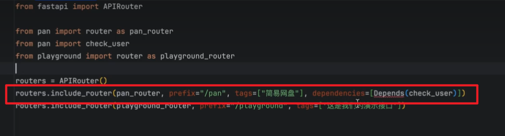

# fastAPI

fastAPI更高效好用

详细项目教程：https://www\.yuque\.com/zacharyblock/iacda?

## 基本语法

官方教程：https://fastapi\.tiangolo\.com/zh/tutorial/first\-steps/

菜鸟教程：https://www\.runoob\.com/fastapi/fastapi\-tutorial\.html

https://juejin\.cn/post/7478185513461268480


## fastapi中的异步任务

https://blog\.csdn\.net/qq\_19072921/article/details/141644472

https://fastapi\.tiangolo\.com/zh/async/


## 并发与Worker与线程


https://juejin\.cn/post/7431754032449847305

https://juejin\.cn/post/7091839981953482789?searchId=20250501193951850523D01636AFE2418C

### 使用 async/await异步路由

当使用异步路由时，FastAPI 采用事件循环模型处理请求：

- 不会为每个请求分配独立线程

- 通过协程（coroutine）实现并发

- 在 I/O 等待时自动切换处理其他请求

```python
@app.get("/async")
async def async_route():
    # 在事件循环中处理，不占用额外线程
    await some_async_operation()
    return {"message": "async response"}

```

### 同步路由

对于同步路由，FastAPI 采用线程池处理：

- 同步函数在线程池中运行

- 避免阻塞事件循环

- 使用 ThreadPoolExecutor 管理线程

```python
@app.get("/sync")
def sync_route():
    # 在线程池中处理
    time.sleep(1)  # 模拟耗时操作
    return {"message": "sync response"}

```


### Worker

#### **worker与线程的关系**

```python
服务器
│
├── Worker进程 1
│   ├── 主事件循环(Event Loop)
│   └── 线程池(ThreadPool)
│       ├── 线程 1
│       ├── 线程 2
│       └── 线程 3
│
├── Worker进程 2
│   ├── 主事件循环(Event Loop)
│   └── 线程池(ThreadPool)
│       ├── 线程 1
│       ├── 线程 2
│       └── 线程 3
...

```

#### **Worker 进程特点**

1. 每个 Worker 是独立的进程

2. 拥有独立的内存空间

3. 运行完整的应用程序副本

4. 包含自己的事件循环和线程池


#### Worker 配置

可以通过 uvicorn 配置 Worker 数量：

```python
import multiprocessing
import uvicorn
from fastapi import FastAPI

app = FastAPI()

if __name__ == "__main__":
    # 获取 CPU 核心数
    cpu_count = multiprocessing.cpu_count()
    
    # 配置 worker 数量和并发限制
    config = uvicorn.Config(
        "main:app",
        workers=cpu_count * 2,  # worker 进程数
        loop="auto",  # 事件循环实现
        limit_concurrency=1000,  # 并发限制
        timeout_keep_alive=30,  # keep-alive 超时
    )
    server = uvicorn.Server(config)
    server.run()

```


import multiprocessing

import uvicorn

from fastapi import FastAPI


app = FastAPI\(\)


if **name** == "\_\_main\_\_":

\# 获取 CPU 核心数

cpu\_count = multiprocessing\.cpu\_count\(\)

\# 配置 worker 数量和并发限制

config = uvicorn\.Config\(

"main:app",

workers=cpu\_count \* 2,  \# worker 进程数

loop="auto",  \# 事件循环实现

limit\_concurrency=1000,  \# 并发限制

timeout\_keep\_alive=30,  \# keep\-alive 超时

\)

server = uvicorn\.Server\(config\)

server\.run\(\)

#### 线程池管理

可以在应用启动时配置线程池

```python
from concurrent.futures import ThreadPoolExecutor

app = FastAPI()

@app.on_event("startup")
async def startup_event():
    # 配置线程池
    app.state.executor = ThreadPoolExecutor(max_workers=20)

@app.on_event("shutdown")
async def shutdown_event():
    # 优雅关闭线程池
    app.state.executor.shutdown()

```


#### 配置建议

**CPU 密集型任务：**

对于 CPU 密集型应用，增加 Worker 数量：

```Bash
bash
 代码解读
复制代码
uvicorn main:app --workers 8 --limit-concurrency 200
```

**I/O 密集型任务：**

对于 I/O 密集型任务，优先使用异步操作：

```Python
python
 代码解读
复制代码
@app.get("/io-heavy")async def io_heavy():    async with aiohttp.ClientSession() as session:        # 并发执行多个 I/O 操作        tasks = [fetch_data(session) for _ in range(10)]        results = await asyncio.gather(*tasks)    return results
```


#### 性能监控

可以添加中间件来监控请求处理时间：

```python
@app.middleware("http")
async def monitor_requests(request, call_next):
    start_time = time.time()
    response = await call_next(request)
    process_time = time.time() - start_time
    # 记录处理时间，用于性能分析
    return response

```


## Uvcion

https://www\.uvicorn\.org/

FastAPI 是一个现代、极速的 Web 框架，天生支持异步，性能炸裂。而 Uvicorn 又是专为异步而生的服务器。两者组合：

- 🚀 **高性能**：异步 I/O，轻松应对高并发。

- 🔒 **新特性**：支持 WebSocket、HTTP2。

- ⚙️ **易用性**：安装简单，配置灵活。

运行：

（reload）会使得新生成的代码实时更新响应，建议仅开发模式使用

```python
uvicorn main:app --reload
```


## debug配置


## swaggerUI搭配开发

1. 只可以用来调式HTTP协议的请求，不可以调式Websocket \!\!\!\!

2. 直接打开服务器的网址后加docs即可打开


3. 点击try\-out可以尝试调用这个接口


4. 输入相应的请求参数，点击excute可以进行参数调用


5. 然后可以看到响应体


## 挂载静态文件与子空间


## 跨域CORS

### 为什么要跨域

1. **原因**：前端后端所处的“源”不同

2. 源是协议（http，https）、域（myapp\.com，localhost，localhost\.tiangolo\.com）以及端口（80、443、8080）的组合。

    因此，这些都是不同的源：

    http://localhost

    https://localhost

    http://localhost:8080

    即使它们都在 localhost 中，但是它们使用不同的协议或者端口，所以它们都是不同的「源」

3. 举个例子：

    假设你的浏览器中有一个前端运行在 `http://localhost:8080`，并且它的 JavaScript 正在尝试与运行在 `http://localhost` 的后端通信（因为我们没有指定端口，浏览器会采用默认的端口 `80`）。

    然后，浏览器会向后端发送一个 HTTP `OPTIONS` 请求，如果后端发送适当的 headers 来授权来自这个不同源（`http://localhost:8080`）的通信，浏览器将允许前端的 JavaScript 向后端发送请求。

    为此，后端必须有一个「允许的源」列表。

    在这种情况下，它必须包含 `http://localhost:8080`，前端才能正常工作。

### 怎么跨域

可以在 **FastAPI** 应用中使用 `CORSMiddleware` 来配置它。

- 导入 `CORSMiddleware`。

- 创建一个允许的源列表（由字符串组成）。

- 将其作为「中间件」添加到你的 **FastAPI** 应用中。


你也可以指定后端是否允许：

- 凭证（授权 headers，Cookies 等）。

- 特定的 HTTP 方法（`POST`，`PUT`）或者使用通配符 `"*"` 允许所有方法。

- 特定的 HTTP headers 或者使用通配符 `"*"` 允许所有 headers。

也可以使用 `"*"`（一个「通配符」）声明这个列表，表示全部都是允许的。

```python
from fastapi import FastAPI
from fastapi.middleware.cors import CORSMiddleware

app = FastAPI()

origins = [
    "http://localhost.tiangolo.com",
    "https://localhost.tiangolo.com",
    "http://localhost",
    "http://localhost:8080",
]

app.add_middleware(
    CORSMiddleware,
    allow_origins=origins,
    allow_credentials=True,
    allow_methods=["*"],
    allow_headers=["*"],
)


@app.get("/")
async def main():
    return {"message": "Hello World"}
```


## 请求路径参数、查询参数


## json和表单Form


## 日志

```python
# 配置日志
logging.basicConfig(level=logging.INFO)
logger = logging.getLogger(__name__)

except Exception as e:
    logger.error(f"音频转文本失败: {str(e)}")

logger.warning("recognize faild! file_path:",file_path,"request_id: ", request_id, " code: ", code, ", message: ", resp["message"])

logger.info("转换成功")
```


## Lifespan\(生命周期事件\)


## AOP（中间件）


## 依赖项

**依赖注入：**

编程中的「依赖注入」是声明代码（本文中为路径操作函数 ）运行所需的，或要使用的「依赖」的一种方式。

然后，由系统（本文中为 FastAPI）负责执行任意需要的逻辑，为代码提供这些依赖（「注入」依赖项）。


**依赖注入常用于以下场景：**

1. 共享业务逻辑（复用相同的代码逻辑）

2. 共享数据库连接

3. 实现安全、验证、角色权限等……


依赖项：

1. 如果是在路由函数中配置依赖项的话，那么依赖项会获取到这个路径下的所有请求的请求体

2. 依赖项缓存：重复的依赖项只会执行一次，因为会进行缓存，生命周期依赖于请求周期

3. 函数和类都可以作为依赖项

```python
from typing import Union

from fastapi import Depends, FastAPI

app = FastAPI()


async def common_parameters(
    q: Union[str, None] = None, skip: int = 0, limit: int = 100
):
    return {"q": q, "skip": skip, "limit": limit}


@app.get("/items/")
async def read_items(commons: dict = Depends(common_parameters)):
    return commons


@app.get("/users/")
async def read_users(commons: dict = Depends(common_parameters)):
    return commons
```


依赖项也可以在路径装饰器中使用，但是没法拿到返回值


这个子路由下所有路径，都增加上了依赖项



## 用户注册登录

https://blog\.csdn\.net/gege\_0606/article/details/146324165

⚠️注意！！手机号和邮箱格式要做校验


1. 注册：手机号注册（需要图片验证\+手机验证码）

2. 登录：

3. 忘记密码


或者下面这种登录注册一体方式，可以不用刻意注册和忘记密码


## SSO/接入第三方联合注册登录

fastapi\-sso 单点登录

https://blog\.csdn\.net/gitblog\_00725/article/details/141838804

基于 FastAPI 的 OAuth2 社交登录与第三方认证解析

https://blog\.csdn\.net/weixin\_52392194/article/details/145106513


## 接入验证码校验

1. 防人机：校验图片、数字

    1. 

2. 邮箱和手机验证码和密码找回

    - **频率限制**：60 秒内禁止重复发送。

    - **次数封禁**：24 小时内超过 5 次请求则封禁。

    - **加密存储**：Redis 中验证码需加密，防止泄露。

https://blog\.csdn\.net/weixin\_52392194/article/details/141422736

https://blog\.csdn\.net/m0\_74113357/article/details/147128205


QQ邮箱验证码：https://zhuanlan\.zhihu\.com/p/664771819


## 权限校验与权限管理

### JWT

#### **前端**

1. **页面保护：**

    1. 首先从前端这块处理，除了login和后续会增加的register页面不需要登录才能访问，其他页面，都需要登录用户之后才能访问，否则自动跳转回login页面

2. **请求加toekn：**

    1. 给请求头带上token，提供给后端进行验证

        1. 写一个hook，获取token

        2. 在axios拦截器中设置http token

        3. https://blog\.csdn\.net/Techlifehacks/article/details/147144432

        4. https://cloud\.tencent\.com/developer/article/1872670

        5. https://cloud\.tencent\.com/developer/information/%E5%A6%82%E4%BD%95%E5%9C%A8axios%E6%8B%A6%E6%88%AA%E5%99%A8%E4%B8%AD%E8%AE%BE%E7%BD%AEhttp%20cookie%EF%BC%9F

#### **后端\-\-\-token校验**

1. **token颁发**

    1. 用户注册或者登录成后颁发token

2. **toekn校验**

    1. 用户请求每一个接口都需要进行token的校验

3. token是有有效期的


## 模板（返回一个网页）

## 图片上传和下载


## 文件上传与下载


## 音频上传与下载


## fastapi使用本地内存


## fastapi使用缓存


## fastapi使用数据库

### sql数据库

#### sqlalchemy \(sqlmodel\)

https://juejin\.cn/post/7380163683010510911?searchId=202505041545416901CFC5A273BD02A621


#### Tortoise\-ORM

教程：https://juejin\.cn/post/7408094966646325288

https://juejin\.cn/post/7172055019926077471?searchId=20250504154751FC4A047258A0162795DD

https://www\.yuque\.com/u1362970/xyh2wn/zrkhd38xxx80hx7u

1. 是什么

    Tortoise\-ORM是一个Python异步ORM（对象关系映射）框架，专门用于异步web应用和微服务。它基于SQLAlchemy并使用asyncio库来处理异步请求。Tortoise\-ORM提供了简单易用的API，允许开发人员使用异步方式将Python对象映射到数据库表中，并进行快速、高效的数据库操作。

    Tortoise\-ORM支持多种主流的关系数据库（如MySQL、PostgreSQL、SQLite等），同时也提供了类似Django的模型定义、自动迁移和查询构建功能。它还支持简单的CRUD操作、复杂的查询（包括聚合查询和连接查询）、事务处理等数据库操作。

    除了数据库操作功能，Tortoise\-ORM还提供了内置的数据验证、序列化和反序列化功能，简化了与数据库交互的过程。另外，它还可以与Python的异步web框架（如FastAPI和Sanic）很好地集成，使开发者能够轻松地构建高效的异步web应用和微服务。

2. 安装：

    1. pip install tortoise\-orm\[aiomysql\]

    2. 

3. 配置：

    1. db\_config\.py

        ```python
        import os
        from tortoise import Tortoise
        from dotenv import load_dotenv
        
        # 加载环境变量
        load_dotenv()
        
        # 数据库配置
        DB_HOST = os.getenv("DB_HOST", "localhost")
        DB_PORT = os.getenv("DB_PORT", "3306")
        DB_USER = os.getenv("DB_USER", "root")
        DB_PASSWORD = os.getenv("DB_PASSWORD", "123")
        DB_NAME = os.getenv("DB_NAME", "interview_assistant")
        
        # 生成数据库URL
        DB_URL = f"mysql://{DB_USER}:{DB_PASSWORD}@{DB_HOST}:{DB_PORT}/{DB_NAME}"
        
        # Tortoise ORM配置
        TORTOISE_ORM = {
            "connections": {"default": DB_URL},
            "apps": {
                "models": {
                    "models": ["models", "aerich.models"],
                    "default_connection": "default",
                },
            },
            "use_tz": False,
        }
        
        
        async def init_db():
            *"""初始化数据库连接"""*
        *    *await Tortoise.init(
                db_url=DB_URL,
                modules={"models": ["backend.db.models"]}
            )
            # 生成数据库表结构
            await Tortoise.generate_schemas()
        
        
        async def close_db():
            *"""关闭数据库连接"""*
        *    *await Tortoise.close_connections() 
        ```

    2. 数据模型 models\.py

        ```python
        from tortoise import fields
        from tortoise.models import Model
        
        
        class User(Model):
            *"""用户模型"""*
        *    *id = fields.IntField(pk=True)
            user_id = fields.CharField(max_length=50, unique=True, description="用户唯一标识")
            username = fields.CharField(max_length=50, null=True, description="用户名")
            created_at = fields.DatetimeField(auto_now_add=True, description="创建时间")
        
            class Meta:
                table = "users"
        
        
        class Resume(Model):
            *"""简历模型"""*
        *    *id = fields.IntField(pk=True)
            user = fields.ForeignKeyField('models.User', related_name='resumes', description="所属用户")
            file_name = fields.CharField(max_length=100, description="原始文件名")
            file_path = fields.CharField(max_length=255, description="保存路径")
            file_type = fields.CharField(max_length=10, description="文件类型(pdf/docx/doc)")
            uploaded_at = fields.DatetimeField(auto_now_add=True, description="上传时间")
            is_active = fields.BooleanField(default=True, description="是否为活跃简历")
        
            class Meta:
                table = "resumes"
        
        
        class ResumeContent(Model):
            *"""简历内容模型"""*
        *    *id = fields.IntField(pk=True)
            resume = fields.OneToOneField('models.Resume', related_name='content', description="关联简历")
            raw_text = fields.TextField(description="原始文本内容")
            parsed_data = fields.JSONField(null=True, description="结构化解析数据")
            last_updated = fields.DatetimeField(auto_now=True, description="最后更新时间")
        
            class Meta:
                table = "resume_contents"
        
        
        class ResumeEvaluation(Model):
            *"""简历评价模型"""*
        *    *id = fields.IntField(pk=True)
            resume = fields.ForeignKeyField('models.Resume', related_name='evaluations', description="关联简历")
            created_at = fields.DatetimeField(auto_now_add=True, description="评价时间")
            scores = fields.JSONField(description="各项评分")
            evaluations = fields.JSONField(description="各项评价")
            suggestions = fields.JSONField(description="各项建议")
            overall_score = fields.IntField(description="总分")
            overall_comment = fields.TextField(description="总体评价")
        
            class Meta:
                table = "resume_evaluations" 
        ```

    3. main\.py配置初始化与关闭

        

        ```python
        @asynccontextmanager
        async def lifespan(app: FastAPI):
            # 数据库初始化 - 启动事件
            await init_db()
            logger.info("数据库连接已初始化")
            
            yield  # 应用运行期间
            
            # 数据库关闭 - 关闭事件
            await close_db()
            logger.info("数据库连接已关闭")
        
        # 创建应用实例，使用生命周期管理器
        app = FastAPI(
            title="AI面试助手", 
            description="提供实时面试辅导和模拟面试功能",
            lifespan=lifespan
        )
        ```

4. 使用


### 向量数据库


## 接入第三方支付平台

## 激活码

支付平台不太好接入（需要公司资质），可以使用激活码服务，通过在第三方平台售卖激活码，

**需要考虑以下因素：**

激活码：生成（唯一性）、传输（安全性）、时效（不可重复激活，并且过期不可用）、激活码种类不同需要处理。这里要考虑并发情况，比如同时激活同一个码，需要数据库的事务处理来避免重复使用

用户权益管理：用户权益的记录，已使用的权益记录，每次使用服务前都需要进行权益校验，每次使用完都需进行扣除（每次用户使用服务时，比如实时面试辅导，系统需要检查剩余时长，并扣减。这里要确保扣减是原子操作，避免超卖）


## fastapi\+websocket


## FastAPI \+ llm

### 怎么调用大模型API

1. fastapi怎么异步调用gpt接口

    1. https://blog\.csdn\.net/weixin\_46398647/article/details/140341545

    2. https://blog\.csdn\.net/spicy\_chicken123/article/details/138224587

### 怎么实现流式响应

### 怎么实现rag知识库挂载


## 安全性问题

https://developer\.aliyun\.com/article/1601802


### 图形验证码和邮箱验证码

### https

账户密码明文传输问题


### CSRF保护


