# linux

https://www\.runoob\.com/linux/linux\-file\-content\-manage\.html

# 核心思想：一切皆文件

## 文件描述符表（File Descriptor Table）的内存结构

在 Linux 内核中，每一个运行的程序都是一个进程。内核使用一个名为 `task_struct` 的 C 语言结构体来管理进程（即进程控制块 PCB）。

在 `task_struct` 中，有一个指针指向 `files_struct`，这里面维护着一个数组——**文件描述符表（File Descriptor Table）**。

- **数组的索引（Index）**：就是我们看到的整数 0, 1, 2, 3\.\.\.。

- **数组的值（Value）**：是指向系统级“打开文件表（Open File Table）”中特定表项的指针。

所以，文件描述符  本质上只是当前进程内存中一个数组的索引 `fd_array[1]`。


完全归功于 Linux 内核中的一个核心组件：**虚拟文件系统 \(VFS, Virtual File System\)**。

VFS 是一个软件层，它位于应用程序和具体的文件系统（如 ext4, FAT32, 或者网络、设备驱动）之间。VFS 在 C 语言中运用了**面向对象**的设计思想。


## 虚拟文件系统 \(VFS, Virtual File System\)

### VFS 的四大核心数据结构：

要实现多态机制，VFS 定义了四个关键的结构体：

- **超级块 \(Superblock\)：** 描述整个特定文件系统的信息（如总容量、空闲块数）。

- **索引节点 \(inode\)：** 代表一个**具体的物理文件**。它包含文件的元数据（权限、大小、创建时间、数据块在磁盘上的物理位置）。

- **目录项 \(dentry\)：** 描述系统在内存中的目录树结构，主要用于快速将路径名（如 `/etc/passwd`）解析为对应的 `inode`。

- **文件对象 \(file\)：** 代表**进程打开的一个文件**。它包含进程视角的当前读取偏移量（offset）等状态。

### 魔法的发生：`file_operations` 结构体

“一切皆文件”的底层魔法在于 `file_operations`。每个 `inode` 都会绑定一个对应的 `file_operations` 结构体（这是一个包含许多**函数指针**的集合）。

C

```Plain Text
// 内核源码中简化的 file_operations 结构struct file_operations {ssize_t (*read) (struct file *, char __user *, size_t, loff_t *);
    ssize_t (*write) (struct file *, const char __user *, size_t, loff_t *);
    int (*open) (struct inode *, struct file *);
    int (*release) (struct inode *, struct file *);
    // ... 其他操作
};
```

### 动态绑定的执行过程（以 `write` 为例）

当你在用户态写一行代码：`write(fd, buffer, size);`

1. **进入内核：** 触发系统调用进入内核的 `sys_write()`。

2. **查文件描述符表：** 内核根据你传入的整型 `fd` \(文件描述符\)，在当前进程的“打开文件表”中找到对应的 `file` 对象。

3. **找操作指针：** 内核顺藤摸瓜，找到 `file` 对象对应的 `dentry`，进而找到 `inode`，最后取出绑定在这个 `inode` 上的 `file_operations` 结构体。

4. **多态调用：** 内核盲调（blind call）那个指针：`file->f_op->write(...)`。

**这个时候，分歧出现了：**

- 如果这是一个 **ext4 磁盘文件**，这个 `write` 指针指向的是 ext4 文件系统的写入函数，数据会被推向块设备驱动，最终写入硬盘。

- 如果这是一个 **Socket 文件**，这个 `write` 指针指向的是网络子系统的发送函数，数据会被封装成 TCP/IP 数据包发送给网卡。

- 如果这是一个 **字符设备文件 \(如 ****`/dev/null`****\)**，这个 `write` 指针指向的就是该设备的驱动程序中的丢弃函数，数据直接消失。

**总结：** VFS 对上提供统一 API，对下要求各驱动/文件系统注册自己的处理函数，通过这种类似面向对象中“接口与实现分离”的方法，完美实现了“一切皆文件”。

# 终端使用技巧

1. 放大终端窗口字体 ctrl shift  =   （mac上为command和\+）

2. 缩小终端窗口 ctrl  \-    （mac上为command和\-）

3. **自动补全**


4. **曾经使用过的命令**

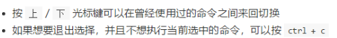

5. **echo文字内容**

    1. echo hello \>a


6. **重定向 \> 和》**

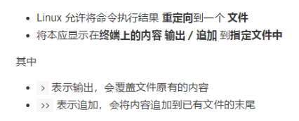

7. **管道**

    1. ls \-lha \~\| more

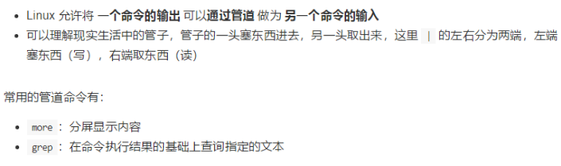

8. **\- 后面一般接缩写，\-\- 后面一般接全拼**

    更详细的一个例子：
    mysql \-h 192\.168\.1\.2 \-u root \-p
    等效于
    mysql \-\-host=192\.168\.1\.2 \-\-user=root \-\-password

9. **一些特殊符号**

    https://www\.cnblogs\.com/dirt2/p/5991033\.html

# Linux系统启动过程

## 内核的引导

当计算机打开电源后，首先是BIOS开机自检，按照BIOS中设置的启动设备（通常是硬盘）来启动。

操作系统接管硬件以后，首先读入 /boot 目录下的内核文件。


## 运行 init

init 进程是系统所有进程的起点，你可以把它比拟成系统所有进程的老祖宗，没有这个进程，系统中任何进程都不会启动。

init 程序首先是需要读取配置文件 /etc/inittab。


## 系统初始化

许多程序需要开机启动。它们在Windows叫做"服务"（service），在Linux就叫做"守护进程"（daemon）。

init进程的一大任务，就是去运行这些开机启动的程序。

但是，不同的场合需要启动不同的程序，比如用作服务器时，需要启动Apache，用作桌面就不需要。

Linux允许为不同的场合，分配不同的开机启动程序，这就叫做"运行级别"（runlevel）。也就是说，启动时根据"运行级别"，确定要运行哪些程序。


Linux系统有7个运行级别\(runlevel\)：

- 运行级别0：系统停机状态，系统默认运行级别不能设为0，否则不能正常启动

- 运行级别1：单用户工作状态，root权限，用于系统维护，禁止远程登录

- 运行级别2：多用户状态\(没有NFS\)

- 运行级别3：完全的多用户状态\(有NFS\)，登录后进入控制台命令行模式

- 运行级别4：系统未使用，保留

- 运行级别5：X11控制台，登录后进入图形GUI模式

- 运行级别6：系统正常关闭并重启，默认运行级别不能设为6，否则不能正常启动

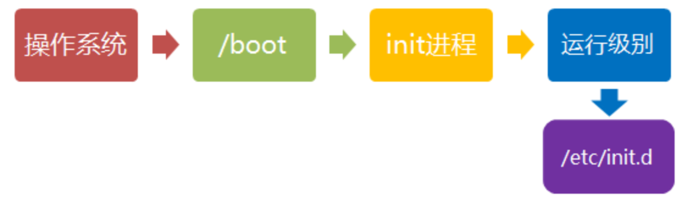

## 建立终端 

rc执行完毕后，返回init。这时基本系统环境已经设置好了，各种守护进程也已经启动了。

init接下来会打开6个终端，以便用户登录系统。在inittab中的以下6行就是定义了6个终端：


## 用户登录系统

一般来说，用户的登录方式有三种：

- （1）命令行登录

- （2）ssh登录

- （3）图形界面登录


# 目录管理


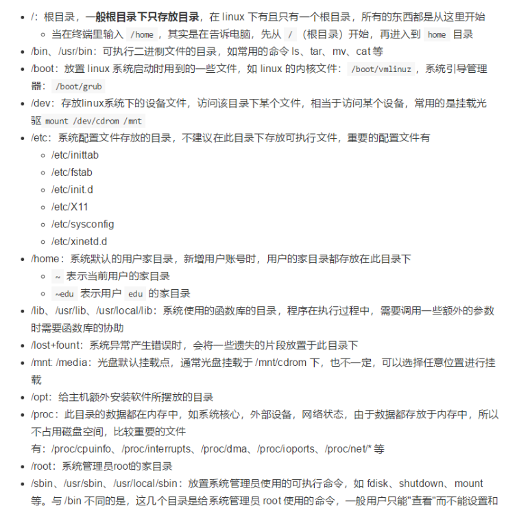

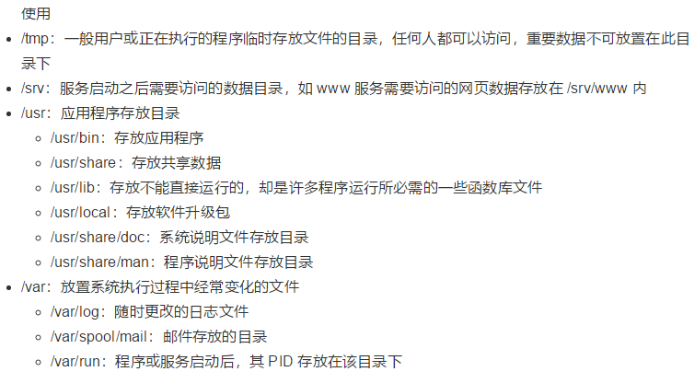

# 文件/文件夹增删改查

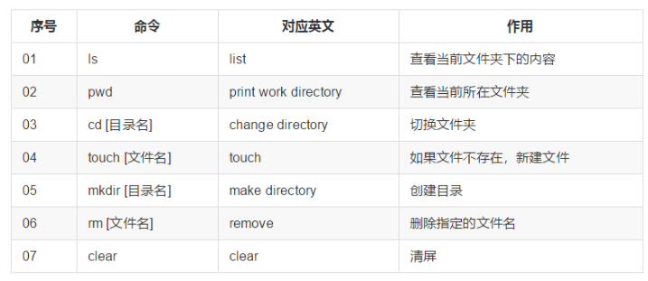

## 绝对路径、相对路径

1. **绝对路径：**
路径的写法，由根目录 **/** 写起，例如： /usr/share/doc 这个目录。

2. **相对路径：**
路径的写法，不是由 **/** 写起，例如由 /usr/share/doc 要到 /usr/share/man 底下时，可以写成： **cd \.\./man** 这就是相对路径的写法。

    - 以`./`开头，代表当前目录和文件目录在同一个目录里，`./`也可以省略不写；

    - 以`../`开头：向上走一级，代表目标文件在当前文件所在的上一级目录；

    - 以`../../`开头：向上走两级，代表父级的父级目录，也就是上上级目录，再说明白点，就是上一级目录的上一级目录；

    - `~`（波浪号）是一个 特殊符号，代表当前用户的 家目录（Home Directory） 的路径。

## 查看所在目录（pwd）、目录下文件（ls）

### pwd\-\-\-**Print Working Directory**

- **\-P** ：显示出确实的物理路径（physical），而非使用链接 \(link\) 路径。

```Plain Text
pwd -P
```


### ls


## 创建文件夹、文件\-mkdir

mkdir \[\-mp\] 目录名称

选项与参数：

- \-m （mode）：配置文件的权限喔！直接配置，不需要看默认权限 \(umask\) 的脸色～

- \-p （parents）：帮助你直接将所需要的目录\(包含上一级目录\)递归创建起来！

```Bash
[root@www ~]# cd /tmp
[root@www tmp]# mkdir test    <==创建一名为 test 的新目录
```

```Plain Text
//加了 -p 的选项，可以自行帮你创建多层目录！
mkdir -p test1/test2/test3/test4

```

```Plain Text
创建权限为 **rwx--x--x** 的目录。
上面的权限部分，如果没有加上 -m 来强制配置属性，系统会使用默认属性。
[root@www tmp]# mkdir -m 711 test2
[root@www tmp]# ls -l
drwxr-xr-x  3 root  root 4096 Jul 18 12:50 test
drwxr-xr-x  3 root  root 4096 Jul 18 12:53 test1
drwx--x--x  2 root  root 4096 Jul 18 12:54 test2
```

## 复制文件/目录\-\-cp

```Plain Text
cp [参数] 原目录 新目录
```

选项与参数：

- **\-a：**相当於 \-pdr 的意思，至於 pdr 请参考下列说明；\(常用\)

- **\-d：**若来源档为链接档的属性\(link file\)，则复制链接档属性而非文件本身；

- **\-f：**为强制\(force\)的意思，若目标文件已经存在且无法开启，则移除后再尝试一次；

- **\-i：**若目标档\(destination\)已经存在时，在覆盖时会先询问动作的进行\(常用\)

- **\-l：**进行硬式链接\(hard link\)的链接档创建，而非复制文件本身；

- **\-p：**连同文件的属性一起复制过去，而非使用默认属性\(备份常用\)；

- **\-r：**递归持续复制，用於目录的复制行为；\(常用\)

- **\-s：**复制成为符号链接档 \(symbolic link\)，亦即『捷径』文件；

- **\-u：**若 destination 比 source 旧才升级 destination ！

用 root 身份，将 root 目录下的 \.bashrc 复制到 /tmp 下，并命名为 bashrc

```Plain Text
[root@www ~]# cp ~/.bashrc /tmp/bashrc
[root@www ~]# cp -i ~/.bashrc /tmp/bashrc
cp: overwrite `/tmp/bashrc'? n  <==n不覆盖，y为覆盖

```

## 目录、文件删除\-rm

1. rm\[文件名\]

2. rm无法直接删除目录（dir）rm \-r 文件名

3. 


## 文件移动\-mv

复制一文件，创建一目录，将文件移动到目录中

```Plain Text
[root@www ~]# cd /tmp
[root@www tmp]# cp ~/.bashrc bashrc
[root@www tmp]# mkdir mvtest
[root@www tmp]# mv bashrc mvtest
```

## 文件内容查看

1. cat命令：用于查看文本文件的内容。例如，可以使用”cat filename”的命令来打开名为”filename”的文本文件。

2. tac  从最后一行开始显示，可以看出 tac 是 cat 的倒着写！

3. more命令：用于分屏显示文本文件的内容。可以使用”more filename”的命令来打开并查看文本文件”filename”的内容。

4. less命令：类似于more命令，也是用于分屏显示文件内容的命令。使用”less filename”命令来打开并查看文本文件”filename”。

5. vi/vim命令：这是一个功能强大的文本编辑器。使用”vi filename”或”vim filename”的命令来打开文本文件”filename”并进行编辑。

6. nano命令：一个简单易用的文本编辑器。可以使用”nano filename”的命令来打开并编辑文本文件”filename”。

7. gedit命令：一个常用的文本编辑器。可以使用”gedit filename”的命令来打开文本文件”filename”并进行编辑。

8. xdg\-open命令：用于打开任何类型的文件，根据文件的MIME类型调用合适的应用程序来打开。使用”xdg\-open filename”的命令来打开文件”filename”。

9. libreoffice命令：用于打开Office文档（如\.doc、\.xls和\.ppt等）。使用”libreoffice filename”的命令来打开Office文档”filename”。

10. evince命令：用于打开PDF文件。可以使用”evince filename”来打开PDF文件”filename”。

11. eog命令：用于打开图片文件。可以使用”eog filename”的命令来打开图片文件”filename”。

12. head

13. tail

    ```Plain Text
    tail -f app.log
    实时查看文件最新变化
    tail -f app.log | grep -E -C20 "123|abcd" --color
    实时查看日志，且包含关键字 123 或者 abcd 的行
    ```


## 搜索（关键字、过滤）


### grep

```Bash
#查询日志中含有某个关键字error的信息，显示行号，带颜色的。
cat -n app log | grep "error" -color  

#使用，more和less命令分页查看日志，空格翻页
cat -n app.log | grep "error" | more

#把日志保存到文件
cat -n app.log | grep "error" > temp.txt

#直接查找压缩包里的日志内容
zcat 压缩文件名.log.gz | gerp "hotelFriendCircle poi"
```

```Bash
# 查看app.log中的关键字
grep "关键字" app.log 

# 基本搜索（区分大小写）
grep "keyword" /var/log/syslog

# 忽略大小写搜索
grep -i "error" /var/log/syslog

# 显示匹配行及前后5行内容
grep -A 5 -B 5 "error" /var/log/syslog
# 或简写为（显示前后各5行）
grep -C 5 "error" /var/log/syslog

# 显示匹配行的行号
grep -n "error" /var/log/syslog

# 搜索多个关键字（OR条件）
grep -e "error" -e "fail" /var/log/syslog

# 同时满足多个条件（AND条件）
grep "error" /var/log/syslog | grep "connection"

# 搜索后排序并统计
grep "error" /var/log/syslog | cut -d' ' -f5 | sort | uniq -c | sort -nr

# 查找最近修改的日志文件并搜索
find /var/log -type f -mtime -1 -exec grep -i "error" {} +

```


### sed

这个命令可以查找日志文件特定的一段 , 也可以根据时间的一个范围查询。

```Plain Text
sed -n "5,10p" app.log：按照行数——查看日志第5到第10行。
sed -n "/2018-04-08 09:40:53.374/,/2018-04-08 10:21:04.812/p" express.log | grep "
此次共实际刷数据" ：按照时间段——查看两个时间之间的日志，并且显示关键字。
其中，时间点一定要在日志中存在，
可用：grep -E "2018-04-08 09:40:53.374" app.log --color：
来查看时间点是不是存在日志中，带颜色。

```


### journalctl

```Bash
# 基本搜索
journalctl -x | grep "error"

# 按时间过滤
journalctl --since "2023-10-01" --until "2023-10-02" | grep "error"

# 按服务/单元过滤
journalctl -u nginx.service | grep "error"

# 实时监控
journalctl -f | grep "error"

```


## 写入文件


### 


# 进程管理

14. 进程信息

    1. 

# 压缩解压安装卸载


apt（Advanced Packaging Tool）是一个在 Debian 和 Ubuntu 中的 Shell 前端软件包管理器。

apt 命令提供了查找、安装、升级、删除某一个、一组甚至全部软件包的命令，而且命令简洁而又好记。

apt 命令执行需要超级管理员权限\(root\)。

## apt 语法

apt \[options\] \[command\] \[package \.\.\.\]

- **options：**可选，选项包括 \-h（帮助），\-y（当安装过程提示选择全部为"yes"），\-q（不显示安装的过程）等等。

- **command：**要进行的操作。

- **package**：安装的包名。

---

## apt 常用命令

- 列出所有可更新的软件清单命令：**sudo apt update**

- 升级软件包：**sudo apt upgrade**

- 列出可更新的软件包及版本信息：**apt list \-\-upgradable**

- 升级软件包，升级前先删除需要更新软件包：**sudo apt full\-upgrade**

- 安装指定的软件命令：**sudo apt install \<package\_name\>**

- 安装多个软件包：**sudo apt install \<package\_1\> \<package\_2\> \<package\_3\>**

- 更新指定的软件命令：**sudo apt update \<package\_name\>**

- 显示软件包具体信息,例如：版本号，安装大小，依赖关系等等：**sudo apt show \<package\_name\>**

- 删除软件包命令：**sudo apt remove \<package\_name\>**

- 清理不再使用的依赖和库文件: **sudo apt autoremove**

- 移除软件包及配置文件: **sudo apt purge \<package\_name\>**

- 查找软件包命令： **sudo apt search \<keyword\>**

- 列出所有已安装的包：**apt list \-\-installed**

- 列出所有已安装的包的版本信息：**apt list \-\-all\-versions**


# 网络连接

## curl

```Python
curl \
    --header "Content-Type: application/json" \
    --data '["Dubbo"]' \
    http://localhost:50051/org.apache.dubbo.samples.quickstar t.dubbo.api.DemoService/sayHello/
```


## 

# 远程登陆/连接服务器

1. **关机/重启**

    1. shutdown 选项 时间

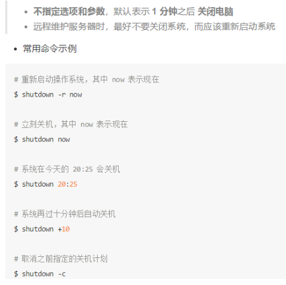

2. **查看或者配置网卡信息**

    1. 网卡和ip地址


    2. ifconfig查看/配置计算机当前的网卡配置信息

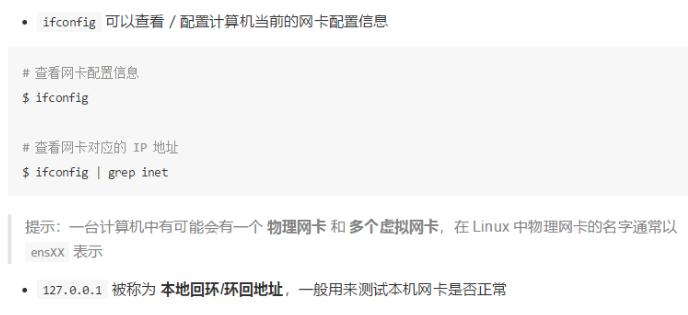

3. **网络连接：ping检测到目标ip地址的连接是否正常**

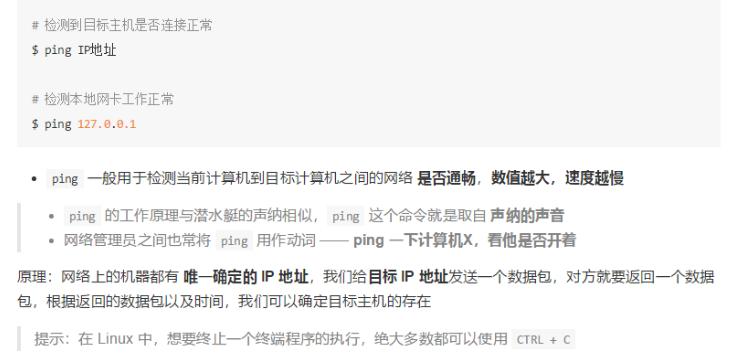

4. **ssh基础**

    1. ssh简介

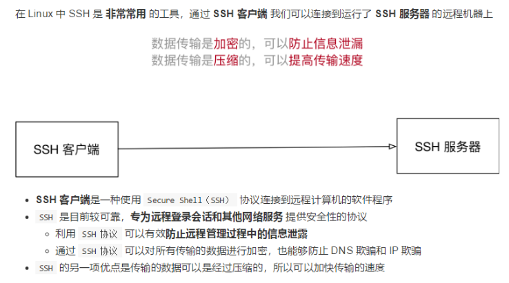

    2. 域名和端口号

        1. ip地址：80

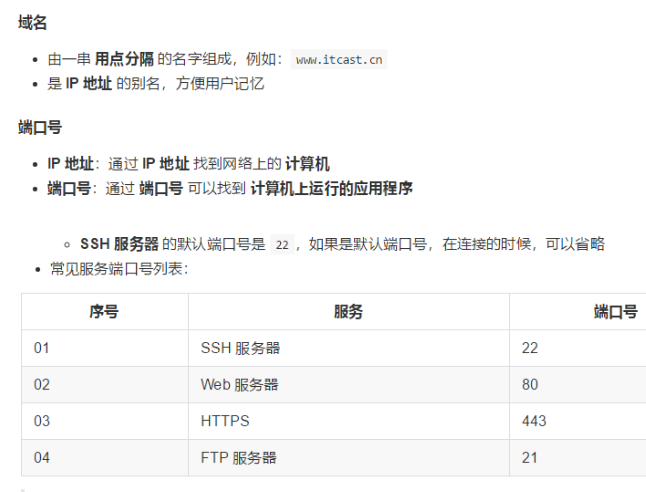

    3. 简单使用ssh

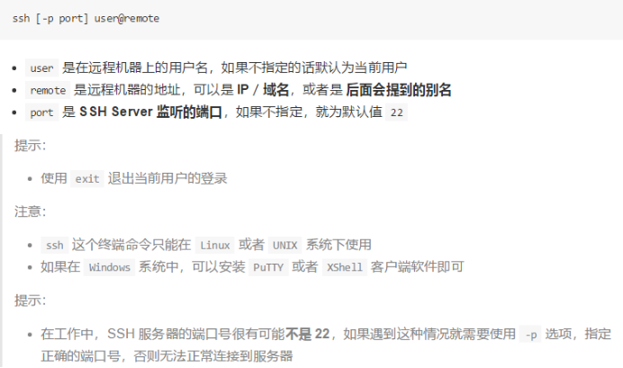

5. **scp远程拷贝文件**

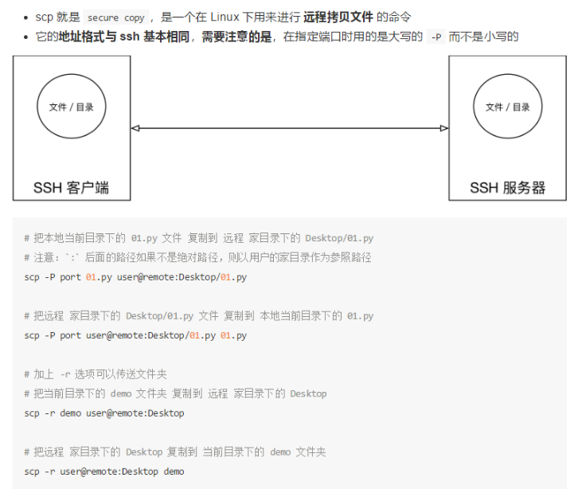

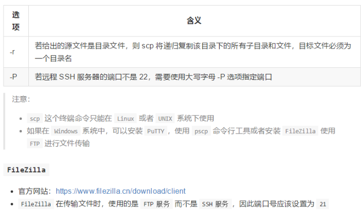

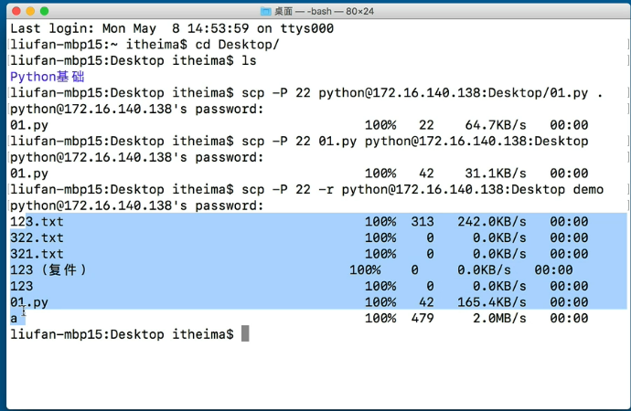

6. **SSH高级**

    1. 免密码登陆

        1. 先连接远程电脑后

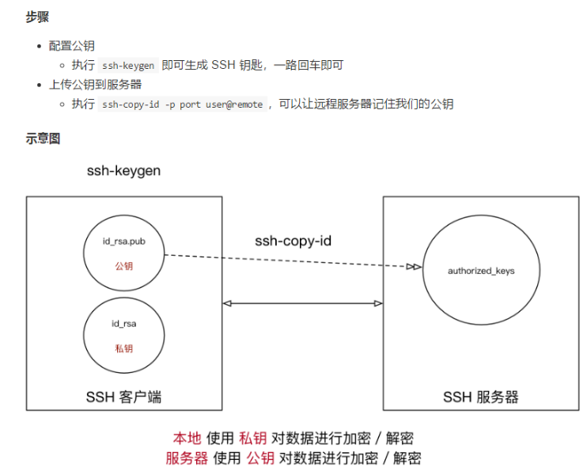

    2. 配置别名

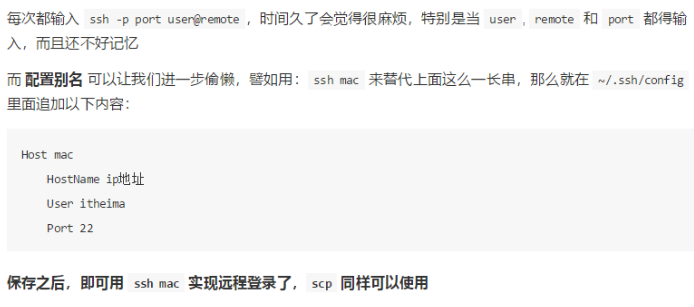

# 用户权限管理

## **用户和权限基本概念**

1. 基本概念

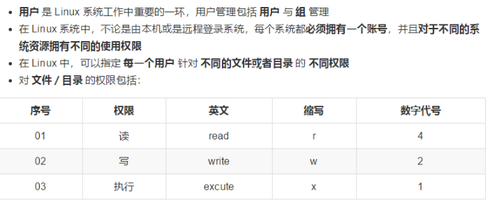

2. 组

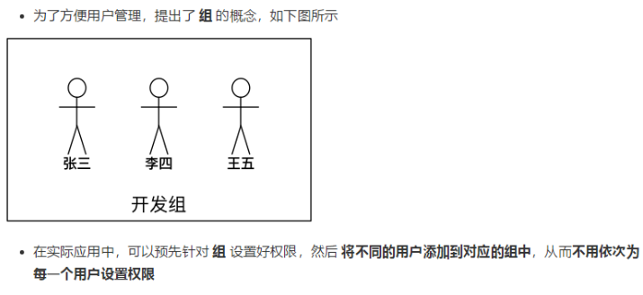

3. ls \-l扩展

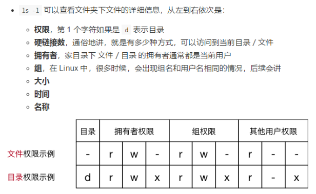

4. chmod简单使用

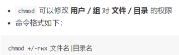

5. 超级用户

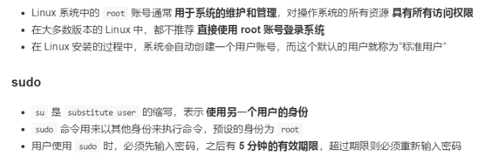

## 组管理

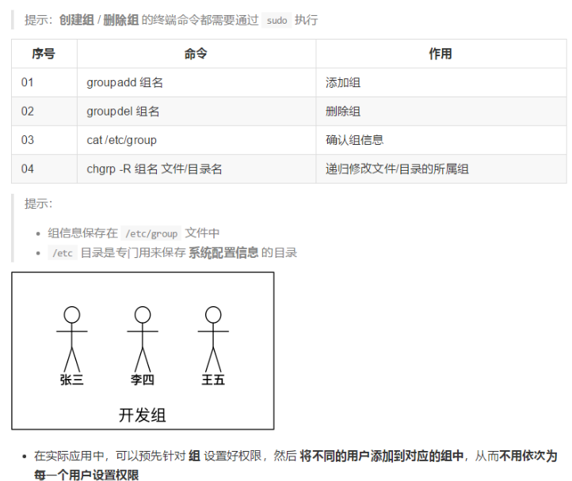

## 用户管理终端命令

1. 创建用户/设置密码/删除用户

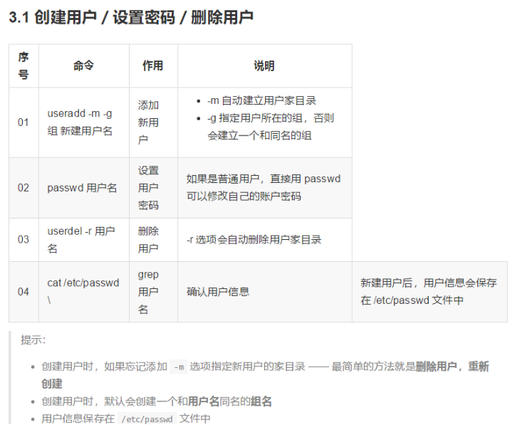

2. 查看用户信息

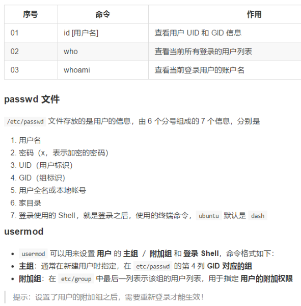

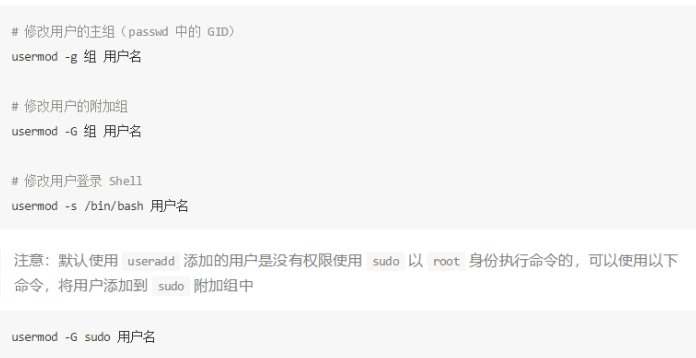

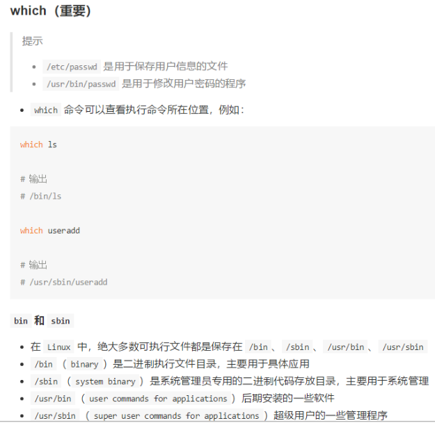

3. 切换用户

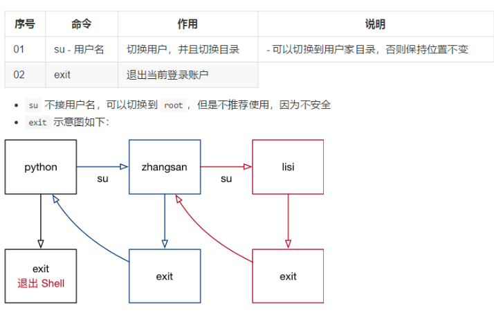

4. 修改文件权限

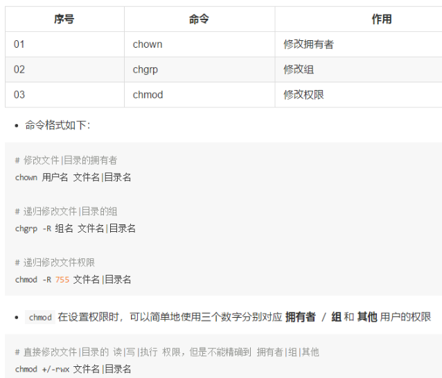

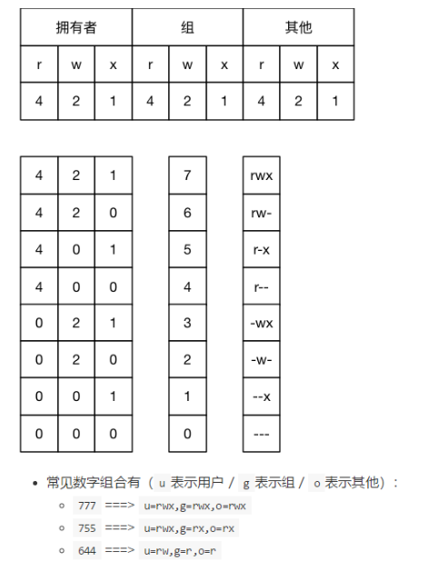

# 练习网站


[https://copy\.sh/v86/?profile=linux26](https://copy.sh/v86/?profile=linux26)
[https://bellard\.org/jslinux/](https://bellard.org/jslinux/)

[**http://s\-macke\.github\.io/jor1k/**](http://s-macke.github.io/jor1k/)


# tabby工具 shell命令远程连接


# Pdsh

分布式shell工具，在多个主机上并行执行命令工具


